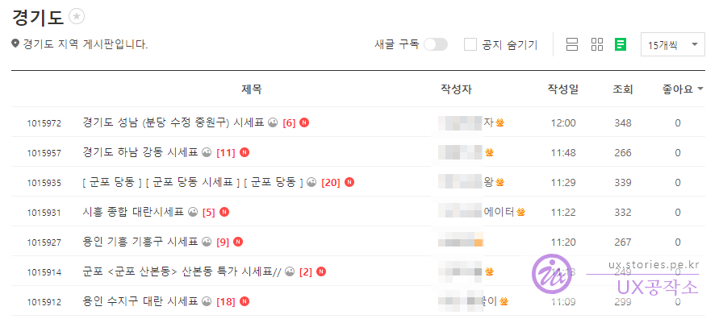
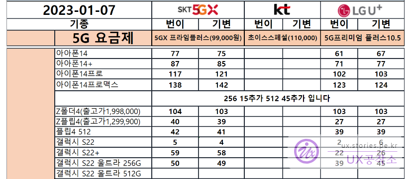
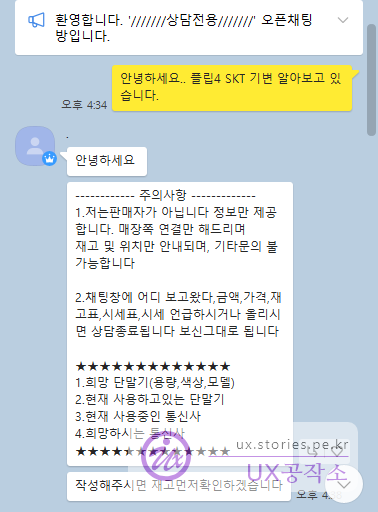
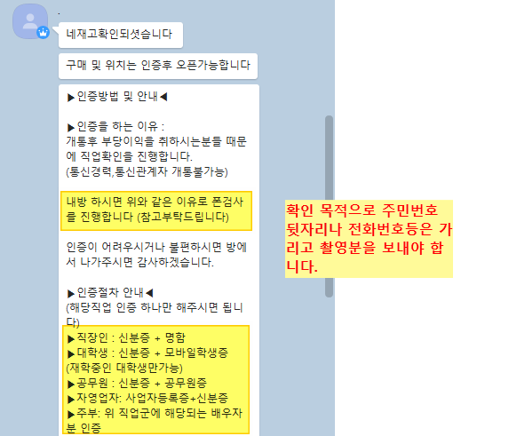
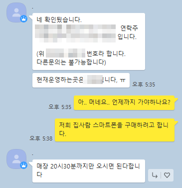

스마트폰을 구매하는 다양한 방법이 있는데, 그중에서 성지에서 구매하는 방법이 있습니다. 불법이라 조금 위험할 수는 있지만 상당히 저럼한 가격에 폰을 구매할 수 있는 방법입니다.
다만 몇가지 조건이 있고 구매가 까다로운 점이 좀 있습니다. 그 부분을 감수 한다면 괜찮은 방법입니다.

# 구매 조건

성지에서의 구매 조건 중 거의 90%가 당연시되는 조건은 아래와 같습니다.

- 고가 요금제로 구매해야 하며 6개월이상 유지해야 함. 그 이후에는 저렴한 요금제로 변경이 가능함
- 유료 부가 서비스 몇개 가입
- 공시지원금 완납 가격
- 가격 언급이나 시세표를 올릴 시 카톡 및 상담 종료
- 기존 위약금은 본인이 확인해야함(성지에서는 확인해주지 않음) --> [핸드폰을 바꿀때 꼭 확인해 봐야 하는 위약금(단말기 할부금,약정할인)](https://blog.stories.pe.kr/616)
- 등등...

# 구매 방법

보통 신도림, 테크노마트에서 오프라인 성지에서 구매를 많이 하셨을 텐데요. 이번에는 온라인에서 성지구매하는 방법을 설명하도록 하겠습니다. 순서는 아래와 같습니다.

## 온라인에서 성지 스마트폰 구매 순서

1. 네이버 카페에서 시세확인
2. 원하는 게시글의 시세표를 확인하고 오픈채팅(카톡) 요청
3. 오픈채팅(카톡)
   1. 판매자가 내 신분 확인 (주민등록증+명함)
   2. 성지 좌표 받음 (주소)
   3. 현금 준비
4. 좌표 주소로 이동(보통 좌표를 받은 당일날 찾아가야 함)
5. 매장방문
   1. 구매 제품 확인
   2. 금액 확인(금액 언급 금지)
   3. 개통 확인(먼저 선금 주지 말것)
   4. 개통 확인 후 금액 지불
6. 114에 전화해서 할부 원금 0원인지 확인

### 1. 네이버 카페에서 시세확인

먼저 네이버 카페 등에서 시세를 먼저 확인해야 합니다. 보통 아래의 카페에서 본인이 바로 방문할 수 있는 지역을 우선적으로 스캔할 필요가 있습니다.

보통 가입자가 많고 활성화가 잘 되어 있는 카페 2~3곳정도 가입을 하고 회원자격을 얻기위해 글과 댓글 등을 몇개 작성을 합니다. 그리고 매일 매일 시세표를 살펴봅니다.

  
게시글에서 본인이 바로 방문할 수 있는 곳의 시세표를 확인합니다.

  
시세표를 보면 조금씩 다르기는 하지만 보통 위와 같은 형식으로 되어 있습니다.
가로 방향으로는 SKT, KT, LGU로 구분하고 각각 번이(번호이동), 기변(기기변경)에 대한 가격을 확인할 수 있습니다. 세로 방향으로는 기종에 대한 가격을 확인할 수 있습닏.
여러곳의 가격을 비교하여 가장 저렴한 금액의 시세표를 제공하는 업체를 선택하면 됩니다.
시세표는 매일매일 달라지기 때문에 자주 확인해 볼 필요가 있습니다. 확정이 되면 당일날 방문해서 구매를 해야 합니다.

### 2. 원하는 게시글의 시세표를 확인하고 오픈채팅(카톡) 요청

보통 댓글을 남기면 쪽지로 오픈채팅의 주소를 보내주거나 아니면 게시글에 오픈채팅 주소를 남겨 놓습니다. 그 채팅으로 인사를 하면 안내가 시작됩니다.

### 3. 오픈채팅(카톡)

  
보통 이런식으로 카톡으로 글을 남기면 안내사항을 알려 줍니다.

#### 1. 판매자가 내 신분 확인 (주민등록증+명함)

좀 찝찝하고 기분이 좀 그렇긴 한데, 폰파라치를 거르기 위해 본인 확인을 한다고 합니다.
사진을 보낼때는 개인정보보호를 위해 주민번호 뒷자리와 전화번호, 촬영 GPS 정보 등은 지우고 보내셔야 합니다. (스마트폰의 사진 상세정보에서 편집으로 해서 위치정보를 삭제하는 것이 좋)

#### 2. 성지 좌표 받음 (주소)

  
신원이 확인되면 좌표를 줍니다. 이제 당일 그 위치로 이동하면 됩니다. 저는 집사람 폰을 교체하려고하는데 둘이 같이 가야 한다고 하네요.

#### 3. 현금 준비

보통 인근의 ATM도 사용하지 말라고 하고, 계좌이체, 카드결제도 않된다고 합니다. 오로지 현금결제입니다. 그래서 출발하기 전에 먼저 상품 비용을 미리 준비하셔야 합니다.  
아무래도 합법적인 판매가 아니라 금융 기록을 남기지 않으려고 하는것 같습니다. 이해는 하지만 또한 이것 때문에 구매자 입장에서도 좀 불안함을 숨길 수 없네요.

### 4. 좌표 주소로 이동(보통 좌표를 받은 당일날 찾아가야 함)

좌표의 주소로 당일 방문해야 합니다. 만약 다음날 이후에 방문해야 한다면 다시 방문하는 날 시세표를 확인하고 다시 연락을 해야 합니다.

### 5. 매장방문

#### 1. 구매 제품 확인

#### 2. 금액 확인(금액 언급 금지)

#### 3. 개통 확인(먼저 선금 주지 말것)

#### 4. 개통 확인 후 금액 지불

### 6. 114에 전화해서 할부 원금 0원인지 확인
