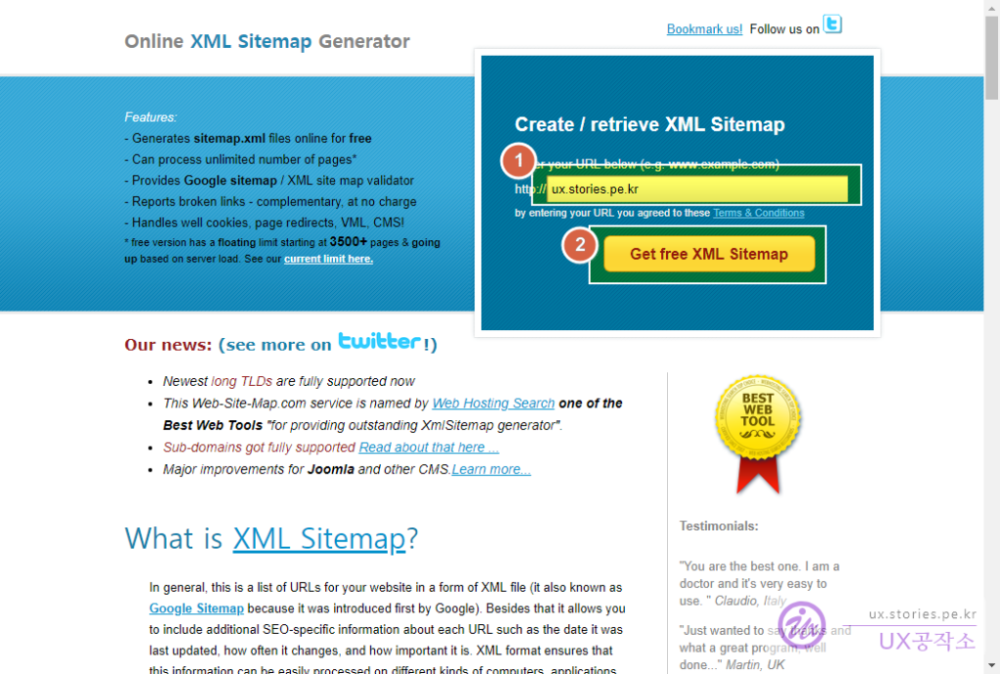
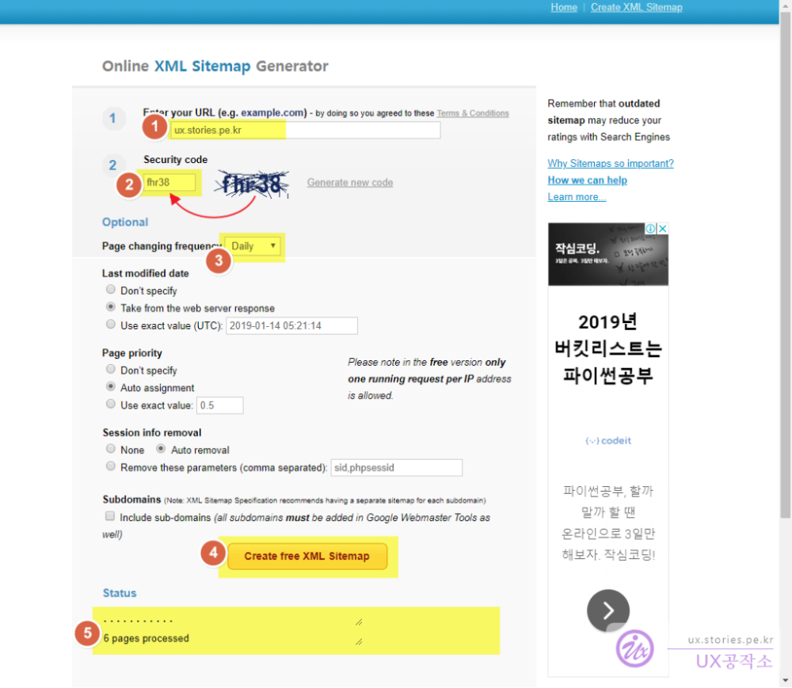
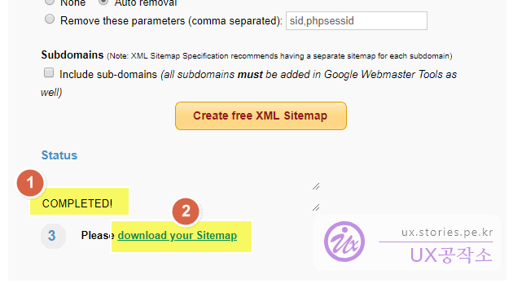
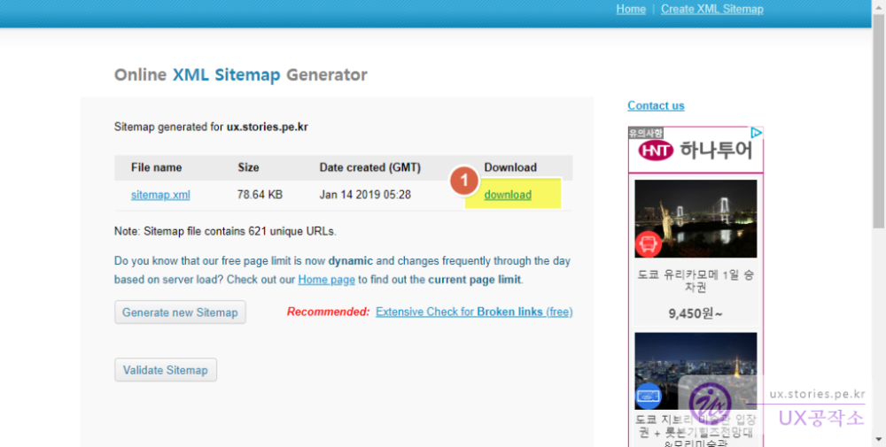
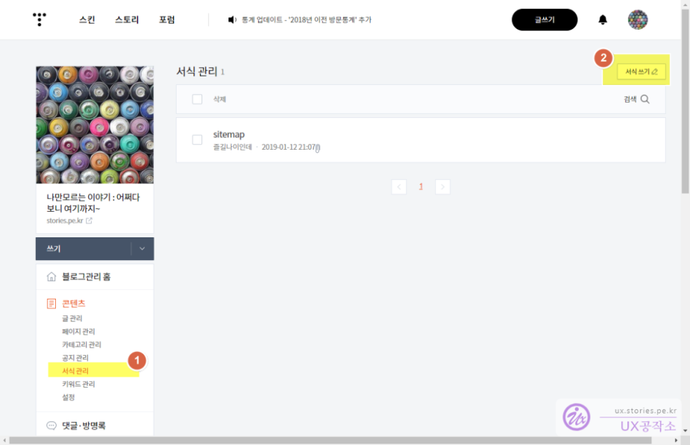
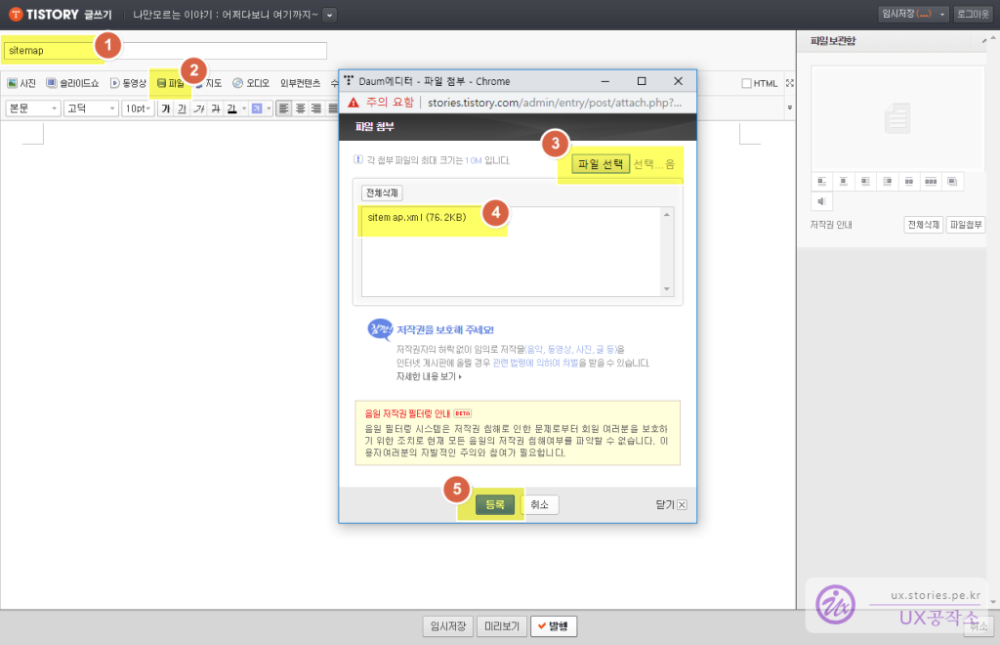
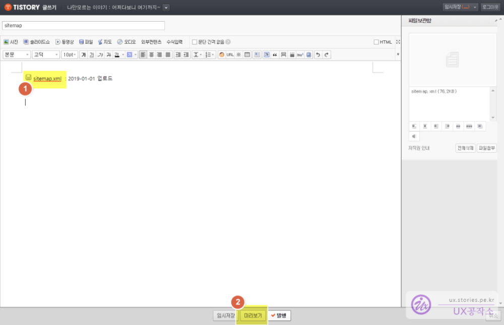
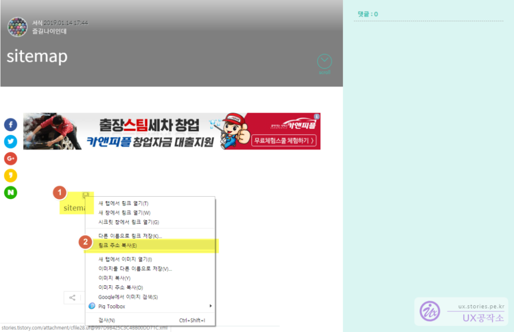
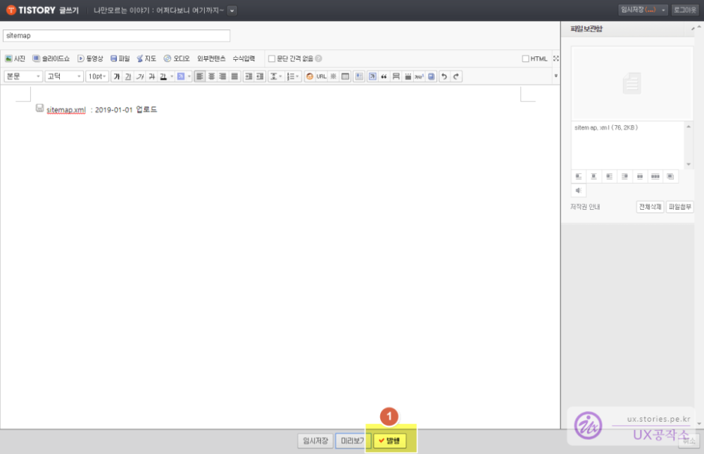

블로그를 운영한다면 한번은 해야 할 것이 각각 검색엔진에 내 사이트를 등록하는 것입니다.  
검색엔진들의 웹마스터도구 사용법에 대해서 나중에 따로 포스팅을 하겠지만 공통적으로 요구하는 것이, 등록하려는 블로그(웹사이트)의 `RSS` 정보와 `사이트맵`입니다.

검색엔진들은 이 RSS와 사이트맵으로 자신들의 `robot`을 보내서 웹사이트 정보와 컨텐츠 정보를 수집합니다. 또한 연결된 링크정보를 싹~ 다 찾아 다니면서 스스로 정보를 수집합니다. 이 수집된 정보는 정제해서 나중에 자신들의 검색엔진에 노출을 시켜 줍니다.
많은 사람들에게 Post된 글을 보여줘야 하는 블로거들에게는 꼭 필요한 작업이라고 할 수 있습니다.

보편적으로 RSS정보는 블로그 서비스 업체에서 개인 블로거URL 뒤에 `/rss`형태로 기능적으로 제공하기 때문에 문제가 없는데,  
사이트맵정보는 제공해 주지 않고 개인이 만들어야만 하는 숙제가 발생합니다.  
그래서 이번에는 간단하고 쉽게 `내 블로그의 sitemap.xml`을 만드는 방법에 대해서 포스팅하려고 합니다.

> 티스토리의 경우 RSS주소는 보통 자기 블로그 주소 뒤에 `/rss`가 붙은 주소를 사용합니다.  
> 예) 티스토리의 RSS : `https://uxgjs.tistory.com/rss`

# 내 블로그(웹사이트)의 sitemap.xml 만들기

사실 인터넷에 사이트맵을 만드는 것을 도와 주는 웹사이트가 있습니다.  
여러 종류의 웹사이트가 있지만 그 중에서도 사람들이 많이 사용하는 [Online XML Sitemap Generator](http://www.web-site-map.com) 를 사용하여 만드는 방법입니다.

> Online XML Sitemap Generator : http://www.web-site-map.com  
> 그
>   
> 먼저 홈페이지에 접속을 하면 위와 같은 화면이 나옵니다.

1. 자신의 블로그(웹사이트) 주소를 입력합니다.
1. `Get free XML Sitemap` 버튼을 클릭합니다.

상세정보를 입력하는 화면으로 이동합니다.

1. 이전 페이지에서 입력한 블로그주소가 자동으로 입력되어져서 넘어옵니다.
1. 안전코드로 옆에 있는 문자/숫자 조합을 똑같이 타이핑해서 입력을 합니다.
1. 페이지가 얼마나 자주바뀌느냐를 체크하는 것인데 `Daily`로 선택하시면 됩니다.
1. `Create free XML Sitemap` 버튼을 클릭합니다.
1. 그러면 Sitemap이 생성 중인 절차를 보여줍니다.

검색 후 블로그의 포스팅 양에 따라서 적게는 몇분에서 많게는 몇시간이 걸릴 수 있는 작업이니 `Status` 상태를 보면서 기다리시면 됩니다.

다른 세세한 옵션 설정은 잘 모르시면 그대로 놔두시고 제가 말씀위에 언급한 내용만 잘 입력하면 됩니다.

1. 시간이 좀 지나서 사이트맵 생성이 완료되면 `Completed`라는 문구가 생성됩니다.
1. 링크를 클릭하면 `다운로드 화면`으로 이동합니다.

1. `Download` 링크를 클릭하면 sitemap.xml이 파일형태로 다운로드 됩니다.

이 다운로드된 Sitemap.xml을 자신의 웹사이트에 업로드 후 링크정보(URL)를 각 검색엔진에서 제공하는 웹마스터 도구에 등록을 하면 됩니다.

본인의 블로그(웹사이트)가 설치형이거나 ftp로 파일을 업로드하여 링크정보를 획득할 수 있다면 그 링크정보를 사용하면 되지만,  
티스토리나 네이버틍 서비스형 블로그인 경우는 그렇게 할 수 없기 때문에 파일형태로 업로드 후 링크정보를 얻어내서 사용하면 됩니다.

# 생성된 Sitemap.xml을 티스토리에 올리기

티스토리의 스킨 파일 업로드를 활용하여 업로드를 할 수 있지만 그럴경우 스킨이 바뀐다던가 URL이 변경된다던가 하는 문제들이 생길 여지가 있기 때문에 다른 방법을 사용합니다.

##### 관리자 화면에서 서식으로 sitemap.xml 등록하기

티스토리 글쓰기 중 `서식관리`기능을 활용합니다.

  
사이트맵을 사용하기 위해서 `서식관리`기능을 활용합니다.

1. 관리자화면 왼쪽메뉴 중 `서식관리`메뉴를 선택합니다.
1. `서식쓰기`를 클릭합니다.

1. 제목을 임의로 작성합니다. 다만 `Sitemap`라고 작성하면 나중에 보더라도 이해가 쉽습니다.
1. `파일`메뉴를 클릭하니다.
1. 새로 생긴 창에서 `파일선택`을 클릭하고 이전에 다운받은 `sitemap.xml`을 찾아 선택합니다.
1. 정상적으로 등록된 경우 파일명이 보여집니다.
1. `완료`버튼을 클릭합니다.

  
파일이 정상적으로 업로드가 되면 파일명이 보여집니다. 옆에 업로드날짜를 기록하면 나중에 보기에 좋습니다.

1. `미리보기`버튼을 클릭합니다.

  
미리보기 화면에서 URL정보를 획득합니다.

1. 파일명에서 마우스 `오른클릭`을 선택합니다.
1. 나온 메뉴 창에서 `링크 주소 복사`를 선택합니다.

이제 복사된 URL을 활용 할 예정입니다. 메모장에 붙혀넣기를 해 놓던지 아니면 바로 웹마스터도구에 붙혀넣기 하셔도 됩니다

  
그리고 반드시 놓치지 말아야 할것은 `발행`버튼을 클릭하여 글을 등록해 주어야 합니다.  
글을 등록하지 않으면 서식은 남아 있지 않고 날라가 버립니다.

이렇게 Sitemap.xml의 링크정보를 획득하셨습니다. 이제 이 링크정보를 활용하기만 하시면 됩니다.

> [MS 빙(Bing) 검색엔진 웹마스터도구에 내 블로그 등록하기](https://stories.pe.kr/303)
> 구글 검색엔진 웹마스터도구에 내 블로그 등록하기  
> 네이버 검색엔진 웹마스터도구에 내 블로그 등록하기  
> 다음 검색엔진 웹마스터도구에 내 블로그 등록하기
