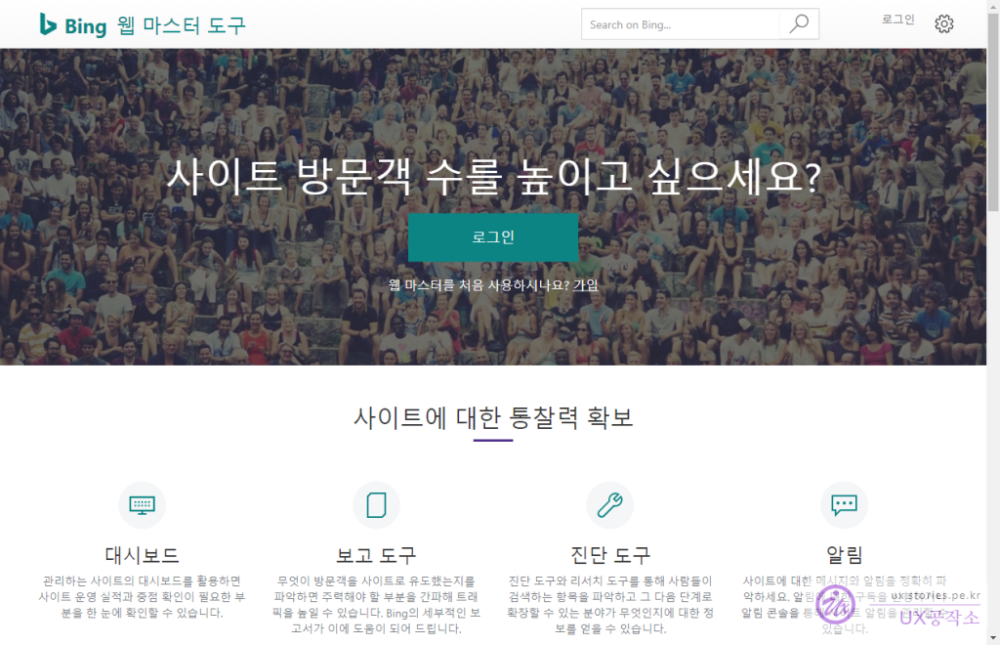
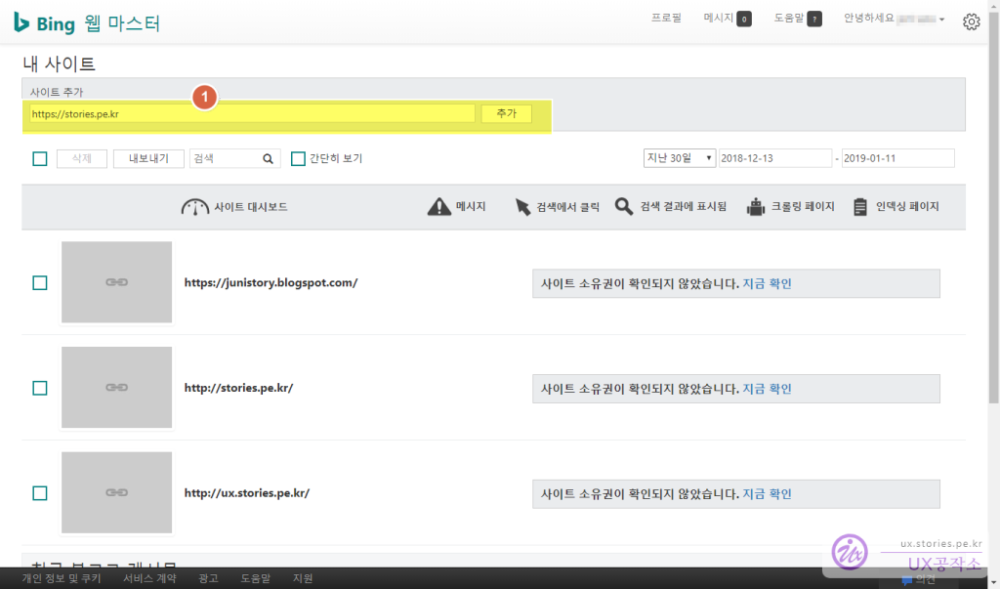
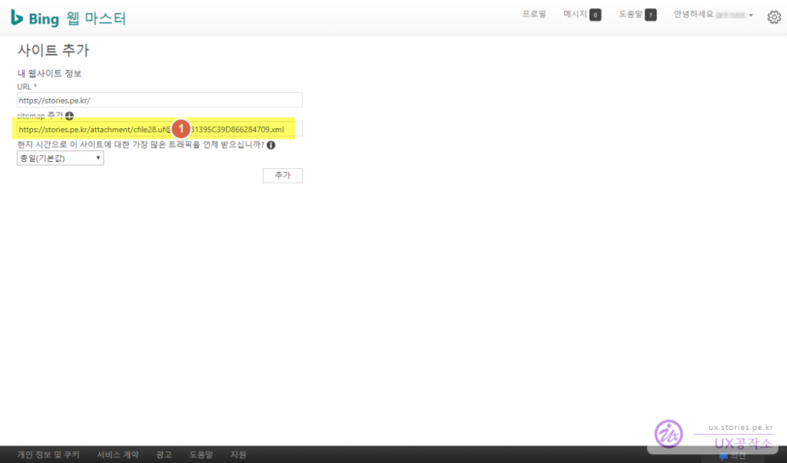
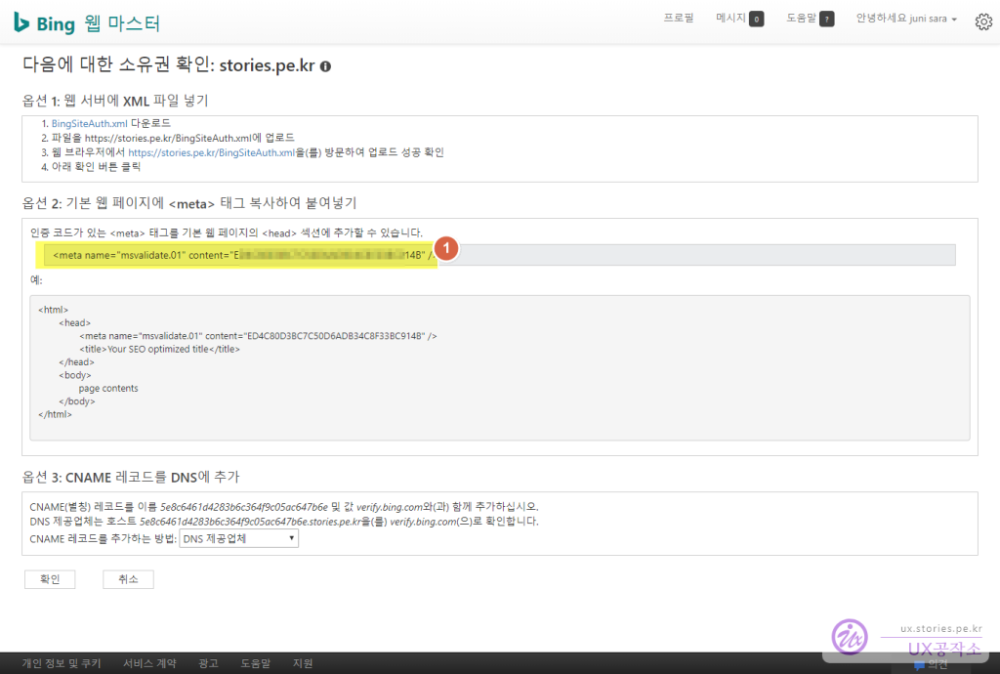
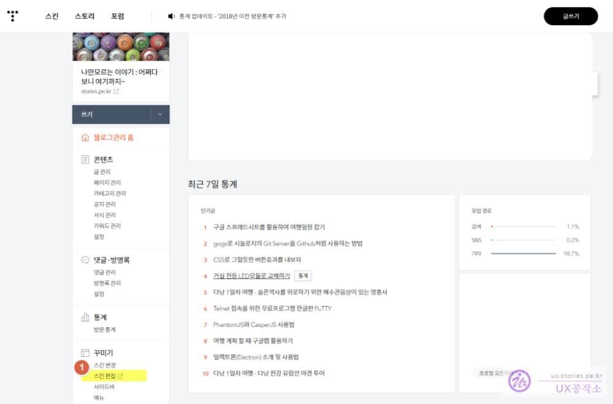
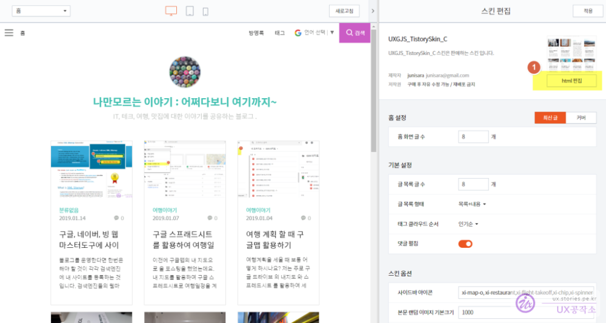
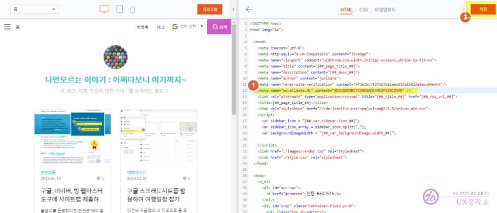
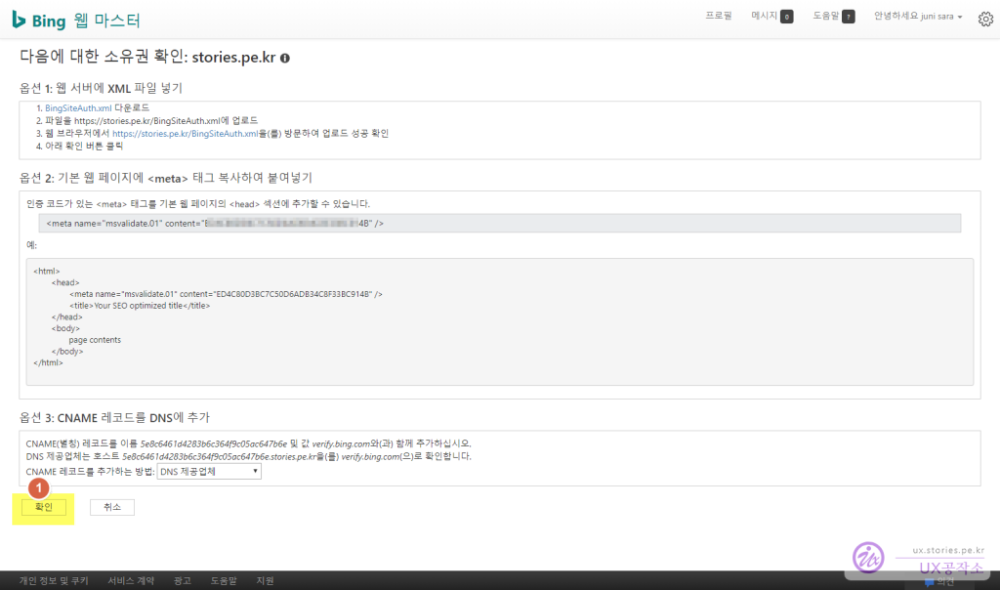
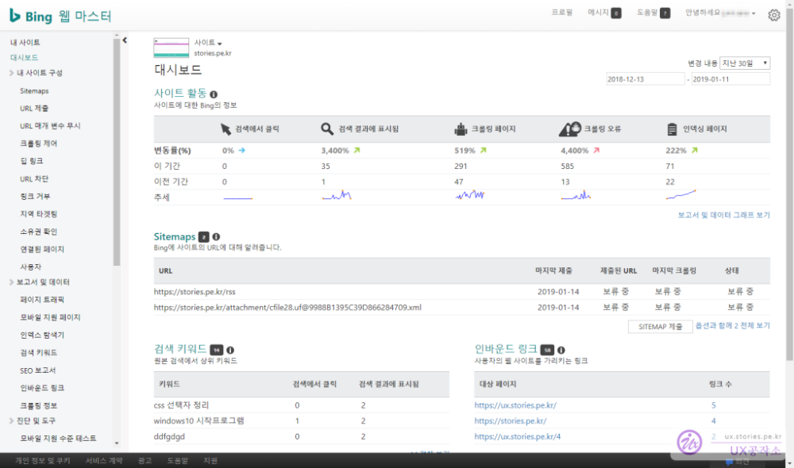

블로그를 만드시면 내 포스트가 많은 사람들에게 보여지게 하기 위해서 구글, 네이버, 다음, MS 등의 검색엔진에 등록을 해야 하는데요.  
보통 메이저 검색엔진의 경우 예전에는 기본 등록도 비용을 받았으나 이제는 `웹마스터도구`라는 서비스를 제공하면서 무료로 등록을 할 수 있게 하고 있습니다. 사용법도 그다지 어렵지 않기 때문에 업체를 통하지 않고 직접  등록을 하셔도 됩니다.  

각 검색엔진의 등록방법은 추후 포스팅할 예정이며 **이번에는 MS의 검색엔진인 빙 (Bing)에 등록하는 방법**을 포스팅 하겠습니다. 

# MS 검색엔진 빙(Bing)에 블로그 등록  

  

Bing 웹마스터도구에 접속을 합니다.  [Bing 접속하기](https://www.bing.com/toolbox/webmaster) 

회원가입을 하시거나 로그인을 먼저 하셔야 합니다.  

  
아래의 리스트에는 이미 등록되어 있는 사이트가 있지만 무시하시고....  
로그인을 하면 아래와 비슷한 화면을 볼 수 있습니다.  

1. `사이트 추가`에 추가하고자 하는 블로그 URL을 입력하시고 `추가` 버튼을 클릭합니다. 

  

1. 그림과 같이 `sitemap.xml`의 URL을 입력합니다  

> 내 블로그의 `sitemap.xml`을 획득하는 방법은 이전에 포스팅 한 [구글, 네이버, 빙 웹마스터도구에 사이트맵 제출하기](https://stories.pe.kr/304) 를 참조 하시면 됩니다.

  
**지금 등록하려고 하는 사이트가 정말 너가 관리하는 사이트인가???** 라는 것을 확인하기 위한 절차입니다.  
검색엔진에서 제안하는 **3가지 방법 중 하나를 선택해서 소유자 임을 증명** 하면 됩니다.  

> `옵션 1` 입증 방법 : Bing에서 제공하는 xml파일을 웹사이트 메인에 업로드하면 검색엔진이 확인을 합니다.  
> **`옵션 2` 입증 방법** : 티스토리같은 서비스형 블로그는 파일 업로드가 힘들기 떄문에 Bing에서 알려주는 META테그를 `HTML` 상단의 `<head>` 태그 영역에 등록을 하면 검색엔진이 확인을 합니다.   
> `옵션 3` 입증 방법 : 이도 저도 아니면 DNS서버에 `CNAME`을 등록해 놓으면 검색엔진이 확인을 합니다.   
3개 중 하나만 확인 하면 되고 블로그라면 보통 `옵션 2` 방법을 제일 많이 사용할 것입니다.   

1. `옵션 2`에서 제공하는 `<meta>` 태그를 그대로 복사를 합니다. 

   
이제는 티스토리 관리자 화면으로 이동하여 복사한 `<meta>` 태그를 붙혀 넣어야 합니다.   

1. `꾸미기` > `스킨편집` 버튼을 클릭합니다.  

   
스킨편집 메뉴 중 `HTML편집` 메뉴를 선택합니다.  

  
오른쪽에 HTML이 보입니다.  `<head>` 태그 내에 붙혀넣으면 됩니다. 

1. 복사해 놓은 `<meta`> 태그를 붙혀넣기 합니다. 
1. 저장을 클릭합니다. 

이제 내 블로그에 `<meta>`태그가 적용되었습니다. 다시 **Bing 웹마스터도구**로 이동하여 진행을 하면 됩니다.  

  
1. 이제 `확인`버튼을 클릭합니다.  

  
정상적으로 등록이 되었다면 오류메시지가 없이 위와 같이 정상적인 대시보드화면이 보여 집니다. 

사이트맵에 보면 `보류중`이라는 에러같은 메시지가 보이는데요. 이것은 하루, 이틀 지나면 정상적인 모습이 보여질 예정입니다.  
현재 `Bingbot`이 열심히 웹사이트를 크롤링 하고 있을 것입니다. 크롤링이 완료되면 정상처리 될 것이니 몇일 기다려 봅시다.   

만약 일주일이 지나도록 계속 `보류중`이면 문제가 있는 것이니 사이트맵 파일 주소가 맞는지, 정말로 내 웹사이트에 sitemap.xml이 있는지 확인이 필요할 것입니다.  

