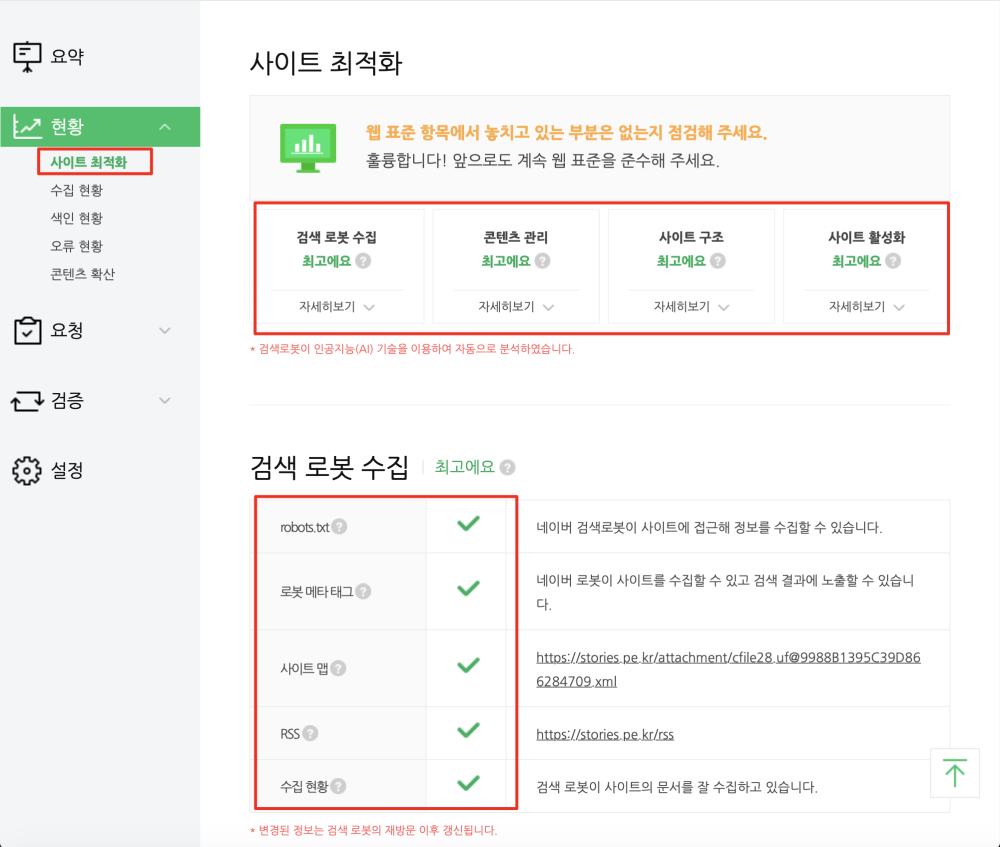

지난번 [MS 빙(Bing) 검색엔진에 내 블로그 등록하기](https://stories.pe.kr/303)에 이어 이번에는 네이버 검색엔진에 블로그 또는 웹사이트를 등록하는 방법을 포스트하려고 합니다. 

## 네이버 검색엔진에 블로그 등록   
네이버에서도 웹마스터도구를 제공해 주고 이곳을 통해서 블로그 또는 웹사이트를 등록하고 관리하고 살펴볼 수 있게 해 주고 있습니다.  
먼저 네이버 웹마스터도구에 접속을 합니다. 

<a href="https://webmastertool.naver.com" class="btn btn-primary">네이버 웹마스터도구 접속하기</a>  

  
해당 서비스는 네이버에 회원가입이 되어있어야 제공되는 서비스이기 때문에 먼저 로그인을 합니다.  

  
로그인을 하면 웹사이트를 추가하는 화면이 나옵니다.  
저는 기존의 블로그가 있어 리스트에 3개가 노출이 되고 있는데, 한번도 하지 않은 사람이라면 처음에 리스트가 보이지 않습니다.   
블로그를 추가하게 되면 리스트 목록에 하나가 추가될 것입니다. 

  
블로그를 추가하고 나면 네이버가 **정말 이 블로그가 네 블로그인가~**를 확인하기 위해서 3가지 조건을 요청합니다.  
이것을 모두 실행할 필요는 없고 이중에서 1개만 선택해서 입증을 하면 됩니다.  
보통은 두번째 입증방법으로 많이 합니다.  

1. 여기에서 html 파일을 다운로드 받아서 너가 제시하고 있는 웹사이트의 첫번째 폴더에 넣어라 그러면 내가 확인하겠다.
1. 여기에 보이는 메타태그를 너가 제시하고 있는 웹사이트의 index.html의 `<head>` 태그에 붙혀넣어라 그러면 내가 확인하겠다.
1. 소유확인을 하지 않고 검색해 추가해 주겠다.

1. 자동등록방지 입력란에 왼쪽에 보이는 그림에 있는 숫자/문자를 똑같이 입력합니다.  
1. `확인`을 선택해서 등록을 완료합니다. 

>    
> 2번 메타 태그 등록으로 선택했다는 가정으로, 먼저 티스토리의 > `스킨편집`으로 이동합니다.  
> 
>    
> 오른쪽에 있는 `HTML편집`을 선택합니다.  
> 
> ![티스토리의 HTML에 메타태그 삽입하기]> (images/2019-01-14-18-29-26.png)   
> 이제 `<html>`의 `<head>` `</head>` 사이에 복사한 태그를 삽입합니다.  > 저장을 하고 다시 네이버 웹마스터도구로 이동합니다.  

  
이번에 등록한 것은 저는 그냥 테스트이기 때문에 3번인 **소유확인없이 사이트 추가**를 선택해서 `소유 미확인`이란 꼬리표가 붙어있습니다.  
`소유 미확인`인 경우 네이버의 검색로봇이 와서 검색을 해 가지만 상세 상태는 확인을 하지 못합니다. 다시말하면 클릭해서 들어갈 수가 없습니다. 

저는 기존에 생성해 놓은 `https://stories.pe.kr`로 클릭하여 상세 내용으로 이동합니다.   

## 네이버 웹마스터도구  

  
메뉴를 간단히 설명하도록 하겠습니다.  

1. 요약 : 대쉬보드라고 할 수 있습니다. 전체적인 현황을 간략히 보여줍니다.  
1. 현황 : `요약`의 상세정보로 현재 사이트에 대한 검색현황을 자세히 보여줍니다. 
1. 요청 : 내가 작성을 해야 하는 항목입니다. rss정보 sitemap정보 제공 등.. 어떻게 보면 가장 중요할 수 있습니다. 
1. 검증 : 내 사이트가 잘돌아가고 있는지 검증하는 곳입니다. robot.txt 설정상태와 포스트 건건이 확인해 볼 수 있습니다. 
1. 설정 : 컨텐츠의 수집주기나 트레픽을 제한하는 곳입니다. 서비스형 블로그에서는 중요하지 않지만 일반 임대형 같이 대역폭 대비 비용을 지불해야 하는 웹사이트 경우는 검색엔진 트레픽을 설정하는 것이 좋습니다.  

### 요청하기 
블로그를 등록하고 내가 해야할 중요한 설정입니다.  
그중에서도 블로그라면 RSS제출과 Sitemap제출이 가장 중요합니다.  

#### RSS 제출하기  
  
블로그나 워드프레스 등 같은 경우는 대부분 RSS를 제공하고 있으며 URL은 보통 웹사이트 주소 뒤에 `/rss`가 붙어서 제공합니다.  
티스토리도 동일한데 웹사이트 주소 뒤에 `/rss`가 붙습니다.  
RSS로 수집된 검색정보는 네이버 검색의 `블로그` 카테고리에 노출이 됩니다.   

> https://stories.pe.kr/rss  

이렇게 등록을 하면 네이버의 검색엔진 로봇이 모두 스크랩을 해 갑니다. 포스트 량에 따라 시간이 다르겠지만 보통 하루 정도면 수집은 완료하고 2~3일정도 걸리면 검색목록에 반영이 됩니다.  

#### 사이트맵 제출하기   
  
RSS와 마찬가지로 사이트맵을 제출하는 것이 좋습니다.  
사이트맵을 통해서 검색된 것은 네이버 검색의 `웹사이트` 카테고리에 노출이 됩니다.  
하지만 블로그의 경우 사이트맵을 RSS와는 다르게 기본 제공하고 있지 않아서 난감한 경우가 발생하는 데요. 인터넷에서 이 Sitemap.xml을 자동으로 생성해 주는 서비스가 있습니다.   
이전에 제가 자세히 포스팅을 해 놨으니 [구글, 네이버, 빙 웹마스터도구에 사이트맵 제출하기](https://stories.pe.kr/304) 글을 참조하시면 됩니다.  

> [구글, 네이버, 빙 웹마스터도구에 사이트맵 제출하기 이동](https://stories.pe.kr/304) 

이렇게 획득한 `sitemap.xml`을 RSS 등록과 비슷한 방식으로 등록하시면 됩니다.  

  
문제없이 잘 등록되고 돌아가고 있으면 위의 그림처럼 `최고예요` 일색인 화면을 볼 수 있습니다.  
혹시 `주의`, `보통` 이런 문구가 나온다면 해당 부분을 잘 살펴보고 해결하는 것이 좋습니다.  
