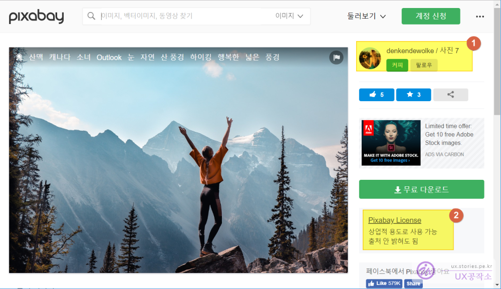
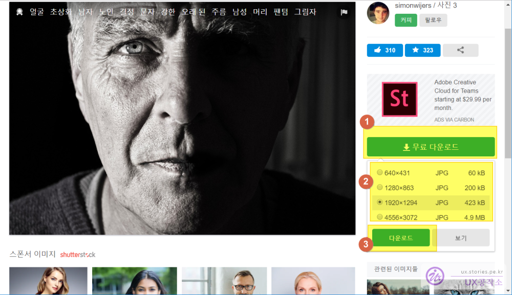

블로그를 운영할 때 가끔은 글밖에는 쓸게 없을 때가 있습니다.   
이럴때 이미지를 하나 넣어주면 좋겠건만..   
내가 알기로 인터넷에서 사진을 다운로드 받아서 올리면 저작권에 걸린다는데...

하지만 고맙게도 무료로 사진을 제공해 주는 웹사이트가 있습니다.   
검색을 해보면 많은 무료제공 이미지 웹사이트가 있겠지만   
그중에서도 가장 유명한 픽사베이를 소개해 드립니다.  

## 픽사베이(pixabay)  
**픽사베이**는 웹사이트 전체가 한글로도 서비스가 잘 되어 있어서 사용하는데 큰 문제가 없습니다.  
또한 조건에 따라서 상업적 용도로도 사용 가능하고 출처를 굳이 밝히지 않아도 됩니다.  
하지만 무턱대고 사용하지는 마세요. 상업적 용도로 사용할 수 없는 경우도 있으닌까요.

아래의 라이선스를 잘 확인하고 사용하시면 됩니다. 

  

1. 해당 사진을 제공하고 있는 작가 입니다. 무료로 제공해 주는 사진인 만큼 팔로우를 하거나 고마움을 표시하기 위한 커피한잔 주기도 있습니다. 강제는 아닙니다.  
1. 라이선스가 한글로 되어 있어서 쉽게 확인이 가능하니 안전합니다.  

### 다운로드 하는 방법  
다운로드 하는 것은 심히 단순합니다.   

   
1. 먼저 **무료 다운로드** 버튼을 클릭합니다.  
1. 보통 4개의 해상도를 선택할 수 있습니다. 기본으로 선택되어 있는 **1920 X 1294**보다 작은 해상도는 바로 다운로드가 가능하지만 최고 해상도는 회원 로그인을 해야만 다운로드가 가능합니다. 
1. **다운로드** 버튼을 클릭하면 실제로 이미지가 다운로드 됩니다. 

무료로 제공하고는 있지만 고마움의 표시를 해 주는것도 좋지않을까 합니다. 

경로는 아래와 같습니다.  
>[https://pixabay.com]( https://pixabay.com)  

