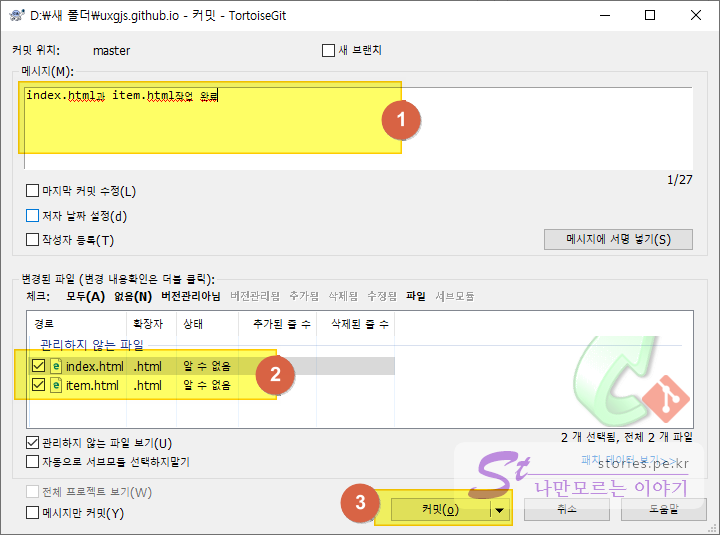

  
예전에는 인터넷에 홈페이지를 만들기 위해서는 보통 무료 또는 약간의 비용을 지불하고 웹호스팅 서비스를 받아서 그곳에 HTML을 올리는 방법이 일반적이였습니다. 웹호스팅이라고 하면 보통 APM(Apache + PHP + MySql)를 사용할 수 있어서 제로보드, 그누보드, 워드프레스 등으로 홈페이지나 블로그를 만들었었습니다.   
하지만 이제 시대가 많이 바뀌어서 다른 방법으로도 나만의 홈페이지나 블로그를 만들수 있게 되었습니다. 그 중에 하나가 **Github**의 **Pages**라는 서비스를 사용하여 Static한 홈페이지나 블로그를 운영할 수 있습니다. 

**Static Site Generators**로 웹사이트를 제작해서 Github의 Pages에 업로드하여 서비스하는 것이 일반적입니다. **Static Site Generators**라 함은 `nodejs`, `go`, `java`, `Ruby `등의 언어와 템플릿을 사용하여 정적인 HTML 웹페이지를 만들어 주는 서비스를 말합니다. 굳이 개발 언어를 몰라도 됨니다. 단지 글을 쓸 수 있는 마크다운(Markdown)정도만 알면 내가 작성한 글을 인터넷에 올릴 수 있습니다. 대표적으로 `Jekyll`, `Hugo`, `Hexo`, `GitBook` 등등이 있습니다. 

하지만 이번에는 그냥 단순히 Github에 Pages를 생성하고 `index.html`과 `item.html`를 업로드 해서 확인하는 정도만 작성하려고 합니다.  

## Github 가입하기   
먼저 Github을 사용하기 위해서 Github에 가입을 해야 합니다.   
아래 URL에 접속합니다.  

> https://github.com  

1. `Sign up` 버튼을 클릭해서 회원가입 페이지로 이동해도 되고 
2. 매인화면에서 회원가입을 해도 됩니다.  

1번을 누르든 2번을 누르든 결국 회원가입 페이지로 이동합니다.  

  
이름과 이메일, 비밀번호로 간단하게 회원가입을 할 수 있습니다. 

사람인지 로봇인지 구분하기 위해서 그림의 방향을 맞춰줘야 합니다.  

## Github Pages 만들기   
회원가입을 했으니 이제 본격적으로 페이지를 만들어 보겠습니다. 페이지는 대표 페이지가 있고 프로젝트 페이지가 있습니다. 

- **대표 페이지** : `http://username.github.io`로 생성 (서브 도메인)    
- **프로젝트 페이지** : `http://username.github.io/repository`로 생성 (서브 디렉토리)  

사용자나 조직의 **대표 페이지**는 **서브 도메인 형태**로 URL이 생성되고 **프로젝트 페이지**는 도메인 뒤쪽에 **디렉토리 형태**로 URL이 생성됩니다.  

대표 페이지를 생성하려면 별도의 레파지토리를 하나 생성해야 합니다. 그리고 레파지토리의 이름은 반드시 `username.github.io`명으로 생성해야 합니다. (**username**은 사용자나 조직의 이름을 입력해야 함) 

  

1. `Owner명`은 **username**로 지정되어 있습니다.   
2. 레파지토리를 만들어야 하는데 반드시 `Owner명.github.io`로 만들어야 합니다.  그렇지 않으면 프로젝트 페이지로 생성이 됩니다.   
3. 페이지는 공개가 목적이므로 Public를 선택합니다. 
4. 레파지토리를 생성합니다.  

### 확인하기   

#### 프로젝트 웹사이트 보기   
   

 1. `https://github.com/uxgjs/uxgjs.github.io` URL로 접속하면 위와 같은 Github화면이 나옵니다.  

#### 페이지(웹사이트) 보기   
  
1. `https://uxgjs.github.io`로 접속하면 위와 같이 웹사이트 화면이 나옵니다.    

## Github Pages 사용하기   
이제 해당 레파지토리에 파일을 업로드하고 서비스가 되는지 확인해 봐야합니다. 직접 github페이지에서 파일을 생성할 수도 있지만 여기서는 로컬PC에서 업로드해서 확인하는 것을 설명하겠습니다.  

### 필수 프로그램 설치하기  
서버는 이미 git이 설치되어 있을테지만 로컬PC에는 Git을 설치해야 합니다. 보통 Git을 GUI툴과 같이 사용하기 때문에 Git과 Git GUI 2개정도를 설치합니다.  

1. [Git SCM](https://git-scm.com/downloads)  
1. [Git GUI TortoiseGit](https://tortoisegit.org/)  

#### Git SCM 설치   
Git을 사용해야 하기 때문에 로컬PC에 반드시 Git을 설치해야 합니다. 설치는 어렵지 않습니다.   

   

>  [Git SCM 홈페이지 바로가기](https://git-scm.com/downloads)

#### Git GUI 설치 (Tortoise Git)   
Git이 텍스트로 명령을 내리는 `CLI`기반이기 때문에 사용을 도와줄 그래픽툴이 필요합니다. OS가 Windows라면 `Tortoise Git`을 많이 사용합니다.   

    

>  [Tortoise Git 홈페이지 바로가기](https://tortoisegit.org/)  

---  

### Clone 하기    
이제 설치할 프로그램은 모두 설치했으므로 생성된 레파지토리를 로컬PC로 Clone합니다. 먼저 새로 생성한 저장소(`https://github.com/username/username.github.io`)에 접속합니다.   

  
1. `Clone or download` 버튼을 클릭합니다. 
2. URL을 클립보드에 복사합니다. 

  
   
1. 로컬PC에서 원하는 위치에 Clone(복제))합니다.  

   
Clone이 완료되면 생성된 폴더에 파일이 다운로드 됩니다. 이제 이 폴더에 index.html파일을 만들고 업로드를 해보려고 합니다.  

### HTML 생성하기  

   
  
index.html과 item.html 페이지를 임의로 만들었습니다.  

### Commit 하기    
페이지를 모두 만들었다면 이제 `Commit`을 해야 합니다. 
`Commit`은 내 로컬PC의 git에 현재까지의 작업에 대해 스냅샷을 찍는 명령어 입니다. 
`Commit`을 한 후 업로드(Push)해야 합니다.   

 
1. 폴더의 빈공간을 마우스 우클릭하고 커밋을 선택합니다.  

   
커밋하기 창에서 커밋할 내용을 확인하고 커밋합니다. 

1. 메시지를 작성합니다. 필수작성해야 합니다. 
2. Commit하고자 하는 파일을 모두 체크 합니다. 
3. 커밋 합니다. 

### Push 하기    
커밋만 하면 로컬PC에만 반영됩니다. 이 반영된 것을 서버(github)에 올릴려면 `Push`까지 해줘야 합니다.   

   
커밋이 완료되면 `Push`할 수 있는 버튼이 보입니다. 꼭 이때 Push를 하지 않아도 됩니다. 나중에 Push 명령어를 실행 시켜도 문제 없습니다. 

   

1. 업로드할 서버의 위치를 확인합니다. 
2. 확인을 누르면 업로드가 됩니다. 

### 확인하기   
다시 확인해 보겠습니다.  

   

`https://github.com/uxgjs/uxgjs.github.io` 에 접속하여 2개의 파일이 업로드 된것을 확인할 수있습니다. 

  

위와 같이 `https://uxgjs.github.io`에 접속하여 `index.html` 화면이 나오는 것을 확인할 수있습니다. 

> 업로드는 완료되었는데 웹사이트가 예전 것이 보이는 경우가 있습니다. 이럴 경우 몇번 더 `Commit`과 `Push`를 해보면 반영이 됩니다.   

## Google의 애드센스에서 ads.txt 문제  
Google의 애드센스에서 `ads.txt` 문제를 해결하기 위해서 업로드하여 사용 할 수도 있습니다. 아래 포스팅을 참조하세요. 

> [수익 손실 위험!! ads.txt 파일 문제를 해결하는 방법](https://blog.stories.pe.kr/378)
