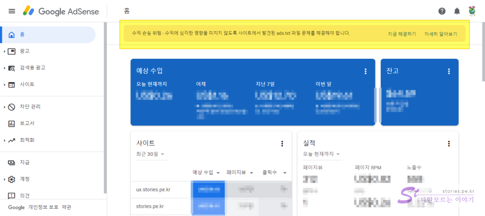
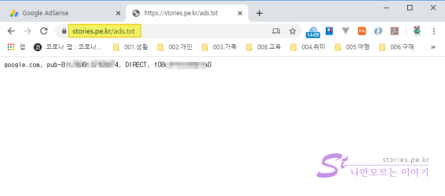
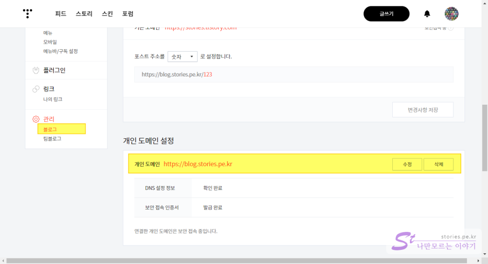

티스토리를 운영하는 사람들은 대부분 애드센스를 붙혔을 것입니다. 그런데 언제부턴가 일부 사용자의 애드센스 관리자 화면에 아래와 같은 메시지가 나타나기 시작했습니다.

**수익 손실 위험 - 수익에 심각한 영향을 미치지 않도록 사이트에서 발견된 ads.txt 파일 문제를 해결해야 합니다.**

뭔가 내 수익에 굉장한 손해가 일어날것 만 같은 문구입니다.

몇달을 묵혀두면서 확인하고 알아 본 결과 이 문구가 있을뿐 저는 계속 수익이 발생한다는 것이였습니다. 그럼에도 불구하고 문구의 찜찜함은 도저히 해결이 되지 않더군요. 그래서 약간의 트래픽 손해를 감수하면서 해결한 내용을 정리해 볼까 합니다.

## 원인

구글의 설명에 의하면 원인은 아래와 같습니다.

> 공식 디지털 판매자 또는 ads.txt는 승인받은 것으로 확인된 판매자(예: 애드센스)를 통해서만 디지털 광고 인벤토리가 판매될 수 있게 해주는 IAB 솔루션입니다. ads.txt 파일을 직접 만들면 사이트에서 광고를 판매할 수 있는 판매자를 더 효과적으로 관리할 수 있으며, 가짜 인벤토리가 광고주에게 판매되는 것을 방지할 수 있습니다.

쉽게 말하면 **이 도메인의 주인이 너냐??? 주인한테만 광고비를 지급하겠다. 너가 주인임을 밝혀라** 라는 의미라고 보시면 될 것 같습니다.

초기에는 `xxx.tistory.com` 식의 티스토리 공식 개인 블로그 주소에도 ads 경고를 붙혔다고하는데 지금은 구글에서 예외처리를 해주었다고 합니다.
문제는 개인이 도메인을 구매해서 티스토리 붙힌 **개인 도메인 사용자**에게 보여지는 문제인것 같습니다.  
저도 개인 도메인으로 **https://stories.pe.kr** 과 **https://ux.stories.pe.kr** 등을 운영하고 있어서 위와 같은 경고를 받았습니다.

## 해결책

이 문제를 해결하기 위해 많은 사람들이 구글이나 티스토리에 문의하고 요청을 했으나 구글은 티스토리에게, 티스토리는 구글에게 해결을 요청하라고 미루고 있는 실정이라고 합니다. 다시말해 해결 할 기미가 보이지 않는다는 것 입니다.

**이 문제의 근본적인 해결 방법**은 자신의 도메인의 루트 폴더에 `ads.txt` 파일을 업로드하고 웹브라우저에 URL을 입력하면 `ads.txt`를 보여주거나 다운로드 받을 수 있게 되면 해결되는 됩니다.

**https://[자신의 도메인]/abs.txt**

- 예제 : https://stories.pe.kr/ads.txt // 저의 개인 도메인 명입니다. ^^

하지만 티스토리의 문제는 구조적으로 저게 되지 않는다는데 있습니다. 아마 이 글을 보시는 80% 이상의 님들은 모두들 여기서 막혀서 제 블로그 까지 왔지 않을까 합니다 .^^

### 제가 해결한 2가지 방법

제가 해결한 방법을 설명 하기 전 이해를 돕기 위해 제 도메인을 예로 들어 설명하겠습니다.

- **개인 도메인의 매인 도메인** : https://stories.pe.kr
- **개인 도메인의 서브 도메인** : [https://**ux**.stories.pe.kr](https://**ux**.stories.pe.kr)
- **해결을 위해 새로 생성한 서브 도메인** : [https://**blog**.stories.pe.kr](https://blog.stories.pe.kr)

### [첫번째 방법] : 기존에 개인 서브 도메인으로 운영했던 경우 해결 방법

만약 아래와 같이 개인 도메인의 **서브 도메인**으로 블로그를 운영하셨다면 그나마 쉽게 해결할 수 있습니다.

- 예제 : https://ux.stories.pe.kr // `ux`라는 서브 도메인으로 블로그 운영

서브 도메인으로 블로그를 운영한다면 **매인 도메인**인 `https://stories.pe.kr`는 다른 서버에서 사용 할 것입니다. 그러면 그 도메인의 서버 **루트폴더**에 `ads.txt`를 넣고 읽혀지는지를 확인해 보면 쉽게 해결 됩니다.

만약에 **개인 메인 도메인을 사용하지 않고 놀고 있다면** 어딘가에 서버 공간을 만들어서 `ads.txt`를 업로드하고 메인 도메인과 연결 시켜주면 됩니다. 저는 그 서버 공간을 **github**의 `Pages`기능을 사용해서 해결 했습니다.

**첫번째 방법의 해결 순서는 아래와 같습니다.**

1. github Pages를 생성하고 ads.txt 를 업로드 합니다.
2. github Pages의 공식 개인 도메인(https://stories24.github.io)을 내 개인 도메인(https://stories.pe.kr)으로 변경 합니다.
3. `ads.txt`를 업로드하고 웹브라우저에서 불러와 지는지 확인 합니다.

#### 1. github Pages를 생성하고 ads.txt 를 업로드 합니다.

**github**은 개발자들이 자신의 개발 소스를 관리하고 공개하는 매우 유명한 **무료 버전관리 웹사이트**입니다.  
제가 github을 선택한 이유는.. 무료이면서 트래픽에 크게 상관없이 Pages기능으로 Static하지만 **웹사이트를 생성**할 수 있기 때문입니다.  
github Pages를 생성하는 방법과 adb.txt를 업로드하는 방법은 내용이 많아서 별도로 포스팅했습니다. 상세한 내용은 아래 글을 참고 하세요.

> [Github Pages로 Static한 블로그나 홈페이지 만들기](https://blog.stories.pe.kr/380)

#### 2. github Pages의 공식 개인 도메인을 내 개인 도메인으로 변경 합니다.

github Pages에서 자동으로 주어지는 공식 개인 도메인(https://stories24.github.io)을 내 개인 도메인(https://stories.pe.kr)으로 변경 합니다.  
`Whois`나 `cafe24` 같은 도메인을 구매한 곳에서 내 도메인을 github 페이지로 연결해야 합니다. 그러면 `https://stories.pe.kr` 이 github Pages로 연결이 됩니다. 연결하는 방법을 별도로 포스팅 했습니다. 아래의 링크를 참고하세요.

> [github Pages의 공식 개인 도메인을 내 개인 도메인으로 변경하는 방법](https://blog.stories.pe.kr/381)

#### 3. `ads.txt`가 웹브라우저에서 불러와 지는지 확인 합니다.

생성한 개인 매인도메인의 서버에 `ads.txt`를 올리고 아래와 같이 매인도메인에서` ads.txt`를 볼 수 있으면 해결된 것입니다.

> https://stories.pe.kr/ads.txt

위와 같은 정상적인 결과물이 나온다고 해도 애드센스에 바로 반영이 되는 것은 아니고 구글 봇이 한바퀴 돌 때까지 몇일 기다려야 하며 그 후에 Alert이 사라집니다.

### [두번째 방법] : 기존에 매인 도메인으로 운영했던 경우 해결 방법

아래와 같이 개인 도메인의 **메인 도메인**으로 블로그를 운영하셨다면 검색엔진의 손실을 감수 해야 합니다.

**메인도메인 :** https://매인도메인.com

- 예제 : https://stories.pe.kr // 매인 도메인으로 블로그 운영

**개인 매인도메인**을 티스토리로 운영했다면 `ads.txt`문제를 해결하기 위해서는 매인도메인 주소를 서브 도메인 주소로 바꿀 수 밖에 없습니다. 도메인 주소를 바꾼다면 생각해야 할 문제가 몇가지가 있습니다.

1. 검색엔진에서 순위가 떨어질수 있음
2. 서브도메인의 블로그 주소로 처음부터 다시 인지도를 쌓기 시작해야함
3. 검색엔진이 도메인 및 사이트를 스팸처리하여 검색이 되지 않을 수 있음 (해결 가능)
4. 기존의 주소로 들어올 경우 `404 Not Found` 오류 발생 (해결 가능)

1, 2는 해결이 불가능하나 3, 4는 해결이 가능합니다. 이것을 감수하고라도 변경하려면 아래의 방법대로 하시면 됩니다.

**두번째 방법의 해결 순서는 아래와 같습니다.**

1. github Pages를 생성하고 `ads.txt` 를 업로드 합니다.
2. 예전 블로그로 들어온 사용자를 새 블로그 주소로 redirect하기 위한 html(javascript)을 생성합니다.
3. github Pages의 공식 개인 도메인(https://stories24.github.io)을 내 개인 도메인(https://stories.pe.kr)으로 변경 합니다.
4. `ads.txt`가 웹브라우저에서 불러와 지는지 확인 합니다.
5. 티스토리 관리자에서 예전 블로그 주소를 새로운 블로그주소로 변경 합니다.
6. 네이버 및 구글의 검색에 새로운 블로그를 등록합니다.

#### 1. github Pages를 생성하고 ads.txt 를 업로드 합니다.

**github**은 개발자들이 자신의 개발 소스를 관리하고 공개하는 매우 유명한 **무료 버전관리 웹사이트**입니다.  
제가 github을 선택한 이유는.. 무료이면서 트래픽에 크게 상관없이 Pages기능으로 Static하지만 **웹사이트를 생성**할 수 있기 때문입니다.  
github Pages를 생성하는 방법과 adb.txt를 업로드하는 방법은 내용이 길어서 별도로 포스팅했습니다. 상세한 내용은 아래 글을 참고 하세요.

> [Github Pages로 Static한 블로그나 홈페이지 만들기](https://blog.stories.pe.kr/380)

#### 2. 예전 블로그로 들어온 사용자를 새 블로그 주소로 redirect하기 위한 html(javascript)을 생성합니다.

도메인 주소가 변경된 경우 이미 검색엔진에 뿌려진 예전 도메인 주소로 들어온 방문자는 내용이 없다는 오류페이지를 만나게 될 것입니다. 그 방문자도 놓칠 수 없는 소중한 트래픽이기 때문에 버릴 수는 없습니다. 이 방문자가 새로 생성한 도메인으로 자동으로 redirecting해주기 위해 javascript를 생성해 주어야 합니다. 아래의 포스팅을 참고하세요.

> [도메인 주소 변경 후 새 도메인 주소로 redirect 하기 위한 쉽고 안전한 방법](https://blog.stories.pe.kr/382)

#### 3. github Pages의 공식 개인 도메인을 내 개인 도메인으로 변경 합니다.

github Pages에서 자동으로 주어지는 공식 개인 도메인(https://stories24.github.io)을 내 개인 도메인(https://stories.pe.kr)으로 변경 합니다.  
`Whois`나 `cafe24` 같은 도메인을 구매한 곳에서 내 도메인을 github 페이지로 연결해야 합니다. 그러면 `https://stories.pe.kr` 이 github Pages로 연결이 됩니다. 연결하는 방법을 별도로 포스팅 했습니다. 아래의 링크를 참고하세요.

> [github Pages의 공식 개인 도메인을 내 개인 도메인으로 변경하는 방법](https://blog.stories.pe.kr/381)

#### 4. `ads.txt`가 웹브라우저에서 불러와 지는지 확인 합니다.

아래와 같이 매인 도메인에서 ads.txt를 볼 수 있으면 해결된 것입니다.

> https://stories.pe.kr/adb.txt

#### 5. 티스토리 관리자에서 예전 블로그 주소를 새로운 블로그주소로 변경 합니다.

티스토리의 관라화면에서 `관리` > `블로그` 메뉴로 접근합니다.

개인 도메인 설정 부분에서 수정을 통해 개인 메인도메인을 새로 사용할 개인 서브도메인으로 변경합니다.
저는 `https://stories.pe.kr` 에서 `https://blog.stories.pe.kr` 로 변경하였습니다.  
악간의 시간이 흐르면 **보안 접속 인증서가 자동으로 발급 완료**됩니다.

이제는 새로운 도메인인 `https://blog.stories.pe.kr`로 티스토리가 접속이 됩니다.

#### 6. 네이버 및 구글, 빙의 검색에 새로운 블로그를 등록합니다.

이제 새로운 도메인을 네이버 **Search Advisor의 웹마스터도구**와 구글 **Search Console**, 빙 검색엔진에 다시 등록을 하여 널리 전파하시면 됩니다.

- [네이버 검색엔진에 블로그 등록하기](https://blog.stories.pe.kr/310)
- [MS 빙(Bing) 검색엔진에 내 블로그 등록하기](https://blog.stories.pe.kr/303)
- [구글, 네이버, 빙 웹마스터도구에 사이트맵 제출하기](https://blog.stories.pe.kr/304)
