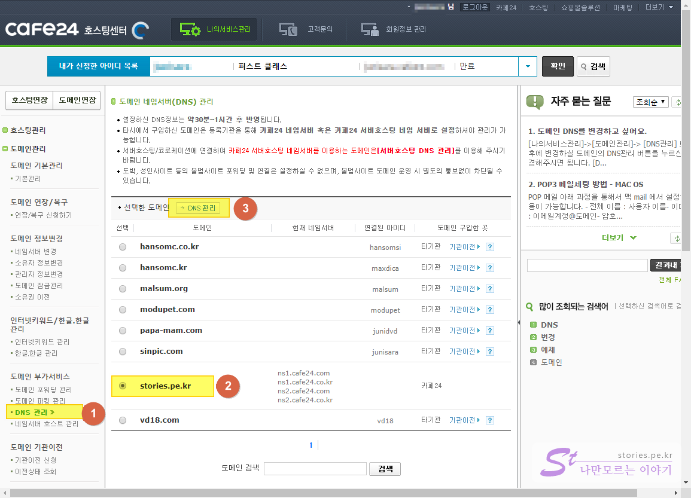
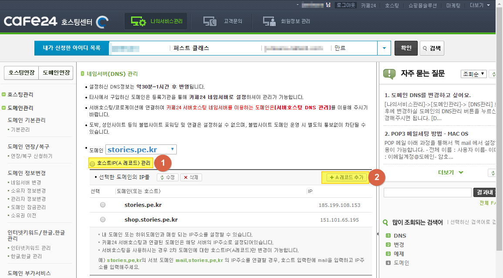
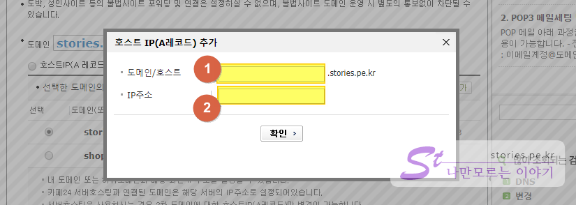
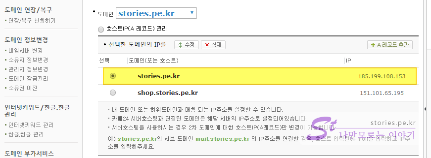
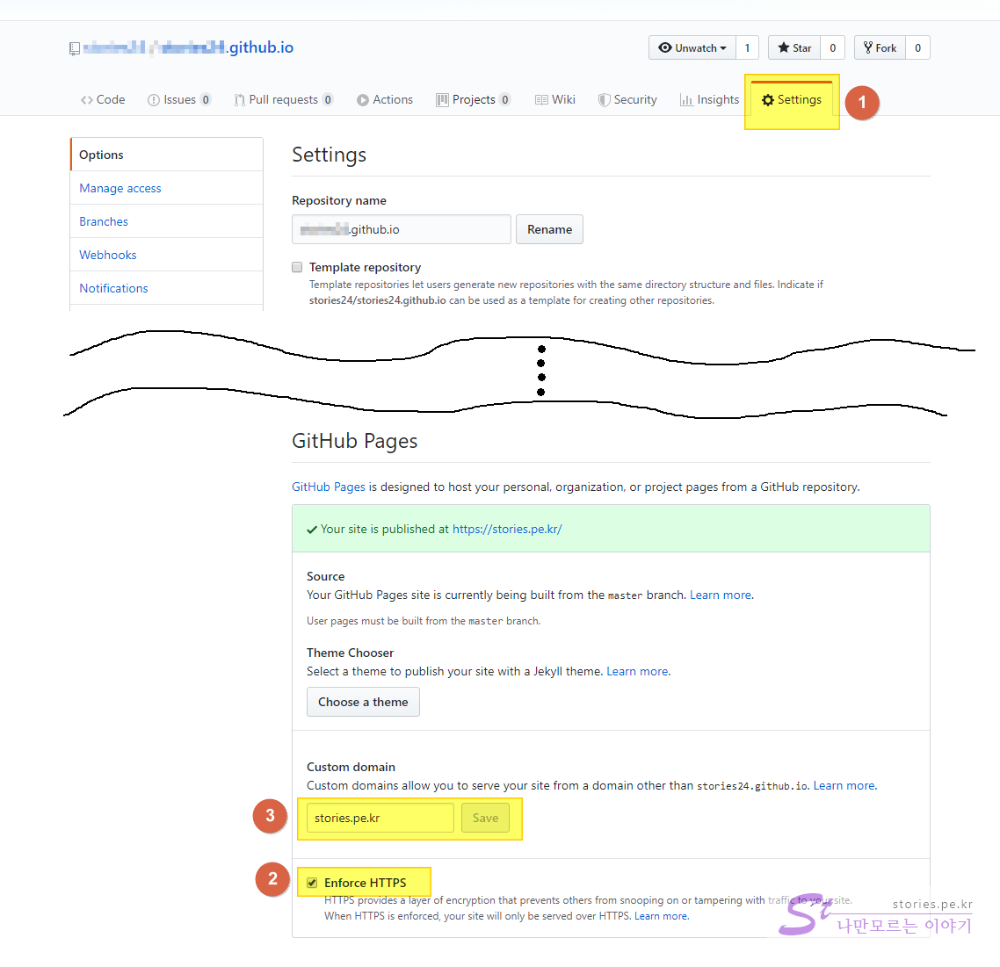

  
github의 Pages기능을 이용하여 블로그 또는 홈페이지를 만드는 방법을 이전에 포스팅을 했었습니다.  

  > [Github Pages로 Static한 블로그나 홈페이지 만들기](https://blog.stories.pe.kr/380) 참고하세요. 

Github으로 블로그나 홈페이지를 만들면 기본적으로 `https://username.github.io` 이런식으로 자신의 `Username`에 github 공식 도메인을 붙혀서 발급 받게 됩니다.  그러나 나만의 도메인을 구매해서 이 주소를 대체 할 수 있습니다.  

## 1. 도메인 구입   
먼저 도메인을 구입해야 합니다. 도메인은 [가비아](https://domain.gabia.com/), [후이즈](https://whois.co.kr/), [카페24](https://www.cafe24.com/?controller=domain_search) 등 국내의 도메인 네임서버에서 구입을 할 수 있습니다.  
이 포스팅에서는 구매하는 방법은 생략하겠습니다.  

## 2. 구입한 도메인을 Github의 IP주소로 연결   
모든 도메인 네임서버에서는 구입한 도메인을 특정 IP주소로 연결해 주는 기능이 있습니다.   
우리는 구매한 도메인을 Github Pages IP로 연결해줘야 합니다. 

>  **Github Pages의 IP 주소**  
> - 185.199.108.153
> - 185.199.109.153
> - 185.199.110.153
> - 185.199.111.153

저는 **카페24**에서 구매를 했으므로 카페24를 기준으로 예를 들어 설명하겠습니다. 
먼저 카페24에 로그인을 합니다.  

    

1. DNS관리 메뉴를 선택합니다.  
2. 구입한 도메인 중 연결하고자 하는 도메인을 선택합니다.  
3. DNS관리 버튼을 클릭합니다.  

   
1. Github는 **A레코드**로 등록을 할 수 있습니다.  저는 이미 등록한 A레코드가 있어서 리스팅 되어 있지만 처음에는 리스트가 없습니다. 
2. `A레코드추가` 버튼을 클릭합니다. 

    
1. 팝업창 중 도메인/호스트에는 호스트명을 작성합니다. 보통 `www`나 빈칸을 입력하면 메인도메인으로 사용하겠다는 의미이고 단어를 입력하면 해당 단어를 서브도메인으로 사용하겠다는 의미입니다.    
2. IP주소는 Github Pages IP주소 중 하나( 예> 185.199.108.153 )를 선택해서 입력하면됩니다.   

> 만약 애드센스의 `ads.txt`를 인증하기 위한 것이라면 **도메인/호스트 란**은 **빈칸**으로 놓고 IP주소만 입력해야 합니다.  

   
이렇게 `stories.pe.kr` 처럼 나오면 등록이 완료된 것입니다.  

도메인 네임서버에서 할일은 끝났습니다. 

## 3. Github pages repository 에서 도메인 설정    
도메인 네임서버에서 위와 같이 설정을 했으면 이제  `https://stories.pe.kr`로 접속을 하면 Github Pages(185.199.108.153)로 넘어오게 됩니다.  
이렇게 넘어온 사람에게 나의 Github Pages가 보이게 도메인 설정을 해줘야 합니다.  

   
1. Github Pages의 레파지토리 설정 버튼을 클릭해서 설정화면(현재화면)으로 들어옵니다.  
2. 설정화면 아래쪽으로 내려오면 **Github Pages 설정** 칸이 나옵니다. HTTP로 접속을 해도 자동으로 HTTPS로 넘겨주기 하려면 체크해 줍니다.  
3. 구매한 도메인명(stories.pe.kr)을 입력하고 `Save`를 눌러줍니다.  

완료되었습니다.   

## 4. 확인하기  
설정은 완료되었습니다. 이제 내가 구매한 도메인을 웹브라우저에 입력했을 때 해당 Github Pages가 나오는지 확인하면 됩니다.   
하지만 일반적으로 도메인을 세팅하면 바로 연결을 확인할 수 있는게 아니고 해당 주소의 정보가 인터넷의 다른 DNS서버에서 인식되기까지 기다려야합니다. 그래서 빠르면 몇십분 늦으면 몇일 걸려야 웹브라우저에서 변경된 주소를 확인 할 수 있습니다.   

