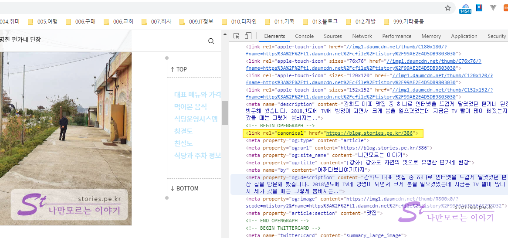
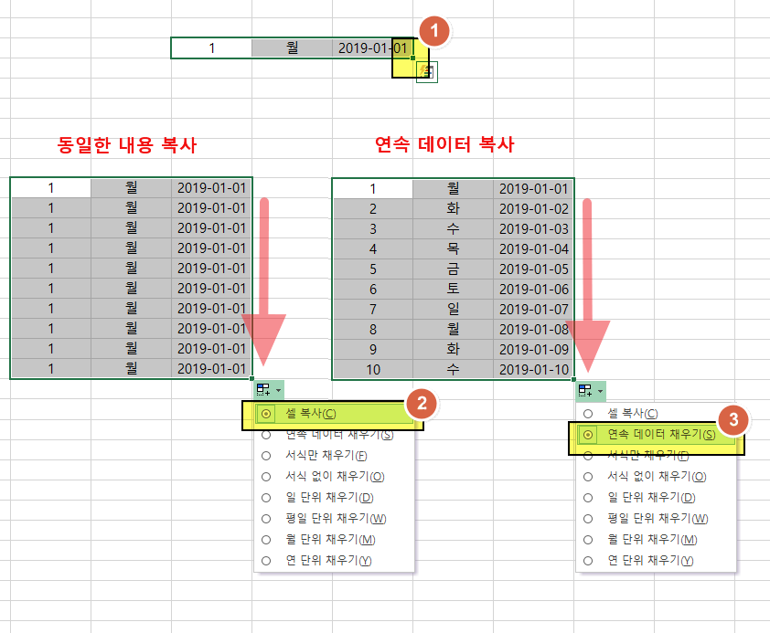
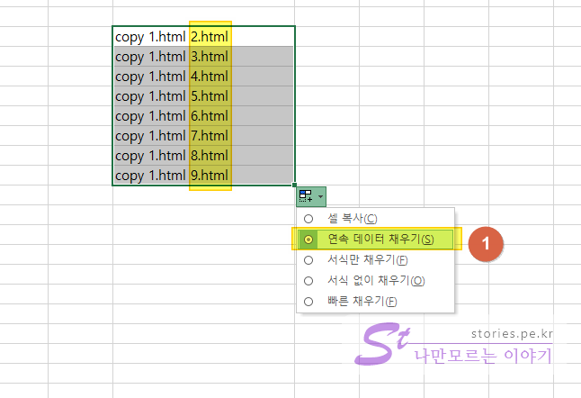
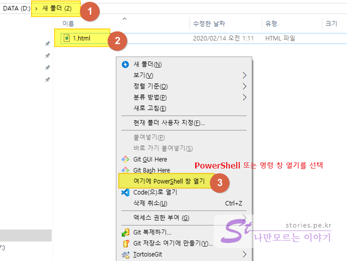
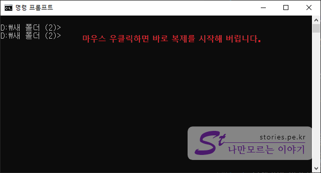
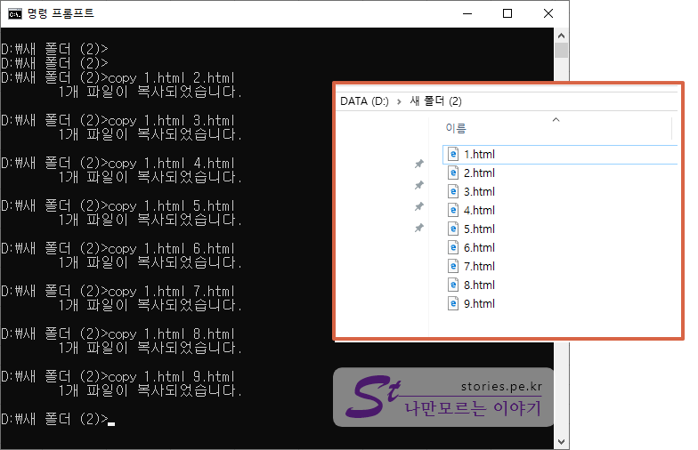

제가 티스토리 주소를 변경하려고 마음 먹은 이유는 애드센스에서 발생한 `ads.txt` 경고 문제를 해결할 방법이 없기 때문이였습니다. 

`stories.pe.kr`이라는 개인 도메인을 구입해서 티스토리 블로그에 연결하여 사용하고 있었는데 애드센스에서 그 도메인이 너의 도메인인지 `ads.txt`로 인증하라는 경고문이 발생했습니다.  
인터넷에서 `https://stories.pe.kr/ads.txt`를 읽을 수 있어야 하는데 티스토리에서는 구조상 이게 불가능한 사항입니다. 그레서 저는 기존의 `https://stories.pe.kr` 를 `https://blog.stories.pe.kr`로 변경하고 Github Pages를 만들어서 `https://stories.pe.kr`과 연결시켜 `ads.txt`를 넣어서 승인되게 하였습니다. 

이렇게 도메인을 변경하였을 때 문제 중에 하나가 이미 네이버나 구글 등에 퍼져있는 이전 도메인 주소로 들어왔을 경우 링크가 깨져서 없는 페이지(404 Not Found) 에러가 발생하는 것입니다.  
그럴경우 검색엔진의 설명에 의하면 가능하면 `HTTP Redirect`를 사용하라는 것입니다. 그런데 이것은 서버 단에서 Redirect(301 redirect)시키는 거라 서버를 손 댈 수 없는 티스토리 사용자에게는 불가능한 일입니다. 
그래서 이런 문제를 해결하기 위해 저는 아래와 같은 방법을 사용했습니다.   

> - canonical 지정으로 표준페이지 설정
> - javascript로 redirect 시키기


## canonical 지정으로 표준페이지 설정  
검색엔진 봇 입장에서 여러 도메인에서 동일한 내용으로 수집된 경우 나중에 수집된 내용은 복제물이라 판단하여 검색등록이 되지 않습니다. 그런데 저같이 부득이한 경우로 인해 도메인주소를 변경 했을 경우 선의의 피해를 막기 위해 표준페이지(canonical)를 지정할 수 있습니다. 이럴 경우 검색엔진은 `canonical`에 등록한 내용을 우선적으로 수집하여 등록합니다.  
아래의 `canonical link` 태그를 `<head></head>` 태그 사이에 넣어주기만 하면 됩니다.  

  

참고로 티스토리에는 `canonical link`가 자동으로 들어가는것 같으니 웹브라우저의 소스보기를 통해 바뀐 도메인이 나오는지만 보시면 될것 같습니다.  

```html
<link rel="canonical" href="https://blog.stories.pe.kr" /> // 바뀐 도메인 주소로 설정
```

## javascript로 redirect 시키기  
이제 중요한 redirect시키는 법입니다. 어쩔수 없이 javascript를 사용해야 하고 지금까지 발행된 주소로 왔을때 맵핑시켜주는것이 필요합니다.   
여기서 전제조건은 티스토리 포스트 주소를 숫자로 설정해서 사용했던 경우에 한합니다.  

> https://blog.stories.pe.kr/**386**

### redirect HTML 페이지 만들기   
javascript로 redirect시키는 HTML을 만듭니다.   

- **1.html**  


```html
<!DOCTYPE html>
<html lang="ko">
<head>
    <meta charset="UTF-8">
    <meta name="viewport" content="width=device-width, initial-scale=1.0">
    <title>도메인 변경으로 인한 포워딩</title>
    <link rel="canonical" href="https://blog.stories.pe.kr"> <!-- 1. 표준 도메인지정 -->
    <script type='text/javascript'>
        var dest = "https://blog.stories.pe.kr";            // 2. 옮겨갈 새로운 도메인 지정

        function canonicalLink() {
            var link = document.getElementsByTagName("link")[0];
            link.setAttribute('href', dest + location.pathname);
            document.head.appendChild(link);                // 3. 포스트 주소가 포함된 canonical을 지정함
        }

        function domainRedirect() {   
            var origin = location.origin;                   // 4. 접속한 정보에서 도메인정보를 확보
            var href = location.href;                       // 5. 접속한 정보에서 도메인이 포함된 포스트 주소를 확보
            var destination = href.replace(origin, dest);   // 6. 접속한 도메인정보를 옮겨갈 새로운 도메인 주소로 치환
            location.href = destination;                    // 7. 이동
        }

        // 실행 
        canonicalLink();
        domainRedirect();
    </script>
</head>
<body>
    도메인 변경으로 인한 포워딩 합니다.
</body>
</html>
```


1. `canonical` link로 표준 도메인을 지정합니다. 혹시 검색봇이 들어왔을 경우 표준도메인이 내가 아니라 옮겨간 새로운 도메인이라는 것을 알려 줍니다.   
2. 옮겨갈 새로운 도메인을 지정합니다.   
3. 안전장치로 canonical Link를 포스트주소까지 포함된 주소로 대체 합니다. (예> `<link rel="canonical" href="https://blog.stories.pe.kr/32343243">`)
4. 접속한 정보에서 도메인 정보를 확보합니다. 
5. 접속한 정보에서 포스트주소까지 포함된 URL을 확보합니다.  
6. 접속한 정보에서 도메인 주소를 새로운 도메인 주소로 치환합니다. 
7. 치환된 주소로 실제로 옮겨갑니다. 


### 만든 HTML 페이지를 갯수만큼 복제   
찾아보면 좋은 방법이 있을것 같긴 하지만 저는 무식하지만 그냥 포스트 갯수만큼 복제를 해서 서버에 올려놓고 해결했습니다.  

- https://stories.pe.kr/1   --> 1.html
- https://stories.pe.kr/13  --> 13.html
- https://stories.pe.kr/45  --> 45.html

위와 같이 매칭이 됩니다. 그래서 포스트 글이 `500`개 있다면 `1.html ~ 500.html`까지 복사해서 만들어야 합니다. (아무리 생각해도 무식한 방법인것 같아요??~~ ^^;)  
그래도 더 생각하기 싫어서.. 그냥 생각없이 직관적이고 안전하게 이렇게 했어요 ㅋㅋ 

### 엑셀로 명령문 만들기  
이제 엑셀을 이용해서 명령 창에서 실행할 `copy 명령문`을 만들어야 합니다. 만드는 방법은 이전에 포스팅한 글을 참조하세요.  

>  [구글 스프레드시트에서 연속데이터 복사하는 방법](https://ux.stories.pe.kr/109)

   
연속데이터체우기 기능을 활용하여 아래의 명령어를 복제합니다.  

```bash
copy 1.html 2.html  //-->  1.html을 가지고 2.html을 복제해서 만들어라
```

아래와 같이 `연속데이터 체우기` 기능으로 원하는 갯수만큼 쉽게 만들면 됩니다.   

   

1. 연속 데이터 채우기를 선택하면 뒤의 파일명이 자동으로 1씩 증가하면서 늘어납니다.  

만든 명령문 전체를 선택 후 `Ctrl + C`를 눌러 복사를 합니다.  

### 명령문 실행하여 파일 복제하기   

이제 실제로 파일을 복제하기 위해서 탐색기를 이용해 해당 폴더로 이동합니다.   

   
1. 먼저 탐색기를 이용하여 원하는 폴더를 선택합니다. 저는 테스트로 새폴더에서 해보겠습니다.  
2. 해당 폴더의 복제원본인 1.html이 있는지 확인합니다. (위에서 만든 것)
3. 탐색기의 빈공간에 `Shift` + `마우스 우클릭`해서 나온 명령어 중 **PowerShell** 또는 **여기서 명령창 열기**를 선택하세요.  


  

위와 같은 명령(CMD)창이 열립니다. 
위에서 클립보드에 명령어가 저장되어 있을 것입니다. 
명령창에서 `마우스 우클릭`을 하면 기다릴 새도 없이 바로 복제가 순서대로 **쫘~ 악~** 실행 됩니다.   

  
이렇게 쉽고 빠르게 복제가 완료됩니다.  
이런식으로 자신의 포스트 갯수만큼 복제하시면 됩니다. 
모든 파일의 내용은 동일하고 파일명만 다릅니다.  


## 서버에 업로드 하기 
이제 만든 모든 html파일을 예전 도메인 주소의 서버에 업로드 합니다. 그러면 해당 도메인으로 들어온 사람은 새로운 도메인 주소로 이동 시켜 줍니다.  

저같은 경우는 서버를 Github Pages를 이용해서 만들었습니다. 만드는 방법은 이전에 포스팅한 내용을 참고하세요.  

> [Github Pages로 Static한 블로그나 홈페이지 만들기](https://blog.stories.pe.kr/380)  

> 참고로 저는 ads.txt 문제 때문이였으므로 `ads.txt`도 동일한 서버에 같이 올려놨습니다.   
> https://stories.pe.kr/ads.txt 로 접속하해서 내용이 나오면 성공입니다.  

서버에 올렸으니 접속테스틀 해보시면 됩니다.  


