티스토리를 운영하면서 대부분 애드센스를 붙히셨을 것입니다. 하지만 그중에서도 **인피드 광고**를 붙히기가 가장 까다로울 텐데요. 이번에는 인피드 광고를 오류없이 잘 붙힐 수 있는 방법을 소개해 볼까 합니다.

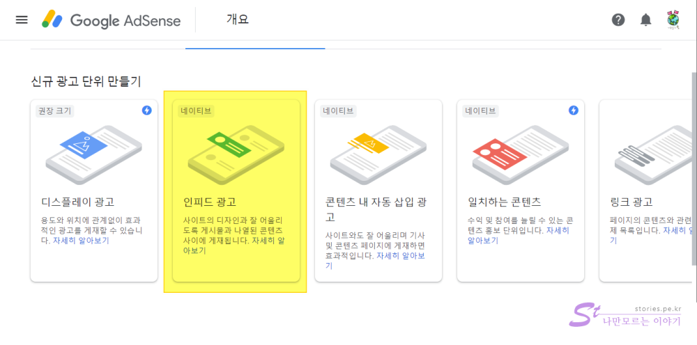

## 인피드 광고란 무엇인가?

먼저 인피드 광고에 대해서 알아봐야 겠죠? 애드센스에도 써있긴 한데 설명이 너무 어려워서...

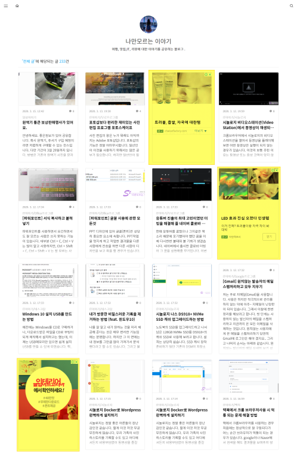  
위의 이미지 처럼 Index 리스트 화면 컨텐츠 곳곳에 애드센스 광고가 들어가 있습니다. 이것을 인피드 광고라고 합니다. `In` + `Feed` 로 피드 안에 광고가 나온다 뭐, 대략 이런 뜻 인것 같습니다.

> [인피드광고 보기 바로가기](https://blog.stories.pe.kr/)

## 애드센스에서 인피드 광고 등록하기

먼저 애드센스 화면에서 인피드 광고를 등록해야 합니다.

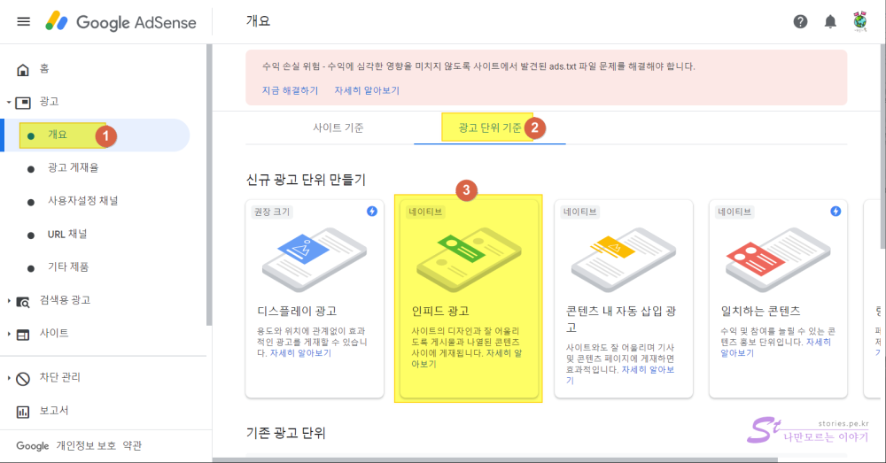

1. `광고` > `개요` 를 선택합니다.
2. ` 광고 단위 기준` 탭을 선택합니다.
3. `인피드 광고` 배너를 클릭합니다.

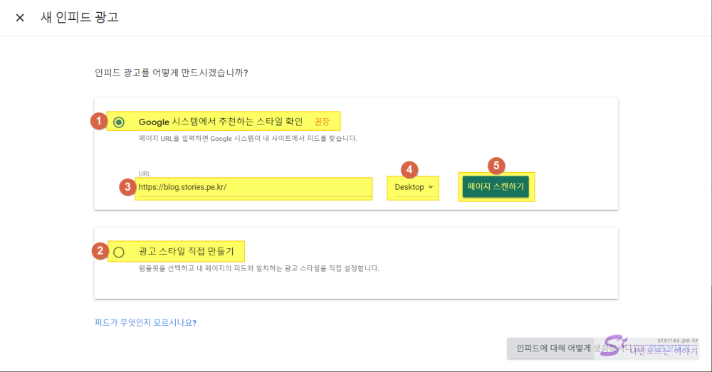  
인피드를 어떻게 생성할지에 대해서 기본 스타일을 설정하는 화면 입니다.

1. Google에서 자동으로 블로그를 분석해서 기존의 피드와 비슷한 형태의 광고 스타일을 제시해 줍니다.
2. 수동으로 스타일을 직접 만들 수 있습니다.
3. 광고를 붙히고자 하는 도메일의 피드화면(리스트화면) URL을 입력합니다.
4. 모바일과 데스트탑을 선택합니다.
5. 페이지를 스캔하면 대략 30초 ~ 1분 정도 스캔을 합니다.

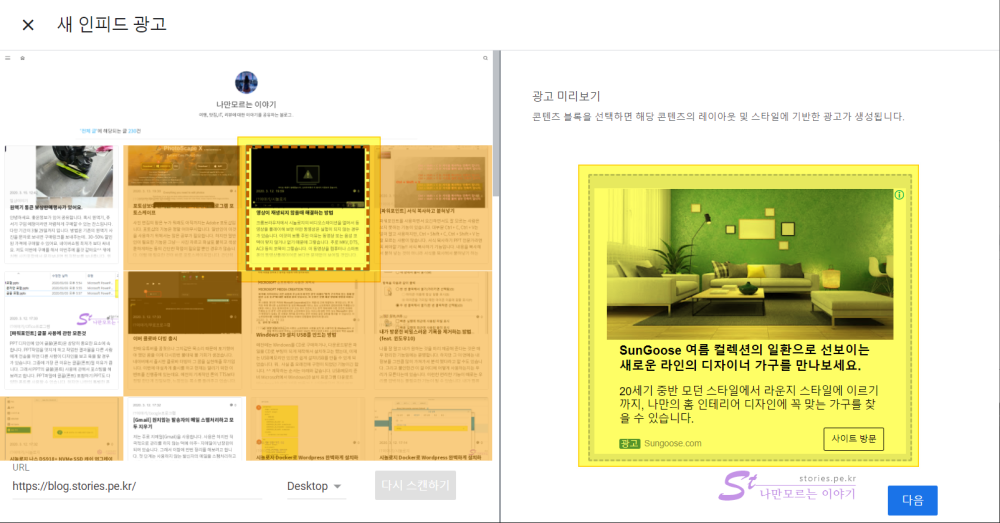  
스캔이 끝나면 분석결과를 볼 수 있습니다. 피드가 가로형인지 세로형인지 제목의 두께, 폰트, 색상 등은 어떻게 되는지 분석해서 최적화된 샘플을 보여줍니다.
`다음`을 클릭하여 넘어 갑니다.

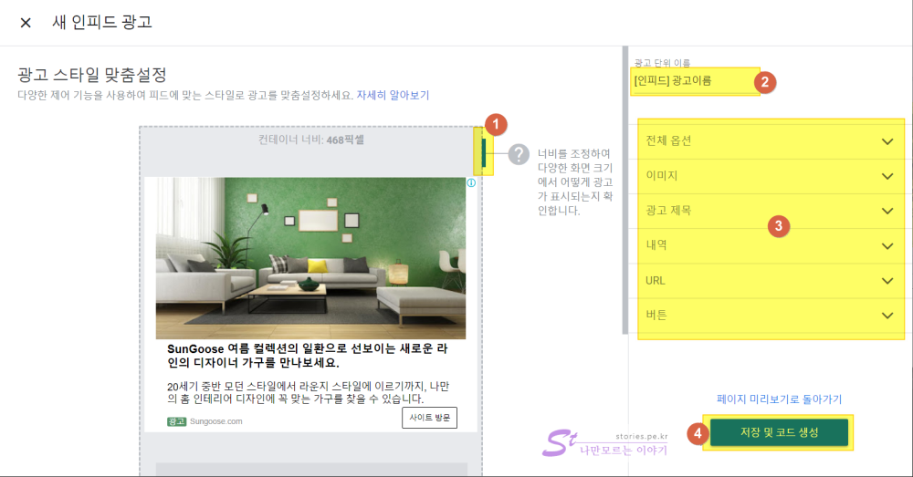  
이제 이 화면에서 스타일을 상세조절할 수 있습니다.

1. 클릭 드래그 해서 피드의 가로 사이즈별 출력 모양새를 볼 수 있습니다. 세팅이 아니고 그냥 미리보기 입니다.
2. 광고의 이름을 임의로 작성합니다.
3. `전체`, `이미지`, `제목`, `내용`, `url`, `버튼`에 대한 스타일을 상세 설정할 수 있습니다.
4. `저장 및 코드 생성`을 클릭해서 완료 합니다.

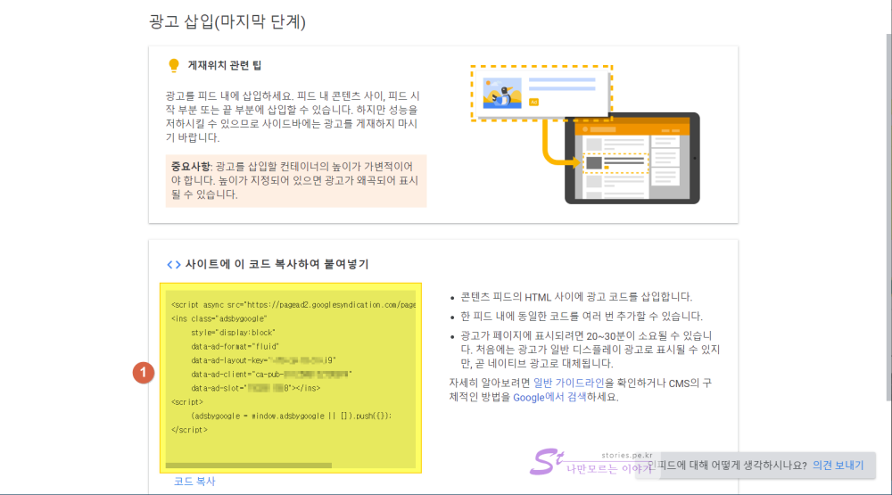  
이제 중요한 광고 코드가 생성되었습니다.  
이 코드는 3부분으로 나눌 수 있습니다.

```html
<!-- 1. adsbygoogle를 로딩 -->
<script async src="https://pagead2.googlesyndication.com/pagead/js/adsbygoogle.js"></script>

<!-- 2. 광고가 나올 태그 -->
<ins
  class="adsbygoogle"
  style="display:block"
  data-ad-format="fluid"
  data-ad-layout-key="[본인의 레이아웃키 입력]"
  data-ad-client="[본인의 클라이언트 번호 입력]"
  data-ad-slot="[본인의 슬롯번호 입력]"
></ins>

<!-- 3. ins 객체 실행 -->
<script>
  (adsbygoogle = window.adsbygoogle || []).push({});
</script>
```

1. `<HEAD>`태그 안에서 딱 한번만 나오면 됩니다.
2. 광고가 나와야 할 위치에 `<ins>`태그를 넣어주면 됩니다. 해당태그에는 애드센스에서 생성한 본인만의 중요한 값이 있으니 잊지 마셔야 합니다.
3. 2번과 같이 동일한 겟수만큼 나와야 합니다.

## 티스토리 Index, Category 페이지에 인피드 광고 적용하기

이제 생성된 위의 코드를 티스토리에 적용하는 방법입니다.
적용은 **HTML방식**으로도 적용할 수 있고 **Javascript방식**으로도 적용 할 수 있습니다.

### HTML로 적용하기

HTML에 적용하려면 티스토리 `관리자 화면`의 `꾸미기` > `스킨 편집` 으로 들어갑니다.

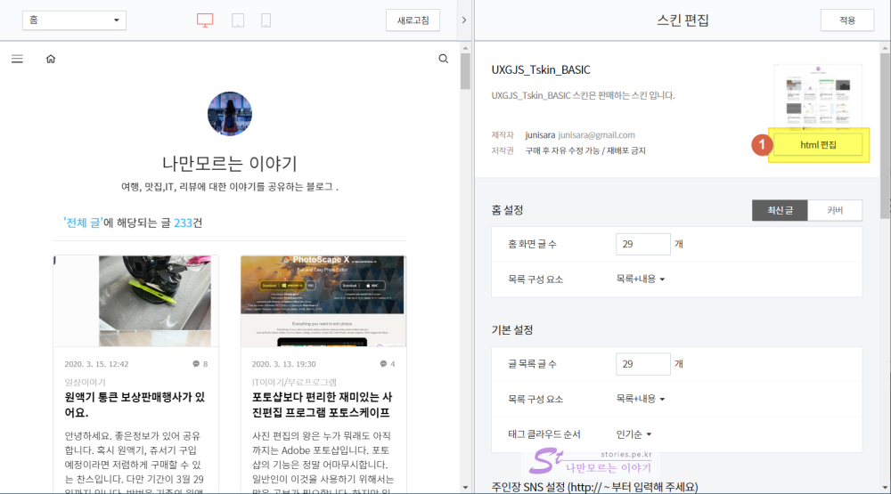

1. HTML편집 화면으로 입장합니다.

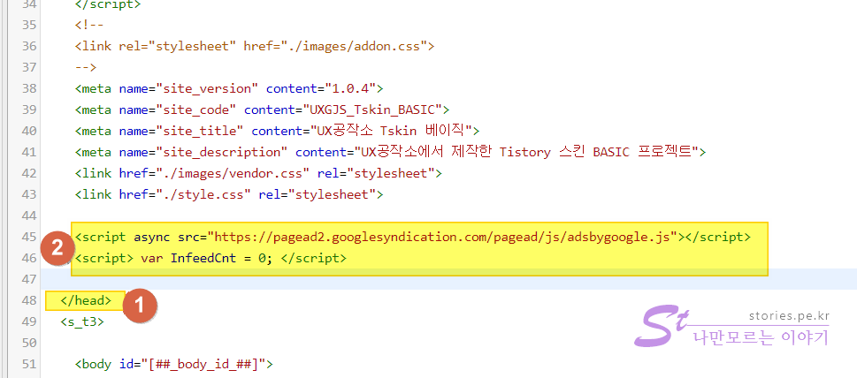

1. 먼저 `</head>`를 찾습니다.
2. `</head>`바로 위에 첫번째 코드였던 아래의 코드를 넣습니다.
   - `<script async src="https://pagead2.googlesyndication.com/pagead/js/adsbygoogle.js"></script><script> var InfeedCnt = 0; </script>`

그 다음에는 위치선정을 잘 해야 합니다. 전체적으로 봤을떄는 아래와 같습니다.  
코드는 항상 열었으면 닫아야 합니다. 여는 태그는 `<태그명>`, 닫는 태그는 `</태그명>` 이렇게 쌍으로 구성되어 있습니다.

```html
<s_article_rep>
  <s_index_article_rep> ... {{ 입력해야 할 위치 }} <-- 삽입 위치 </s_index_article_rep>
  <s_permalink_article_rep>
    <s_permalink_article_rep> <s_article_rep></s_article_rep></s_permalink_article_rep></s_permalink_article_rep
></s_article_rep>
```

위와 같이 `<s_article_rep>`와 `</s_article_rep>` 로 둘러싸여있는 안쪽에 `</s_index_article_rep>` 닫는 태그 바로 위에 삽입하시면 됩니다. `Skin.html`코드에는 `<s_index_article_rep>`이 2~3개정도 나오기 때문에 잘 찾아야 합니다.

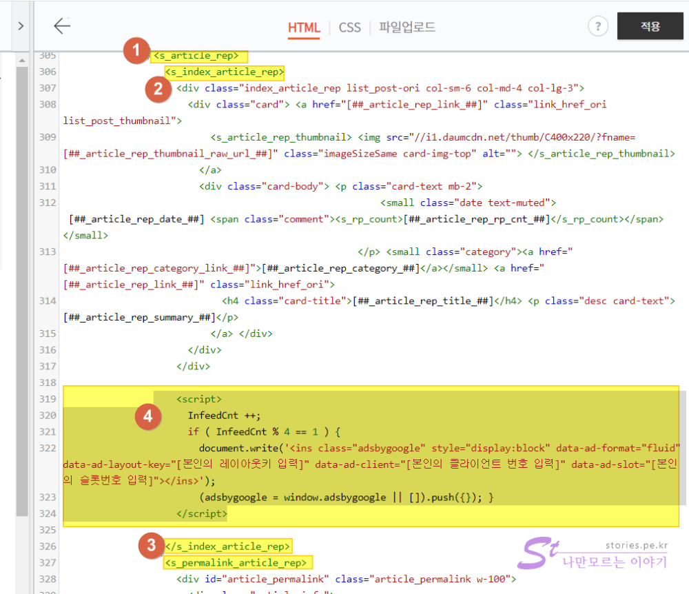

1. 먼저 `<s_article_rep>`를 찾습니다.
2. 그 다음 바로 아래쪽에 있는 `<s_index_article_rep>`를 찾습니다.
3. 그 다음 아래쪽에 있는 `</s_index_article_rep>`를 찾습니다.
4. 그 바로 위쪽에 아래 코드를 삽입합니다.

```html
<script>
  InfeedCnt++;
  if (InfeedCnt % 4 == 1) {
    document.write(
      '<ins class="adsbygoogle" style="display:block" data-ad-format="fluid" data-ad-layout-key="[본인의 레이아웃키 입력]" data-ad-client="[본인의 클라이언트 번호 입력]" data-ad-slot="[본인의 슬롯번호 입력]"></ins>'
    );
    (adsbygoogle = window.adsbygoogle || []).push({});
  }
</script>
```

완성입니다. 이제 저장하고 확인해 보시면 됩니다.

### javascript로 적용하기

이번에는 javascript로 적용하는 방법입니다. 위에서 적용한 HTML은 필요없으니 원래대로 원복 시켜놓으시면 됩니다.

먼저 javascript파일을 만드셔야 합니다.

`adsense_infeed.js`라는 임의의 파일을 만드셔서 아래의 코드를 작성합니다.

```js
(function ($) {
  var feedTag = ".index_article_rep"; // 1. 본인의 반복되어 지는 Feed 태그를 입력합니다.
  var adLayoutKey = "[본인의 레이아웃키 입력]"; // 2. 애드센스의 인피드 코드에서 생성된 본인의 data-ad-layout-key 를 입력합니다.
  var adClient = "[본인의 클라이언트 번호 입력]"; // 3. 애드센스의 인피드 코드에서 생성된 본인의 data-ad-client 를 입력합니다.
  var adSlot = "[본인의 슬롯번호 입력]"; // 4. 애드센스의 인피드 코드에서 생성된 본인의 data-ad-slot 를 입력합니다.
  var adCount = 4; // 5. 반복 주기

  if ($("#tt-body-index, #tt-body-category").is(":visible")) {
    //<-- 6. Index와 Category화면일 경우만 실행
    function fn_adSense() {
      var adSense_ins =
        '<ins class="adsbygoogle" style="display:block" data-ad-format="fluid" data-ad-layout-key="' + adLayoutKey + '" data-ad-client="' + adClient + '" data-ad-slot="' + adSlot + '"></ins>';

      $.getScript("https://pagead2.googlesyndication.com/pagead/js/adsbygoogle.js", function () {
        var adsbygoogle = (adsbygoogle = window.adsbygoogle || []);
        $(".adsbygoogle").each(function () {
          adsbygoogle.push(this);
        });
      });

      $(feedTag).each(function (index) {
        if (index % adCount == 1) {
          $(this).append(adSense_ins); //<-- 7. 본인의 상황에 맞게 조정해 줄 필요있습니다.
        }
      });
    }
    adLayoutKey && adClient && adSlot ? fn_adSense() : "";
  }
})(jQuery);
```

1.  HTML 중에서 반복되어 지는 Feed의 최상위 태그의 CLASS명을 입력합니다. (ex> `.index_article_rep` )
2.  애드센스의 인피드 코드에서 생성된 본인의 data-ad-layout-key 를 입력합니다.
3.  애드센스의 인피드 코드에서 생성된 본인의 data-ad-client 를 입력합니다.
4.  애드센스의 인피드 코드에서 생성된 본인의 data-ad-slot 를 입력합니다.
5.  몇번마다 한번씩 광고가 나올지 주기를 작성합니다.
6.  `#tt-body-index`는 보통 Index화면의 `BODY`태그에 자동으로 생성되는 `ID`이고 `#tt-body-category`는 Category화면의 `BODY`태그에 자동으로 생성되는 `ID`입니다. 그러므로 Index화면과 Category화면에서만 아래의 js코드가 실행되어라 라는 뜻입니다.
7.  `<ins>`태그를 붙히는 부분입니다. 상황에 따라 `append` 대신 `after` 을 사용해야 될 수도 있습니다.

이렇게 생성된 javascript를 티스토리에 올리고 링크를 걸어 주면 됩니다.
HTML 보다 간결합니다.

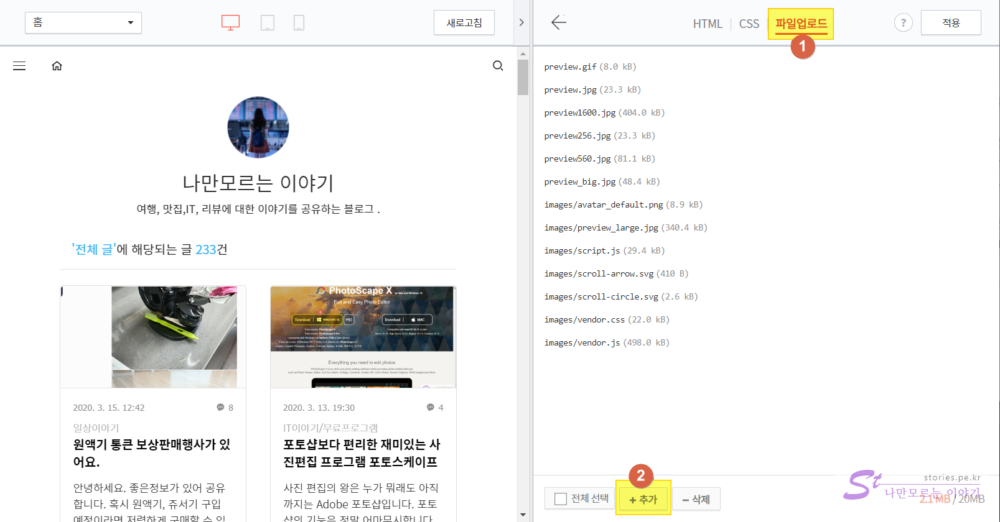

1. 파일업로드 탭을 선택합니다.
2. 추가 버튼을 클릭해서 지금 생성한 `adsense_infeed.js` 를 업로드 합니다.

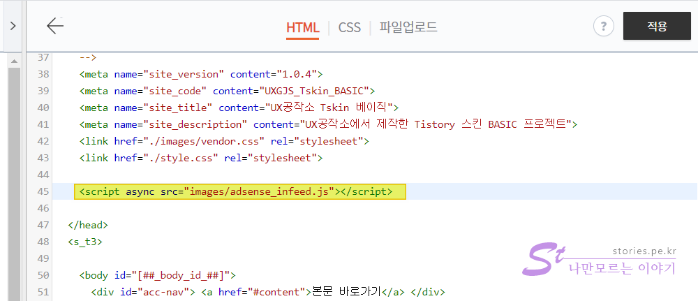  
다시 `HTML`탭으로 이동해서 `</HEAD>`태그 바로 위에 javascript링크를 추가해 주면 됩니다.

> `<script async src="images/adsense_infeed.js"></script>`
