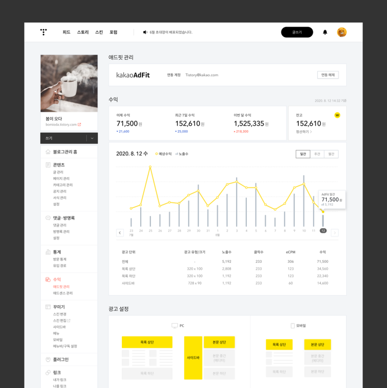

이번에 티스토리에서 상당히 반길만한 공지가 떴습니다. 일단은 카카오에서 티스토리를 방치하고 버리지는 않고 있구나라는 안도감이 먼저 들었습니다. 공지의 핵심은 아래와 같습니다. 

> - 수익 창출 기능 강화
> - 티스토리에 카카오 계정 도입
> - 현 기능의 개선

  

이 중에서 가장 기대가 큰 것은 **카카오 계정 도입**입니다. 네이버가 언제 부턴가 티스토리의 포스팅을 블로그 글이 아닌 일반 웹사이트에서만 노출되게 처리하면서 부터 조회수가 거의 1/2 ~ 1/3정도 줄어 들어서 블로그 작성에 회의를 느꼈던 적이 있었습니다. 티스토리에서 어떤 조치가 없다면 이렇게 이글루스 꼴이 나는게 아닌가 하는 걱정도 들었습니다. 

티스토리가 카카오 계정과 연동이 되면 아쉬운 대로 네이버 블로그와 대적할 만한 기반은 되지 않을까 합니다. 물론 카카오톡에 티스토리의 포스팅이 노출 된다면 더할 나위 없겠지만 일단 계정 연동만으로도 상당히 기대가 됩니다. 

요즘 주가도 그렇고 여러 방면에서 조금씩 네이버를 바짝 추격하고 있는 카카오의 모습이 보기 좋습니다. 블로그(티스토리) 지원 면에서도 계속 잘 신경 써 주시면 감사하겠습니다. 

아래 티스토리 공지를 참고 하세요.
https://notice.tistory.com/2547 
