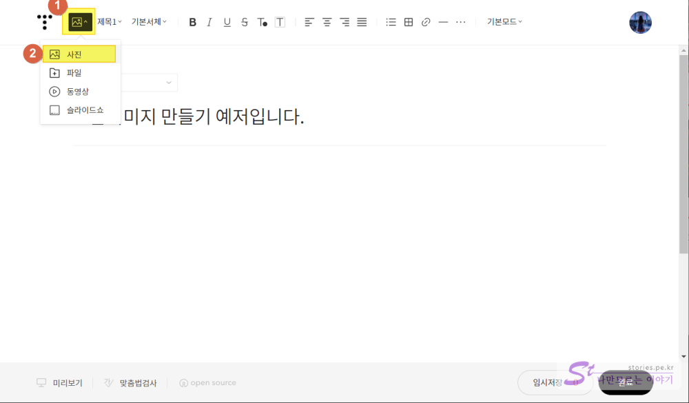
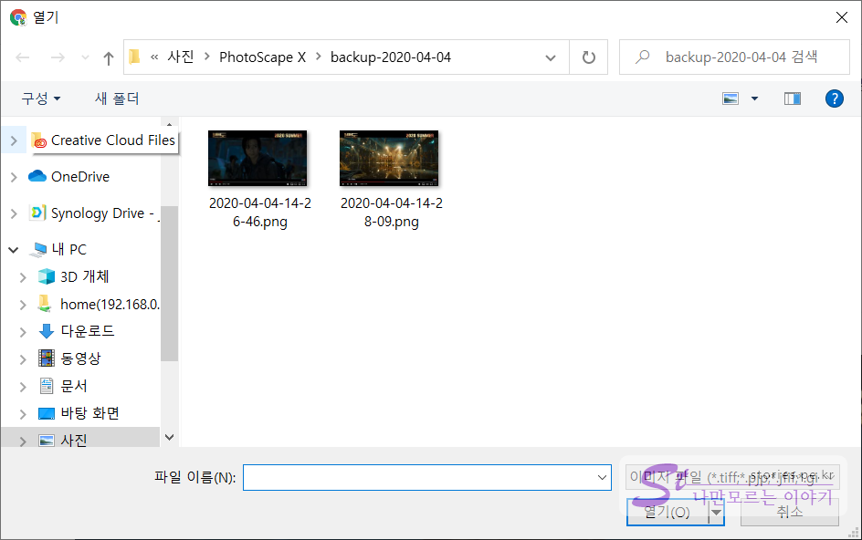

저는 블로그 작성을 주로 VSCode를 이용해서 마크다운으로 작성을 하는데 그렇게 작성을 하면 구 에디터로 작성된 형태로 글이 작성됩니다. 티스토리에서 작년에 새 에디터를 출시한 건 알고 있지만 VScode로 글을 쓰는 것이 너무나 익숙하고 편해서 글 작성하는 방법을 바꾸지는 안을 예정입니다.

하지만 새 에디터에는 정말 강력한 기능들이 많네요. 이번에 [토리월드 T라이프님](https://torylife.tistory.com/)을 통해서 알게 된 기능을 하나 소개하려고 합니다.  

## 그룹 이미지 만들기 (사진을 가로로 나열하는 방법)  
보통 사진은 한줄에 하나가 들어가고 그 사진을 왼쪽, 중앙, 오른쪽으로 정렬하는 것은 일반적인 기능입니다. 하지만 사진 여러 장을 가로로 나열하는 것은 쉬운 방법이 아닙니다. 그런데 티스토리 새 에디터는 이 것을 쉽게 구현해 줍니다. 알면 쉬운데 모르면 사용하지 못하는 기능이지 않을까 합니다. 

### 적용된 모습   

  
위의 그림처럼 사진을 가로로 배열할 수 있습니다. 

### 적용하는 방법  
먼저 관리자 화면의 새 글쓰기 화면으로 들어갑니다. 

  
1. 먼저 파일 첨부 아이콘을 선택합니다.
2. 사진 메뉴를 선택합니다.

  
원하는 이미지를 모두 선택하여 업로드합니다. 

  
이렇게 사진이 모두 글쓰기 창에 올라옵니다. 

  
사진을 하나 마우스로 클릭하여 잡고 다음 다른 사진 위로 올려놓습니다. 이때 우측에 세로로 길게 빨간 줄이 표시되어야 정상적으로 합쳐집니다.
그러면 2개의 사진이 가로로 그룹핑이 됩니다. 

알고 나면 간단하죠?

## 이 방법으로 콜라주도 만들 수 있어요.

  
동일한 방법으로 여러 장의 사진을 올려놓으면 사진 콜라주도 만들 수 있습니다. 
콜라주 안에서 사진을 드래그 해서 위치도 변경할 수 있습니다. 
