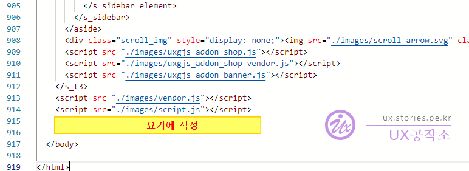

꽤 오래된 이슈이긴 합니다만 **티스토리에서 2차 도메인(개인 도메인)을 운영**하는 사람은 브라우저의 보안 이슈로 인해 로그인이 풀려버리는 현상으로 상당히 괴로우신 상황일 것입니다. 저도 **blog.stories.pe.kr**라는 개인 도메인(2차 도메인)을 운영하고 있고 리다이렉션 방법으로 문제를 회피하여 운영을 하고 있었습니다. 그러던 중... 이게 최선인가?라는 고민을 하다가 현재 상황에서 최선일 것 같은 방법을 찾아 적용하여 운영하고 있습니다. (더 나은 방법이 있을지는 모르겠네요.)

# 개인 도메인(2차 도메인)을 운영하기 위한 개념

개념은 간단합니다. 사용자가 비로그인 상태이면 개인 도메인(`***.stories.pe.kr`)을 사용하고, 사용자가 로그인을 한 상태이면 티스토리 도메인(`***.tistory.com`)을 사용하는 것입니다.

여기에서 중요한 점은 비로그인 상태에서 로그인 상태로 전환되는 **구독하기**, **댓글 쓰기** 버튼을 눌렀을 때 자동으로 1차 도메인(티스토리 도메인)으로 전환해서 로그인을 하는 것이고 로그아웃 버튼을 클릭했을 때 로그아웃 후에 다시 개인 도메인(2차 도메인)으로 전환하는 것입니다.

# 구현 방법

## 기본 함수 만들기

먼저 로그인인 경우는 티스토리 도메인 주소를 리턴해 주고 로그아웃인 경우에는 개인 도메인 주소를 리턴해 주는 함수를 아래와 같이 만듭니다.

그리고 댓글, 구독 등 로그인이 필요한 기능을 호출할 경우 해당 함수를 이용하여 변경을 해 줍니다.

```javascript
function tistoryUrlToggle() {
  let oriUrl;
  let online = document.URL;
  let TistoryBlog = window.TistoryBlog;
  let Url = TistoryBlog.url; // 2차 도메인 획득 (blog.stories.pe.kr)
  let TistoryUrl = TistoryBlog.tistoryUrl; // 1차 도메인 획득 (stories.tistory.com)

  if (!!initData.user) {
    // 로그인 상태인 경우
    if (online.match(TistoryUrl)) {
      // 티스토리 도메인이라면..
      oriUrl = online.replace(TistoryUrl, Url); // 개인 도메인으로 변경함(stories.tistory.com ==> blog.stories.pe.kr)
    } else {
      oriUrl = online;
    }
  } else {
    // 로그아웃 상태인 경우..
    if (online.match(Url)) {
      // 개인 도메인이라면..
      oriUrl = online.replace(Url, TistoryUrl); // 티스토리 도메인으로 변경함(blog.stories.pe.kr ==> stories.tistory.com)
    } else {
      oriUrl = online;
    }
  }
  return oriUrl;
}
```

## 댓글 쓰기에 적용하기

댓글을 작성할 때 자동으로 로그인을 유도하는 경우 로그인한 후에 티스토리 도메인(1차 도메인)으로 넘어가게 하기 위해서 아래와 같은 코드를 작성합니다.

```javascript
// 2차 도메인으로 댓글 작성 시 1차 도메인으로 자동 변경함
let oriUrl = tistoryUrlToggle();
window.T.config.LOGIN_URL = "https://www.tistory.com/auth/login?redirectUrl=" + encodeURIComponent(oriUrl);
```

위의 코드로는 **댓글 작성** 시 에만 적용되고 **구독하기**는 아래에 설명하겠습니다.

### 구현 결과

위의 코드를 작성하면 아래와 같이 구현되는 것이 정상입니다.


1. 위와 같이 로그인 전 화면이며 개인 도메인(2차 도메인) 주소입니다.
2. 댓글을 작성하기 위해 포커싱을 합니다.(제 블로그는 댓글을 옆으로 붙여서 일반적인 모습은 아니지만 기능적으로는 똑같아요 ^^)
3. 로그인을 하라는 알림 창이 뜹니다.(티스토리 설정에서 댓글 작성을 로그인한 사용자만으로 설정해야 합니다.)
4. 확인을 누르면 티스토리 로그인 화면이 나오고 로그인을 합니다.
5. 로그인 후에는 티스토리 도메인(1차 도메인)으로 자동 변경이 되는 것을 볼 수 있습니다.
6. 그리고 로그인 상태가 되고 댓글 작성이 가능합니다.

> 테스트해 보세요 : https://stories.tistory.com/611

로그아웃을 하면 다시 자동으로 개인 도메인(2차 도메인)으로 변경이 됩니다.

## 구독하기에 적용하기

구독하기의 버튼은 개별 스킨에 있지 않고 티스토리에서 제공을 하고 있는 기능이라 그냥 적용은 되지 않습니다. 기존 구독하기 버튼의 기능을 제거하고 새로 만든 기능을 적용하는 방법입니다. 새로 만든 기능은 기존 기능을 복사해서 `redirectUrl`부분만 수정하면 됩니다.

```javascript
/**************************************************
 ** 구독하기 기능 구현
 **************************************************/
setTimeout(() => {
  // DOM 로딩을 위해 딜레이를 조금 시켜줌
  $(".btn_subscription").addClass("btn_subscription_new"); // 기존 구독의 Class에 새로운 Class를 추가
  $(".btn_subscription_new").removeClass("btn_subscription"); // 기존 구독의 Class를 제거(기존 기능 정지)

  // 구독하기 버튼을 클릭 하였을 때...
  $(".btn_subscription_new").click(function (e) {
    e.preventDefault();
    if ($(this).hasClass("following") === true) {
      let blogId = $(this).data("blog-id");
      let $target = $(this);
      let url = $(this).data("url");
      let device = $(this).data("device");
      unfollowBlog_new(blogId, $target, url, device); // 구독 취소 요청
    } else {
      let blogId = $(this).data("blog-id");
      let $target = $(this);
      let url = $(this).data("url");
      let device = $(this).data("device");
      followBlog_new(blogId, $target, url, device); // 구독하기 요청
    }
  });

  // 구독 하기 기능 수행
  function followBlog_new(blogId, $target, url, device) {
    let oriUrl = tistoryUrlToggle();
    if (!!initData.user) {
      var requestUrl = addUriPrefix("/subscription/");
      return $.ajax({
        method: "POST",
        url: requestUrl,
        data: {
          blogId: blogId,
          type: "follow",
          token: TistoryBlog.token,
          url: url,
          device: device,
        },
        xhrFields: {
          withCredentials: true,
        },
      })
        .done(function (r) {
          $(".btn_subscription_new").addClass("following");
          $(".btn_subscription_new .txt_post,.btn_subscription_new .txt_state").html("구독중");
          showTooltip("이 블로그를 구독합니다.");
        })
        .fail(function (r) {
          showTooltip("구독 실패");
        })
        .always(function () {
          $target.data("doing", false);
        });
    } else {
      window.location = window.appInfo.loginUrl + "?redirectUrl=" + encodeURIComponent(oriUrl);
    }
  }

  // 구독 취소 기능 수행
  function unfollowBlog_new(blogId, $target, url, device) {
    let oriUrl = tistoryUrlToggle();
    if (!!initData.user) {
      var requestUrl = addUriPrefix("/subscription/");
      $.ajax({
        method: "POST",
        url: requestUrl,
        data: {
          blogId: blogId,
          type: "unfollow",
          token: TistoryBlog.token,
          url: url,
          device: device,
        },
        xhrFields: {
          withCredentials: true,
        },
      })
        .done(function (r) {
          $(".btn_subscription_new").removeClass("following");
          $(".btn_subscription_new .txt_post,.btn_subscription_new .txt_state").html("구독하기");
          showTooltip("이 블로그 구독을 취소합니다.");
        })
        .fail(function (r) {
          showTooltip("구독 취소 실패");
        })
        .always(function () {
          $target.data("doing", false);
        });
    } else {
      window.location = window.appInfo.loginUrl + "?redirectUrl=" + encodeURIComponent(oriUrl);
    }
  }
}, 500);
```

# 전체 코드

지금까지 작성한 전체 코드입니다.  
이 코드를 `<HTML><BODY> ... </BODY></HTML>`의 가장 마지막 부분에 추가해 주시면 됩니다.



```html
<script type="text/javascript">
  /**************************************************
  /** 공통 함수
  **************************************************/
  function tistoryUrlToggle() {
    let oriUrl;
    let online = document.URL;
    let TistoryBlog = window.TistoryBlog;
    let Url = TistoryBlog.url; // 2차도메인 획득 (blog.stories.pe.kr)
    let TistoryUrl = TistoryBlog.tistoryUrl; // 1차도메인 획득 (stories.tistory.com)

    if (!!initData.user) {
      // 로그인 상태인 경우
      if (online.match(TistoryUrl)) {
        // 티스토리 도메인이라면..
        oriUrl = online.replace(TistoryUrl, Url); // 개인 도메인으로 변경함(stories.tistory.com ==> blog.stories.pe.kr)
      } else {
        oriUrl = online;
      }
    } else {
      // 로그아웃 상태인 경우..
      if (online.match(Url)) {
        // 개인 도메인이라면..
        oriUrl = online.replace(Url, TistoryUrl); // 티스토리 도메인으로 변경함(blog.stories.pe.kr ==> stories.tistory.com)
      } else {
        oriUrl = online;
      }
    }

    return oriUrl;
  }

  /**************************************************
   ** 댓글 작성 기능 구현
   **************************************************/
  let oriUrl = tistoryUrlToggle();
  window.T.config.LOGIN_URL = "https://www.tistory.com/auth/login?redirectUrl=" + encodeURIComponent(oriUrl);

  /**************************************************
   ** 구독하기 기능 구현
   **************************************************/
  setTimeout(() => {
    // DOM 로딩을 위해 딜레이를 조금 시켜줌
    $(".btn_subscription").addClass("btn_subscription_new"); // 기존 구독의 Class에 새로운 Class를 추가
    $(".btn_subscription_new").removeClass("btn_subscription"); // 기존 구독의 Class를 제거(기존 기능 정지)

    // 구독하기 버튼을 클릭 하였을 때...
    $(".btn_subscription_new").click(function (e) {
      e.preventDefault();
      if ($(this).hasClass("following") === true) {
        let blogId = $(this).data("blog-id");
        let $target = $(this);
        let url = $(this).data("url");
        let device = $(this).data("device");
        unfollowBlog_new(blogId, $target, url, device); // 구독 취소 요청
      } else {
        let blogId = $(this).data("blog-id");
        let $target = $(this);
        let url = $(this).data("url");
        let device = $(this).data("device");
        followBlog_new(blogId, $target, url, device); // 구독하기 요청
      }
    });

    // 구독 하기 기능 수행
    function followBlog_new(blogId, $target, url, device) {
      let oriUrl = tistoryUrlToggle();
      if (!!initData.user) {
        var requestUrl = addUriPrefix("/subscription/");
        return $.ajax({
          method: "POST",
          url: requestUrl,
          data: {
            blogId: blogId,
            type: "follow",
            token: TistoryBlog.token,
            url: url,
            device: device,
          },
          xhrFields: {
            withCredentials: true,
          },
        })
          .done(function (r) {
            $(".btn_subscription_new").addClass("following");
            $(".btn_subscription_new .txt_post,.btn_subscription_new .txt_state").html("구독중");
            showTooltip("이 블로그를 구독합니다.");
          })
          .fail(function (r) {
            showTooltip("구독 실패");
          })
          .always(function () {
            $target.data("doing", false);
          });
      } else {
        window.location = window.appInfo.loginUrl + "?redirectUrl=" + encodeURIComponent(oriUrl);
      }
    }

    // 구독 취소 기능 수행
    function unfollowBlog_new(blogId, $target, url, device) {
      let oriUrl = tistoryUrlToggle();
      if (!!initData.user) {
        var requestUrl = addUriPrefix("/subscription/");
        $.ajax({
          method: "POST",
          url: requestUrl,
          data: {
            blogId: blogId,
            type: "unfollow",
            token: TistoryBlog.token,
            url: url,
            device: device,
          },
          xhrFields: {
            withCredentials: true,
          },
        })
          .done(function (r) {
            $(".btn_subscription_new").removeClass("following");
            $(".btn_subscription_new .txt_post,.btn_subscription_new .txt_state").html("구독하기");
            showTooltip("이 블로그 구독을 취소합니다.");
          })
          .fail(function (r) {
            showTooltip("구독 취소 실패");
          })
          .always(function () {
            $target.data("doing", false);
          });
      } else {
        window.location = window.appInfo.loginUrl + "?redirectUrl=" + encodeURIComponent(oriUrl);
      }
    }
  }, 500);
</script>
```
