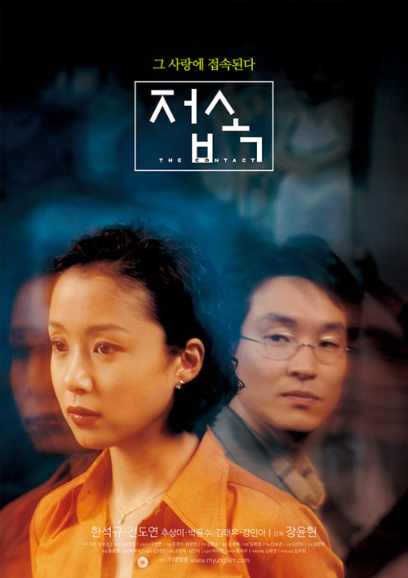

  
길복순은 사회로부터 억울한 일을 당한 한 여성이 스스로 문제를 해결하기로 결심하는 이야기를 중심으로 한 한국 드라마로 많은 기대를 모으고 있습니다. 이 드라마의 주연은 스크린에서 뛰어난 연기력과 다재다능함으로 평단의 호평을 받고 있는 배우 전도연이 맡았습니다. 이 기사에서는 전도연의 배경과 경력, 그리고 앞으로 길복순에서 맡게 될 역할에 대해 자세히 살펴볼 것입니다.

## 전도연은 누구인가요?

전도연은 20년 넘게 연예계에서 활동해온 한국의 유명 배우입니다. 그녀는 1973년 2월 11일 대한민국 서울에서 태어났습니다. 전도연은 중산층 가정에서 자랐으며 처음에는 연기 경력을 쌓는 데 관심이 없었습니다. 하지만 운명은 그녀를 위해 다른 계획을 세웠고 결국 그녀는 연기의 매력에 빠져들게 되었습니다.

## 초기 경력

전도연은 1990년 드라마 **우리들의 천국2**에서 조연으로 연기 데뷔를 했습니다. 하지만 1997년에 이르러서야 **접속**에서의 획기적인 역할로 두각을 나타내기 시작했습니다. 이 영화에서 그녀의 연기는 비평가들의 찬사를 받으며 청룡영화상 여우주연상을 비롯한 수많은 상을 수상했습니다.

## 명성 상승

전도연은 연이은 영화와 드라마에서의 성공적인 연기로 관객과 평단 모두에게 깊은 인상을 남겼습니다. 그녀의 대표작으로는 '해피엔드', '인어아가씨', '너는 내 운명' 등이 있으며, 칸 영화제에서 여우주연상을 수상한 '너는 내 운명'이 있습니다. 이 권위 있는 상을 수상한 최초의 한국 여배우입니다.

## 경력 하이라이트

전도연은 뛰어난 연기력으로 수많은 상과 찬사를 받으며 경력을 쌓아왔습니다. 그녀의 가장 주목할 만한 업적은 다음과 같습니다:

- 청룡영화상 여우주연상, '접속' (1997)
- "해피엔드"(1999)로 한국영화평론가협회상 여우주연상 수상
- "나도 아내가 있었으면 좋겠다" (2001), 춘사영화예술상 여우주연상
- 칸 영화제 여우주연상 "너는 내 운명" (2005)

## 길복순

전도연의 '길복순' 출연 소식은 연예계에서 큰 화제를 불러일으키고 있습니다. 이 드라마는 복수 스릴러로, 전도연은 주인공 길복순 역을 맡았습니다. 지금까지 알려진 바에 따르면 길복순은 사회로부터 억울한 일을 당한 후 스스로 문제를 해결하기로 결심하는 여성입니다. 전도연의 뛰어난 연기력이 더해져 한시도 눈을 뗄 수 없는 강렬한 연기를 기대해도 좋을 것 같습니다.

## 최종 소감

전도연은 의심할 여지없이 대한민국에서 가장 재능 있는 배우 중 한 명입니다. 그녀의 인상적인 작품과 수많은 수상 경력은 그녀의 뛰어난 연기력과 스크린에서의 다재다능함을 증명합니다. 곧 개봉할 길복순 역을 통해 이 재능 있는 배우의 또 다른 뛰어난 연기를 기대할 수 있을 것입니다.
