오전에 한돈에 예약을 걸어놓고 시간이 남아서 1100고지 습지를 다녀왔습니다. 중문에서 약 30분 정도 소요가 되는 거리입니다. 원래 1100고지는 겨울에 눈이 왔으나 도로가 통제되지 않았을 때 올라가는 길이 정말 압권인 길입니다. 아래 사진 3개는 올해 1월에 눈이 한참 왔을 때 1100고지에서 찍은 사진입니다.  
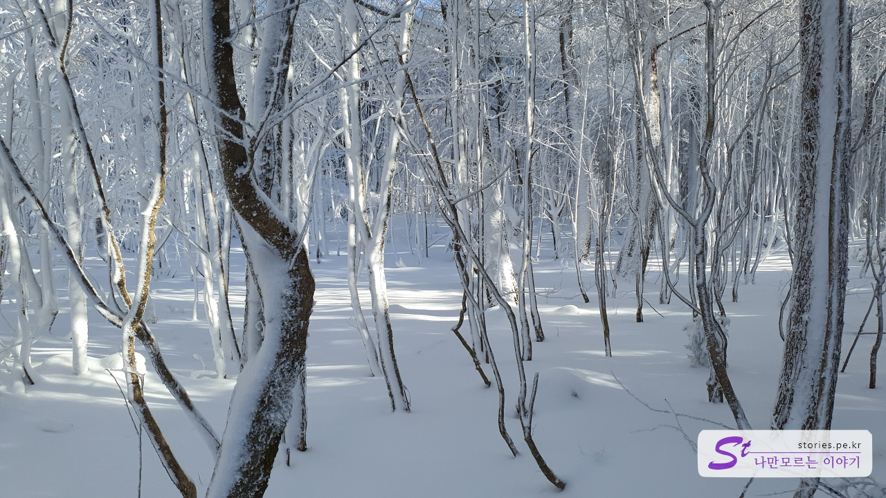
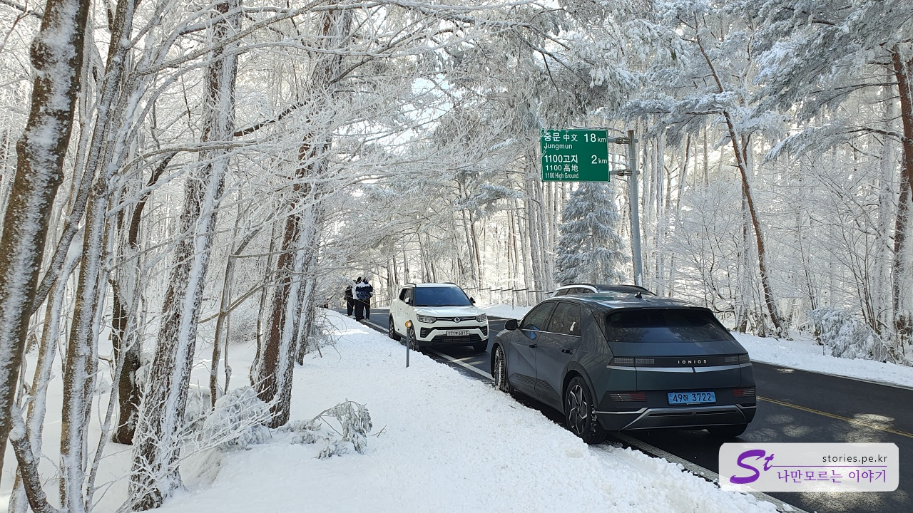
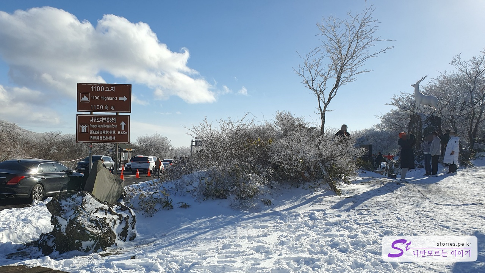

지금은 11월이라 눈은 없네요. 그래도 가볼만합니다.

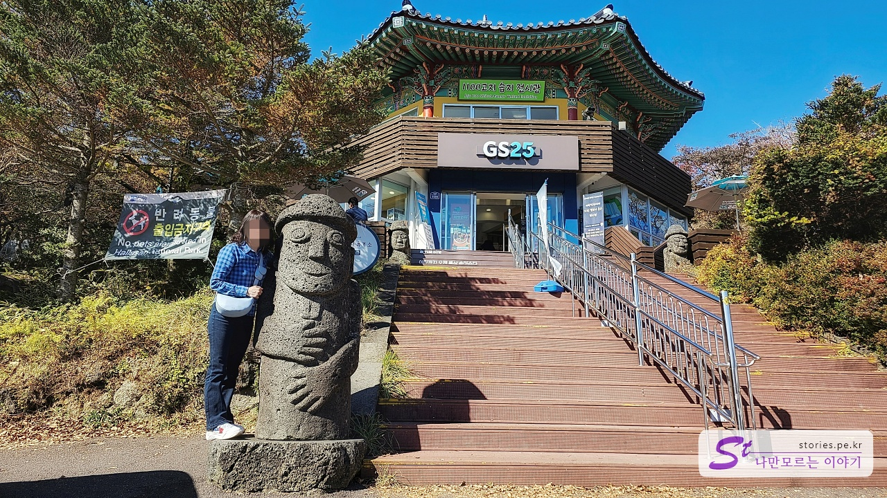
1100고지에 있는 습지 전시관입니다. 1층은 GS25 편의점이고 2층은 전시관으로 운영을 하고 있습니다.

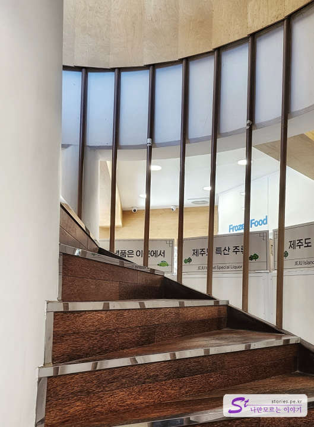
먼저 전시관을 가봤는데 GS25로 들어가서 나선형 계단으로 올라가면 됩니다.

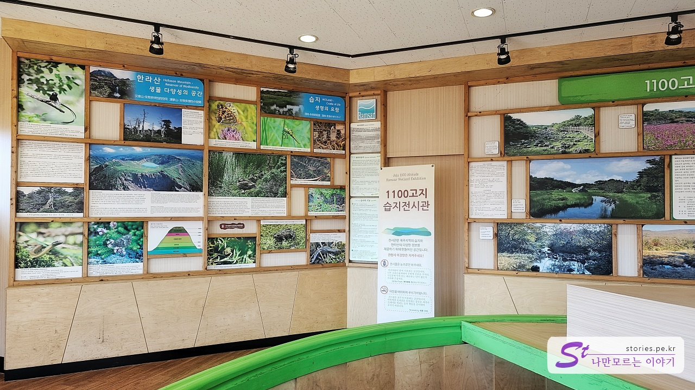
전시관이라고 해서 대단한 것이 있을 거라 생각하겠지만 별것 없습니다. 한라산과 습지에 대한 예전 사진과 설명이 되어 있습니다.

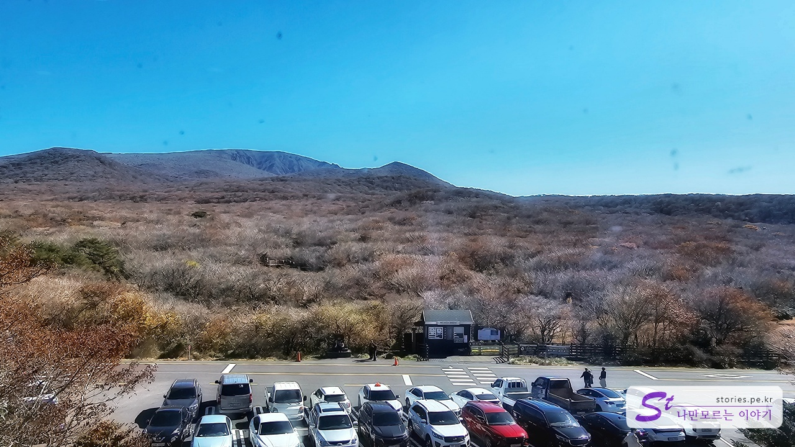
창문을 통해 한라산을 볼 수 있습니다. 습지는 주차장 바깥쪽에 있는 행길을 지나야 가볼 수 있습니다. 방향으로 봐서 한라산의 영실코스 쪽이고 윗세 오름을 볼 수 있습니다.

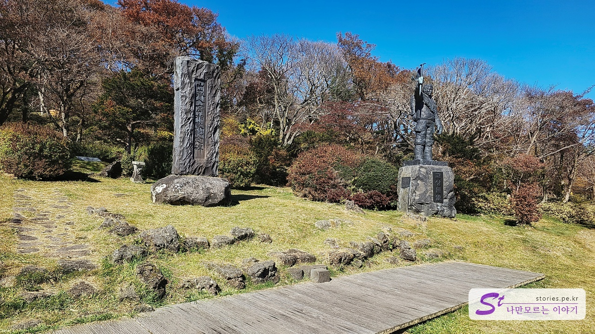
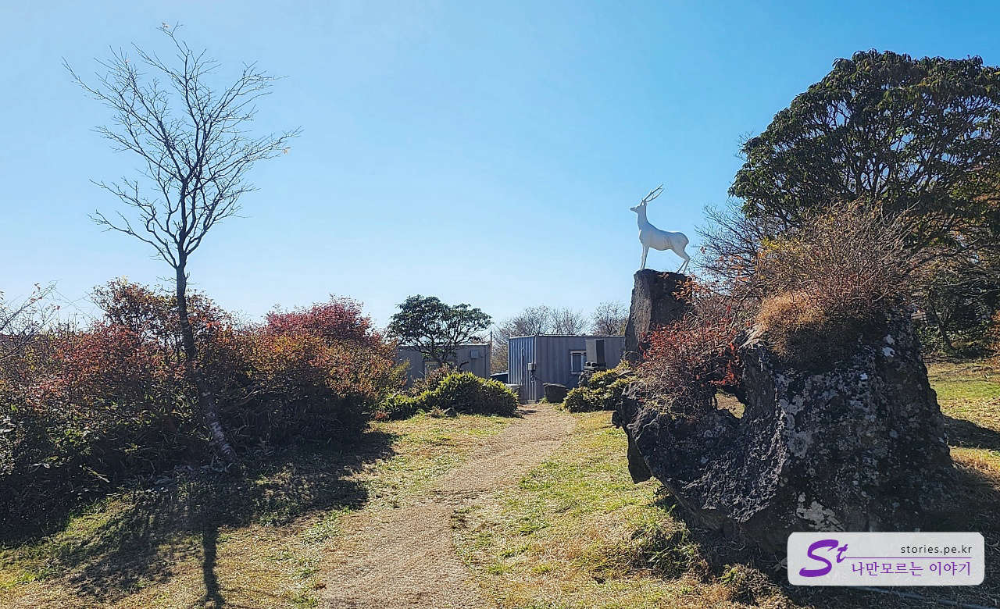
전시관 옆쪽으로는 고상돈 동산과 사슴 동상 등 조그만 공원이 있습니다. 겨울에는 많은 사람들이 이곳에서 사진을 찍었었는데, 눈이 없으니 지금은 별로 찾는 사람이 없었습니다.

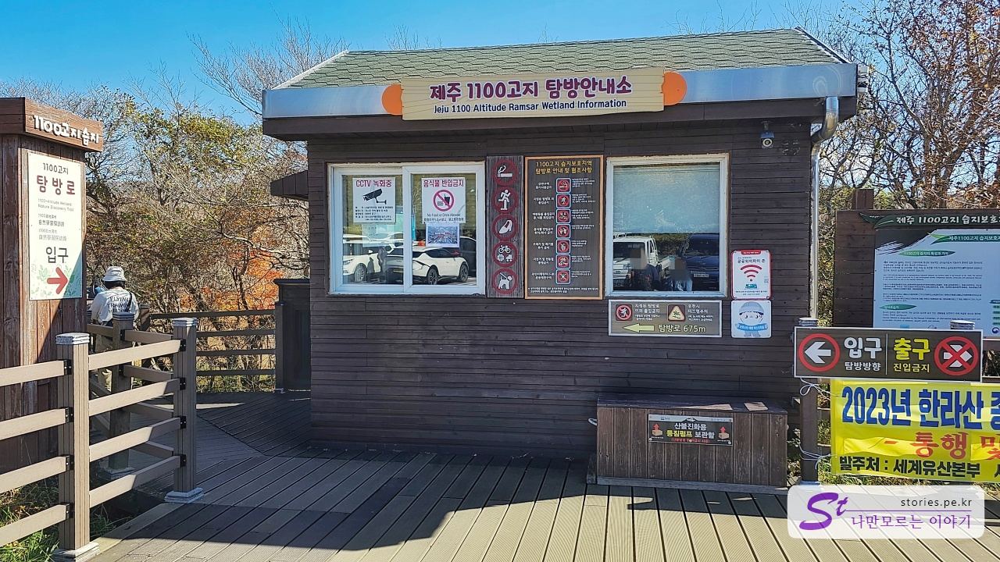
주차장에서 행길을 건너면 습지로 들어갈 수 있는 데크가 있습니다.
탐방로는 걸어서 대략 10~30분 정도의 순환 데크로 되어 있습니다. 사진에서 좌측의 길이 탐방로 입구입니다.

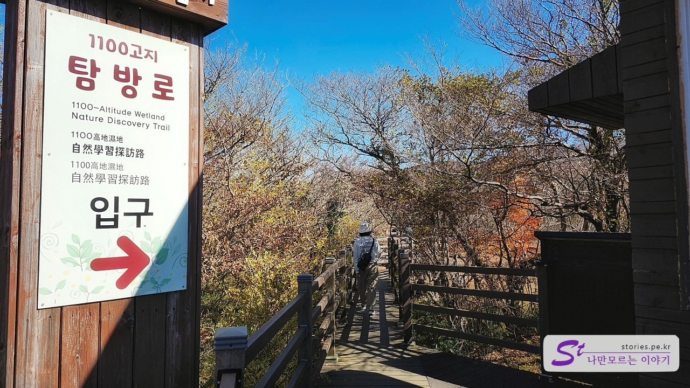
데크길은 한두 명 정도가 들어갈 수 있는 길입니다.

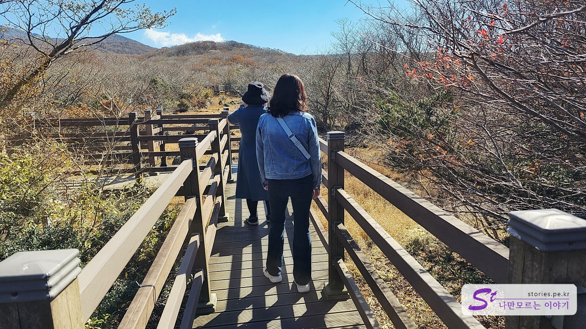
전체가 데크길이라 유모차도 돌아볼 수 있습니다.

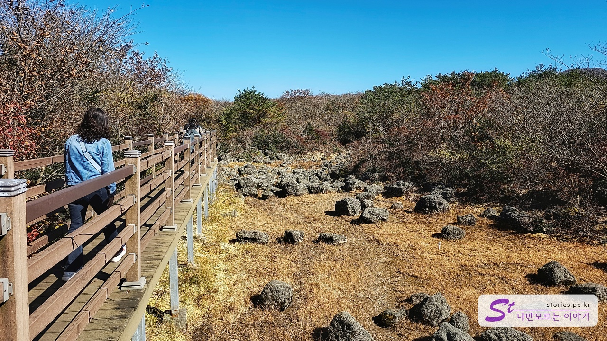
습지라면 바닥에 물이 고여있어야 할 텐데 지금은 그냥 마른 바닥입니다.

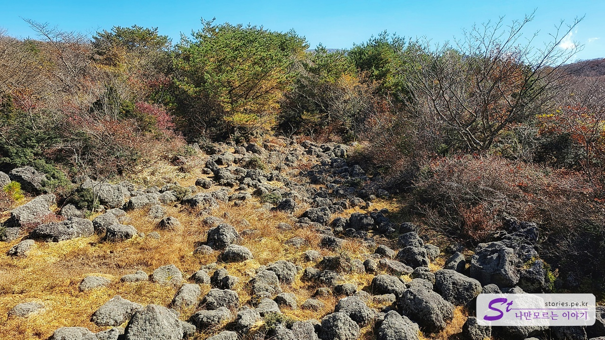
여기도 물이 고여있었던 것 같은데 현재는 마른 바닥입니다.

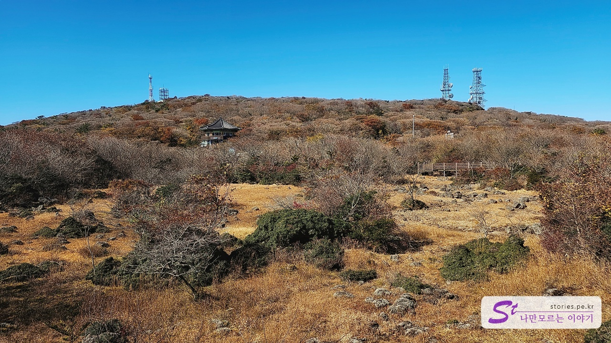
반바퀴를 돌면 1100고지 전시관을 볼 수 있습니다. 그 전시관이 있는 곳이 삼 형제 큰 오름입니다.

## 비용

비용은 무료입니다. 편의점에서 간식 사 먹을 돈 정도만 필요합니다. 주차비용도 없습니다.

## 여행지 정보

- 주소 : 제주 서귀포시 1100로 1555
- 연락처 : (+82) 064-740-6000
- URL : https://www.visitjeju.net/kr/detail/view?contentsid=CNTS_000000000021240

<iframe src='https://www.google.com/maps/embed?pb=!1m18!1m12!1m3!1d3332.508170193741!2d126.4604888761965!3d33.35779680407872!2m3!1f0!2f0!3f0!3m2!1i1024!2i768!4f13.1!3m3!1m2!1s0x350c57c0decbb733%3A0xd9bf1dcb826c5b1a!2zMTEwMOqzoOyngCDtnLTqsozshow!5e0!3m2!1sko!2skr!4v1700308929790!5m2!1sko!2skr' className='embed-responsive-item' allowFullScreen></iframe>

## 주차정보

약 20대 정도 주차를 할 수 있는 주차공간이 있습니다. 그곳에 주차를 못하면 갓길에 주차를 하는 경우도 많습니다.
