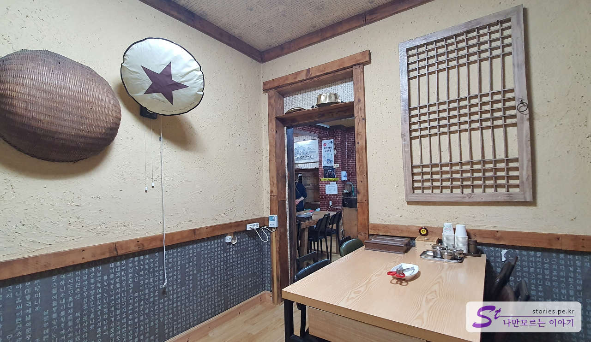
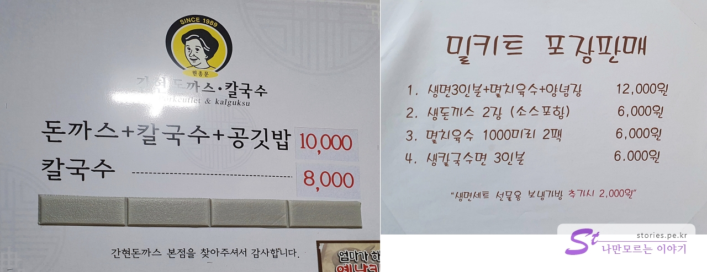
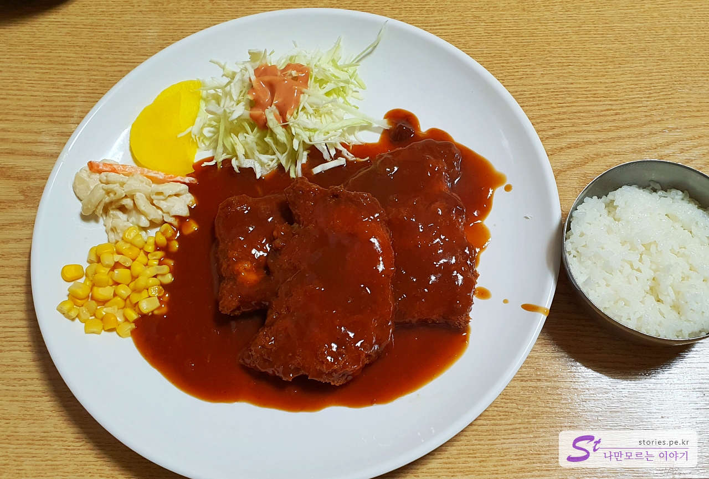
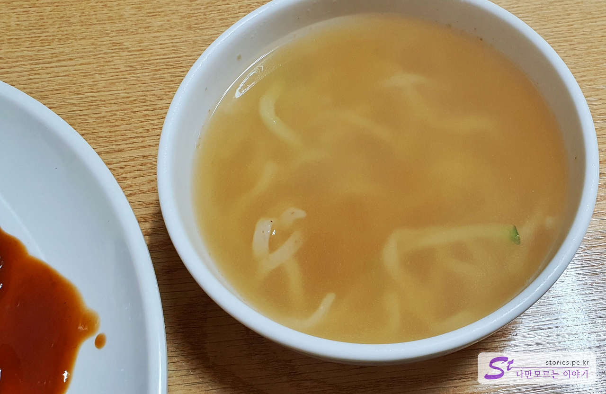
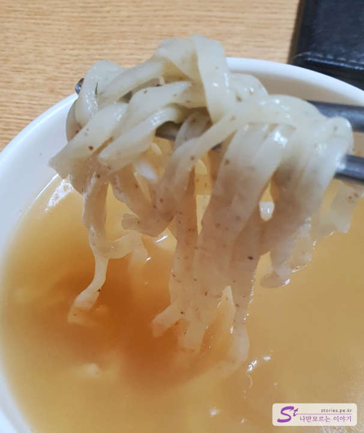
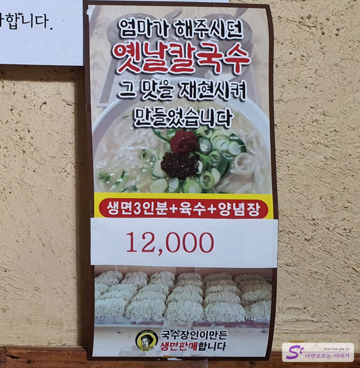
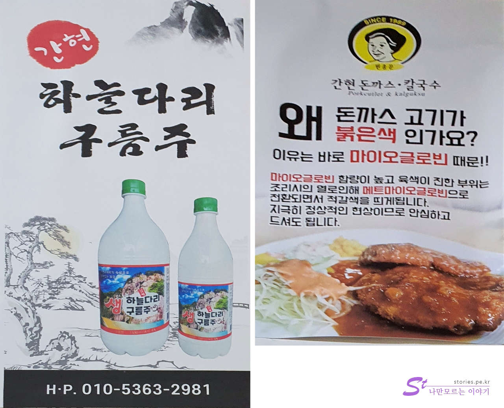

The first destination on the second day of the trip is Sogeumsan Grand Valley (Kanhyeon Tourist Site). Before starting the trip, I searched a nearby restaurant for breakfast and lunch. Among them, there is a pork cutlet restaurant that stands out, so I stopped by.

# Ganhyeon Pork Cutlet

As the name of the restaurant suggests, it is a restaurant in the village right in front of Ganhyeon Tourist Site.

It looks a little small from the outside, but if you go inside, it's quite spacious and there are many seats.

The entrance has a slightly modern look, but the interior has a traditional interior. It's a little unbalanced, but... Well, as long as the pork cutlet tastes good...

There is a kitchen outside the door in the middle of the picture, and there is a faucet next to it, so you can wash your hands easily.

## Representative menu and price (cost-effectiveness)

There are only two menus. Currently, the representative menu is ** pork cutlet + kalguksu + rice** Based on the overall composition of the restaurant and the food, I think kalguksu was the main dish. Then, since pork cutlet is selling well, I think I set the main menu as a pork knife ball (personal guess). ^^)

Milkits are also on sale, so you can buy them and cook them at home later or give them as gifts.

## Food I've tried

Of course, we ordered a pork cutlet + noodle soup + rice. + kalguksu + rice). When you order, they serve kimchi and kkakdugi in a jar first. This is also a method that is usually used in kalguksu restaurants.

It's basically a marinade placed on the table. This is also a sauce for kalguksu.

The black pepper paste on the top gives the pickled peppers a deep, spicy taste.

The main menu is pork cutlet. It tastes very good in the old light-style pork cutlet method. The sauce was sprinkled and served, but the crispness remained for a considerable amount of time.

If you ask for a separate sauce, they put it in a separate bowl.

And kalguksu comes out right away. The amount is not large, and it comes in the size of a soup bowl.

The noodles are chewy and delicious. I heard that the noodle maker made it.

I tried eating it with minced seasoning on the table. It tasted good because I put ripened sauce in the anchovy broth base.

## Taste Assessment (extremely subjective)

The kalguksu was delicious, but the pork cutlet tasted really good. It's a good taste for the main menu.

I recommend this flavor.

<b>Subjective taste score: </b> ★★★★☆

## Restaurant Management System

We visited around 11:30 and were the first guests. I received the order quickly and served the food quickly. Customers came in one by one and ate behind us. There were some empty seats because there were no tourists because it was a weekday and the weather was cold. Half of the customers were locals and half of the tourists.

It's sold as a milk kit, so you can eat it at home.

Sky Bridge Cloud Liquor is also on sale. We don't usually drink, so pass!

<b>Operating System: </b> ★★★☆☆

## Restaurant and parking information

- Address: 155, Ganhyeon-ro, Jijeong-myeon, Wonju-si, Gangwon-do
- Contact point: 033-732-3111
- Business hours (break time): 10:30-20:00
- Closed: Closed on the first and third Mondays of every month
- Parking: There is no separate parking lot. We usually park on the side of the road.

<iframe src='https://www.google.com/maps/embed?pb=!1m18!1m12!1m3!1d1885.5736031980014!2d127.83456940971821!3d37.36276549409992!2m3!1f0!2f0!3f0!3m2!1i1024!2i768!4f13.1!3m3!1m2!1s0x3563723bb56933c9%3A0x49cf22798cc56cac!2z6rCE7ZiE64-I6rmM7IqkIOuzuOygkA!5e0!3m2!1sko!2skr!4v1671612934619!5m2!1sko!2skr' className='embed-responsive-item' allowFullScreen></iframe>

