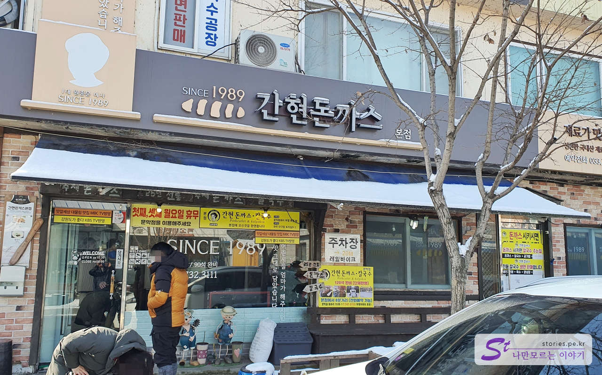
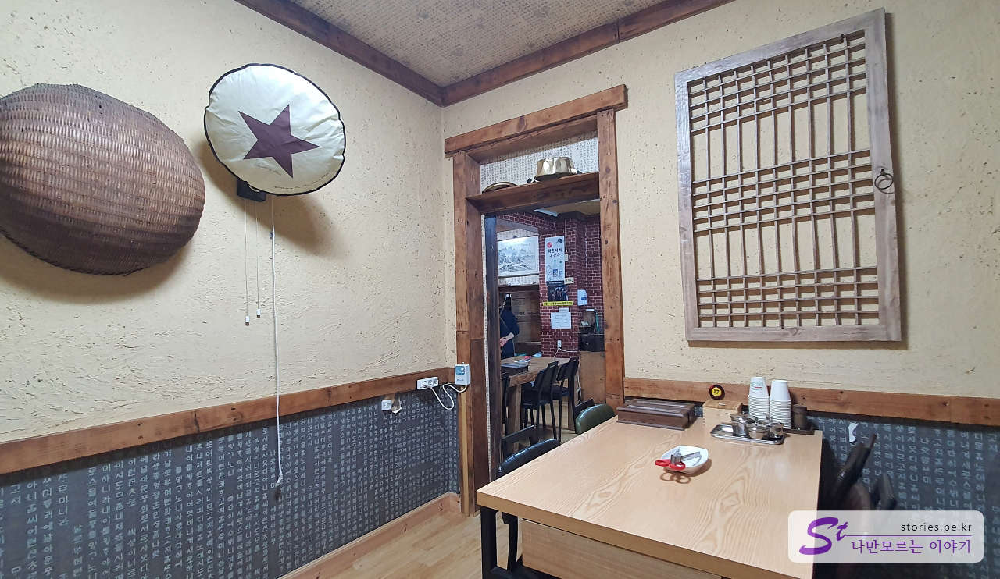
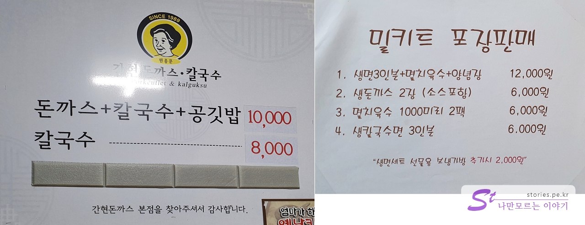
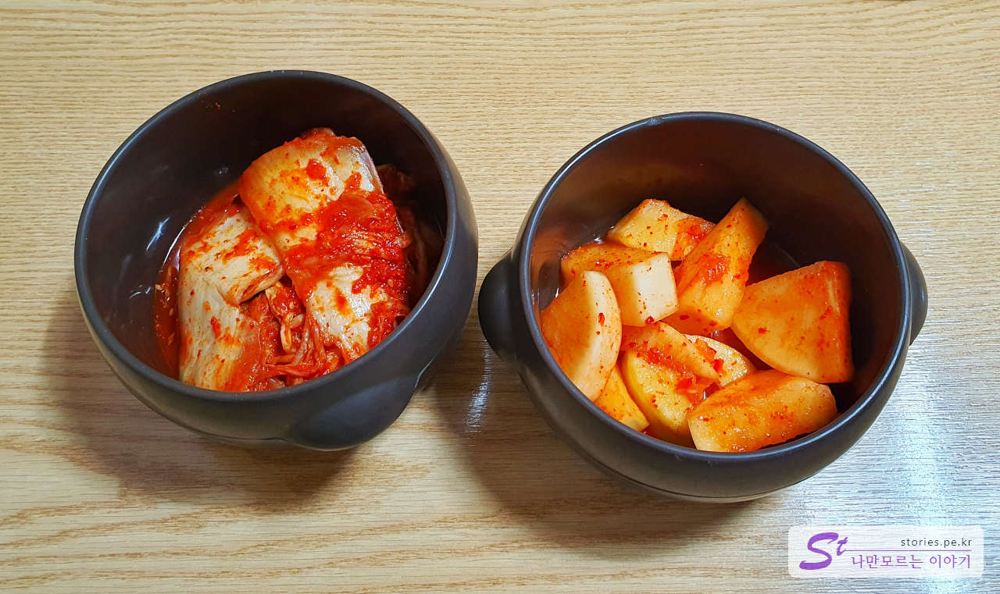
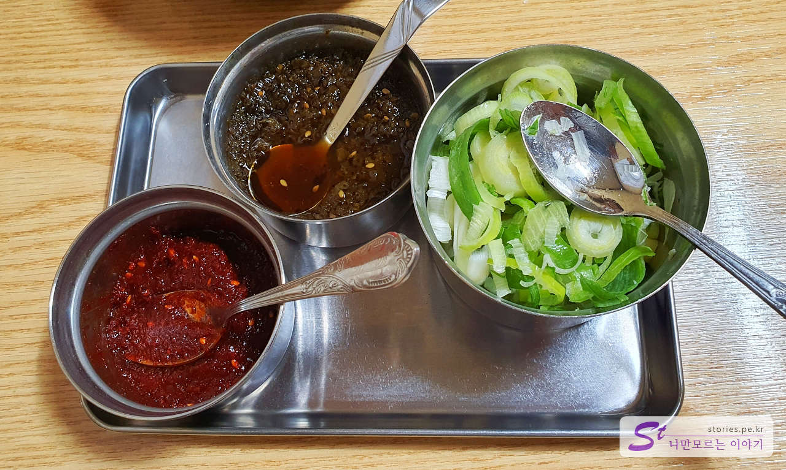
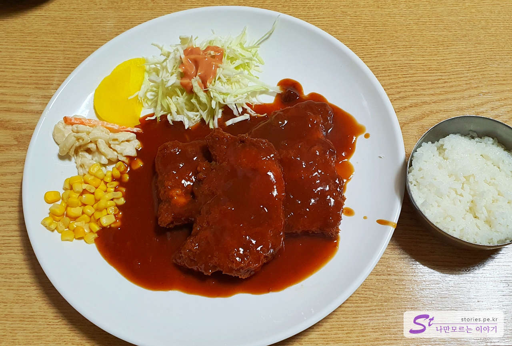
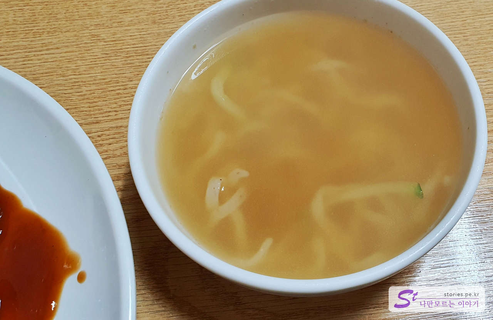
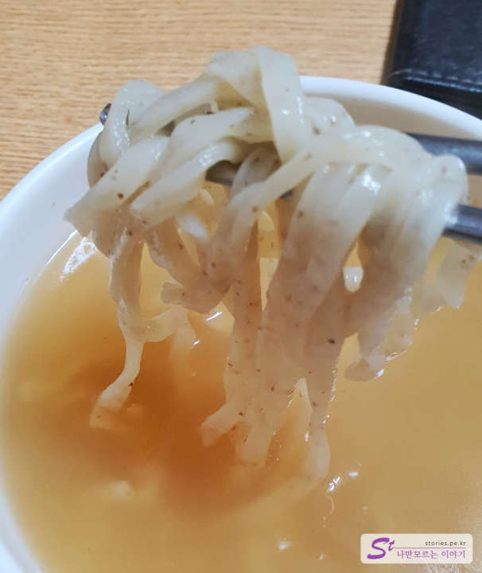
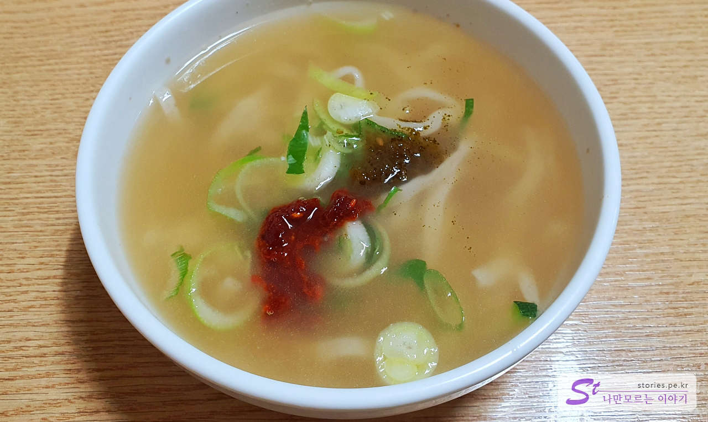
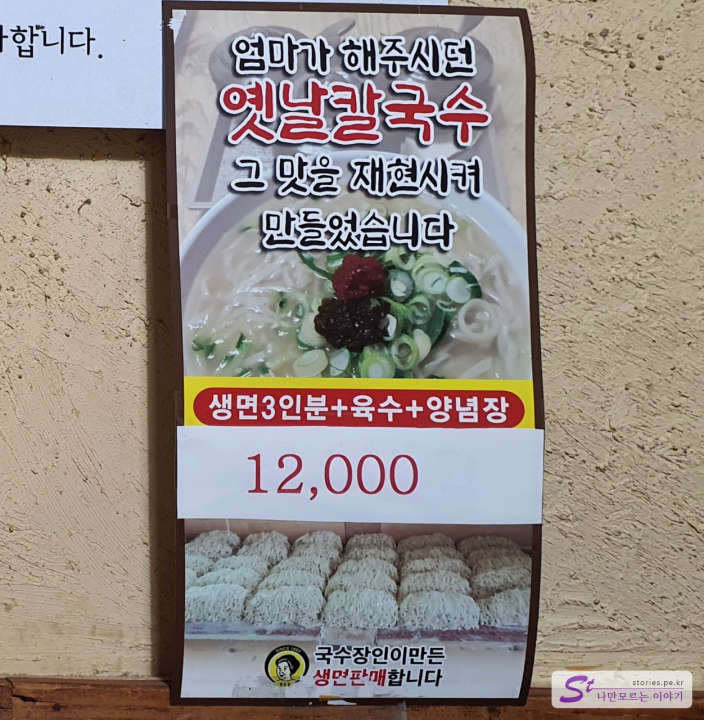

여행 2일째 첫 번째 여행지는 소금산 그랜드밸리(간현관광지) 입니다. 여행을 시작하기 전에 먼저 아침 겸 점심을 먹기 위해 근처 식당을 서치해 봤는데요. 그중에 눈에 띄는 돈가스 식당이 있어서 들러봤습니다.

# 간현 돈가스

식당 이름에서도 알 수 있듯이 간현관광지 바로 앞쪽 마을에 있는 식당입니다.

겉에서 봤을 때는 좀 작아 보이는데 안으로 들어가면 꽤 넓고 많은 좌석이 있습니다.

입구는 약간 현대식의 모습을 가지고있는데 실내는 전통식의 인테리어를 하고 있습니다. 조금 언밸런스한 면이 있지만.. 뭐.. 돈가스가 맛만 있다면야...

사진 가운데 쪽 문밖에 주방이 있고 그 옆에 손을 닦을 수 있는 수전이 있어서 간단하게 손을 씻을 수도 있습니다.

## 대표 메뉴와 가격(가성비)

메뉴는 딱 2가지입니다. 현재 대표 메뉴는 **돈가스+칼국수+공깃밥**입니다. 전체적인 식당과 음식의 구성을 봤을 때 원래는 아마도 칼국수가 메인이지 않았나 싶습니다. 그러다가 돈가스가 잘 팔리다 보니 메인메뉴를 돈칼공으로 설정한듯싶습니다.(개인적인 추측입니다. ^^)

밀키트도 판매를 하고 있어서 사다가 나중에 집에서 요리해 먹거나 선물을 해도 될듯합니다.

## 먹어본 음식

저희는 당연히 돈칼공(돈가스+칼국수+공깃밥)을 주문했습니다. 주문을 하면 먼저 김치와 깍두기를 항아리에 담아서 덜어먹도록 내옵니다. 이 방식도 보통 칼국숫집에서나 주로 사용하는 방식이지요.

기본적으로 식탁에 배치되어 있는 양념장입니다. 이것도 칼국수를 위한 양념장이지요.

위에 있는 위에 있는 거무 퉤퉤한 양념장은 절인 고추를 잘게 다진 것으로 깊고 칼칼한 맛을 나게 해줍니다.

메인메뉴인 돈가스입니다. 옛날 경양식 돈가스 방식으로 맛이 상당히 좋습니다. 소스가 뿌려져서 나오는데 상당 시간 바싹함이 유지가 되었습니다.

찍먹파는 소스를 따로 달라고 하면 따로 그릇에 담아 줍니다.

그리고 바로 칼국수가 나옵니다. 양은 많지 않고 국그릇 정도의 크기에 담아져 나옵니다.

면도 쫄깃하니 맛이 있습니다. 국수 장인이 만들었다고 하네요.

테이블에 있는 다진 양념을 조금씩 넣어서 먹어봤습니다. 멸치 국물 베이스에 숙성된 양념장을 넣으니 나름 맛이 좋았습니다.

## 맛 평가 (지극히 주관적임)

칼국수도 맛있는데 돈가스도 정말 맛이 좋았습니다. 메인메뉴 할 만한 맛입니다.

추천하는 맛입니다.

<b>주관적인 맛 점수 : </b> ★★★★☆

## 식당 운영 시스템

저희가 거의 11시 30분쯤에 방문해서 첫 손님이었습니다. 빠르게 주문받고 빠르게 음식을 내왔습니다. 저희 뒤로 손님들이 하나둘씩 들어와서 식사를 하셨습니다. 평일이고 날이 추워서 관광객이 없어서 그런지 빈자리가 좀 있었습니다. 손님은 현지인 반, 관광객 반 정도 비율이였습니다.

밀키트로 판매하고 있어서 집에서도 먹을 수 있습니다.

하늘다리 구름주도 판매를 합니다. 저희는 원래 술을 먹지 않아서 패스~

<b>운영 시스템 : </b> ★★★☆☆

## 식당과 주차 정보

- 주소 : 강원 원주시 지정면 간현로 155
- 연락처 : 033-732-3111
- 영업시간(브레이크 타임) : 10:30 - 20:00
- 휴무일 : 매달 1, 3번째 월요일 정기 휴무
- 주차 : 별도의 주차장은 없습니다. 보통 도로 옆쪽에 주차를 합니다.

<iframe src='https://www.google.com/maps/embed?pb=!1m18!1m12!1m3!1d1885.5736031980014!2d127.83456940971821!3d37.36276549409992!2m3!1f0!2f0!3f0!3m2!1i1024!2i768!4f13.1!3m3!1m2!1s0x3563723bb56933c9%3A0x49cf22798cc56cac!2z6rCE7ZiE64-I6rmM7IqkIOuzuOygkA!5e0!3m2!1sko!2skr!4v1671612934619!5m2!1sko!2skr' className='embed-responsive-item' allowFullScreen></iframe>

## 인근 여행지

> [[원주 여행] 원주의 랜드마크 간현 관광지의 소금산 그랜드밸리 바로가기](https://blog.stories.pe.kr/606)
