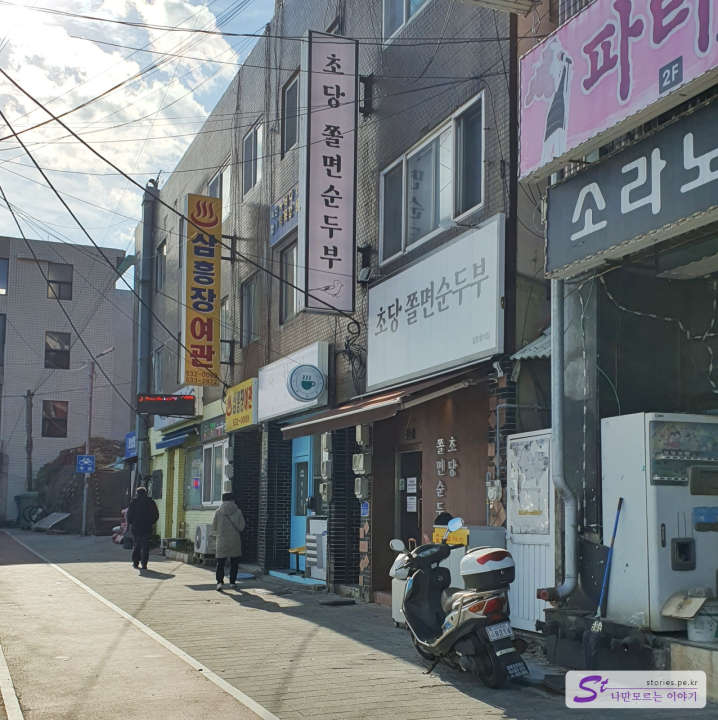
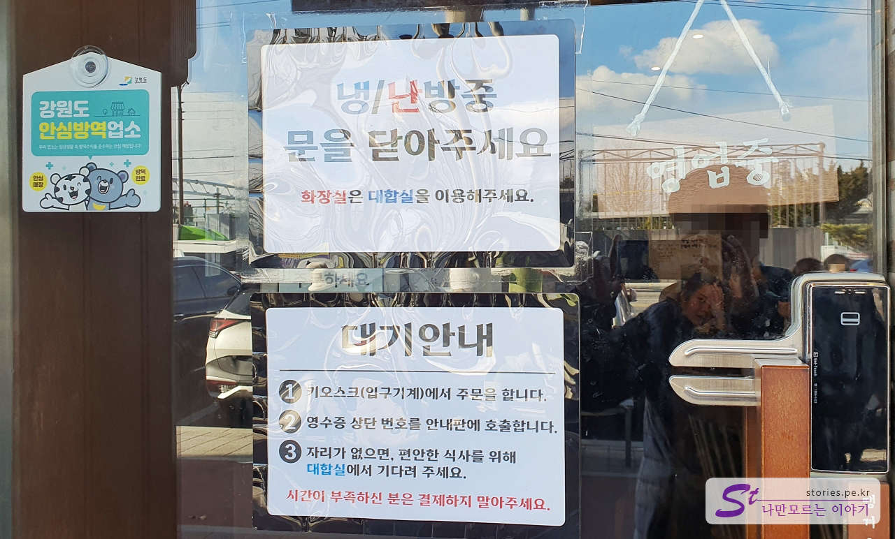
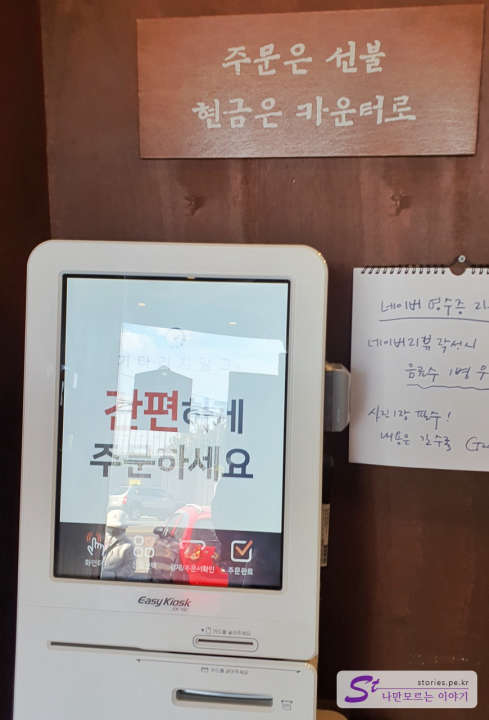
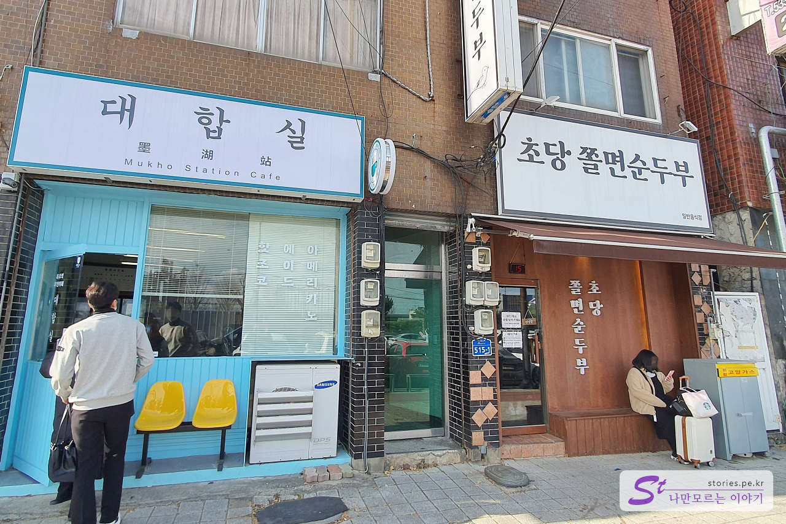
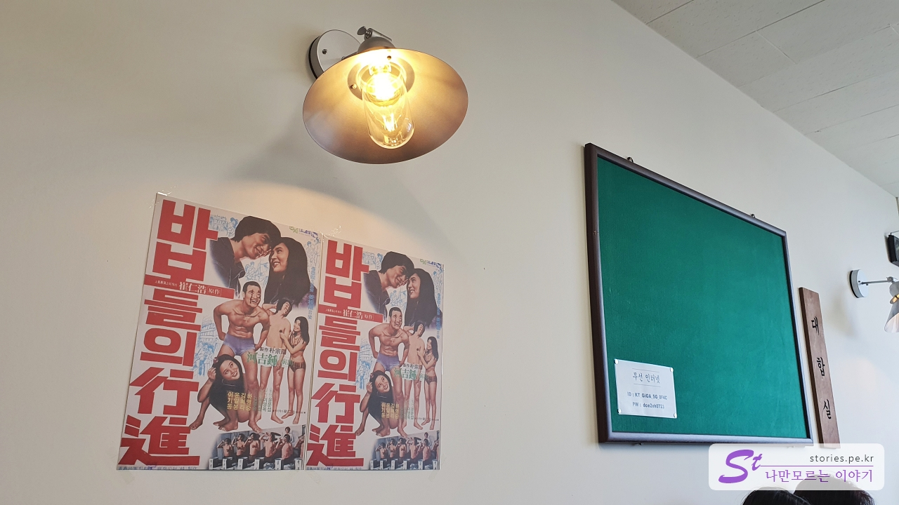
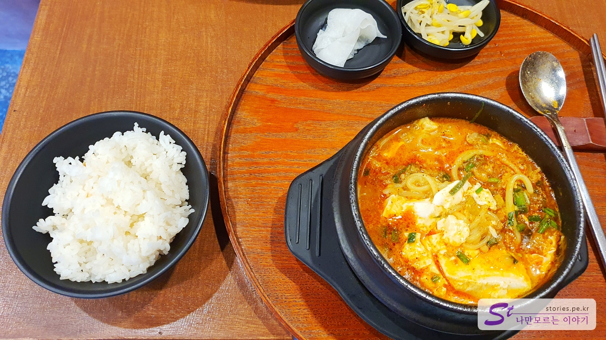
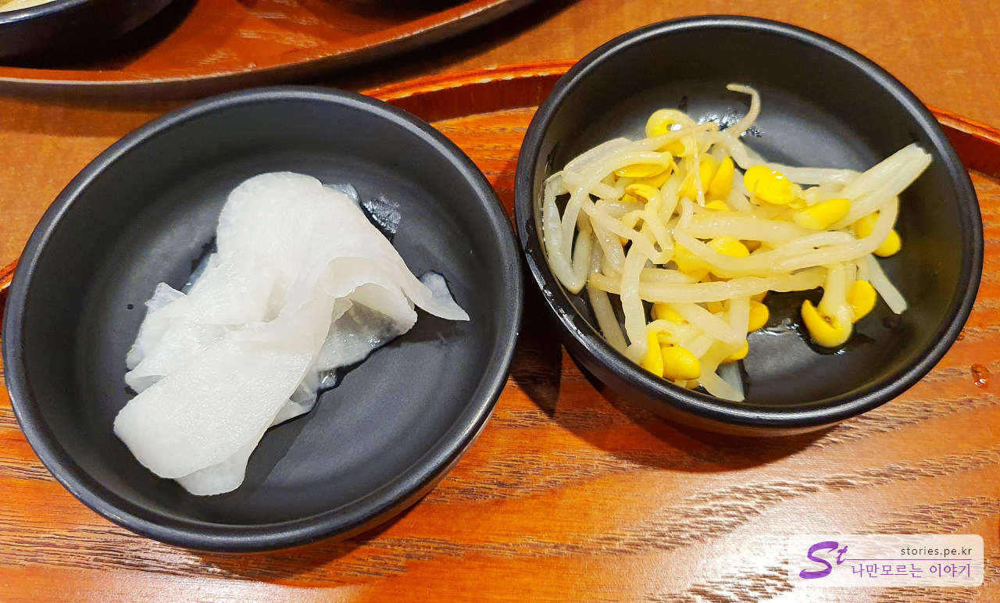
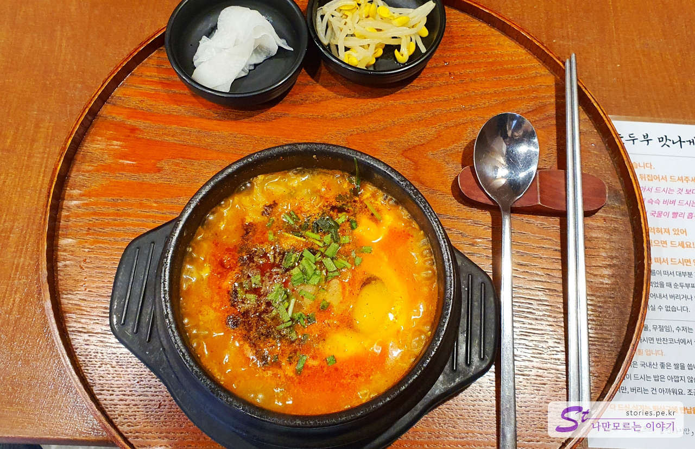
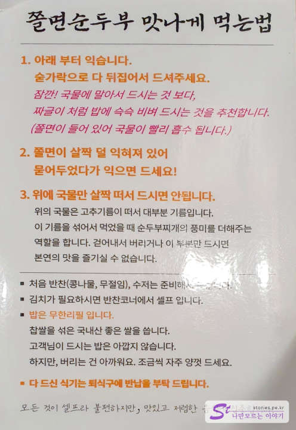

There is a restaurant called Chodang Jjolmyeon Soft Tofu\*\* in Donghae. There is a waiting room, and the operating hours are short from 11 p.m. to 2 p.m., so you have to decide to go there. Young people in their 20s and 30s usually visit.

The restaurant is a building on the main street. The name of the restaurant is neither more nor less **Chodang Jjolmyeon Soft Tofu**.

Once you arrive at the restaurant, you have to order from the kiosk first. If you receive the order number and wait in the waiting area (the waiting room), call the number. It is not a system that notifies you by Kakao Talk or text message.

Order through kiosk as above. You can pay by credit card, or if it's cash, you can pay at the counter. You have to keep it well because there is a call number on the receipt.

There's a waiting room right next to it. Originally, it looks like an unmanned cafe, but it is used as a waiting place for soft tofu restaurants. The owner of this waiting room seems to be the owner of a soft tofu restaurant. If you're waiting here, they'll call your number.

The interior of the waiting room has an old '60s and '70s atmosphere.

We waited in the waiting room for about 30 minutes, and our turn came. **The menu is Chodang Jjolmyeon soft tofu and sanjeok (beef) rice balls only 2**. We couldn't order because we ran out of rice balls. Instead, you can eat the rice with unlimited refills.

The side dishes are pickled radish and two bean sprouts. Side dishes are not the main dish, so it doesn't matter.

There is jjolmyeon on the floor and chili oil is floating on top. There are uncooked eggs on top. So when you get the soft tofu, you have to turn it upside down and mix it. That way, the eggs will be cooked and the jjolmyeon on the floor won't burn.

## Taste Assessment (extremely subjective)

It's delicious. It's usually a single menu, but if there are many people, it's likely to be a good restaurant.

<b>Subjective taste score: </b> ★★★★☆

## Restaurant Management System

From the order to the waiting, the food is served in a quick succession. Of course, there are many people waiting, but it was nice to be able to wait while running the waiting room. However, what's unfortunate is that it would be better to establish a system that informs you through Kakao Talk or text messages.

<b>Operating System: </b> ★★★★☆

## Cleanliness

It's just the right amount of cleanliness.

<b>Cleanliness: </b> ★★★★☆

## Restaurant and parking information

- Address: 515-11th floor, Haean-ro, Donghae-si, Gangwon-do
- Contact: 0507-1389-9639
- Business hours: 11:00 to 14:30
- Break time: None
- Last order: 14:00
- Closed: Every Tuesday
- Parking: There is a parking lot in front of the restaurant, but parking is not easy because it is almost full. You can park in the back alley.

<iframe src='https://www.google.com/maps/embed?pb=!1m18!1m12!1m3!1d3163.3729160228277!2d129.10487551557247!3d37.546276933045405!2m3!1f0!2f0!3f0!3m2!1i1024!2i768!4f13.1!3m3!1m2!1s0x3561c76088faabe1%3A0xb506761c208e1702!2z7LSI64u57KuE66m07Iic65GQ67aA!5e0!3m2!1sko!2skr!4v1671976769291!5m2!1sko!2skr' className='embed-responsive-item' allowFullScreen></iframe>

## a nearby destination

> [[[DONGHAE TRAVEL] Make sure to go to Dojevigol Sky Valley, a new attraction in the East Sea](https://blog.stories.pe.kr/609)
