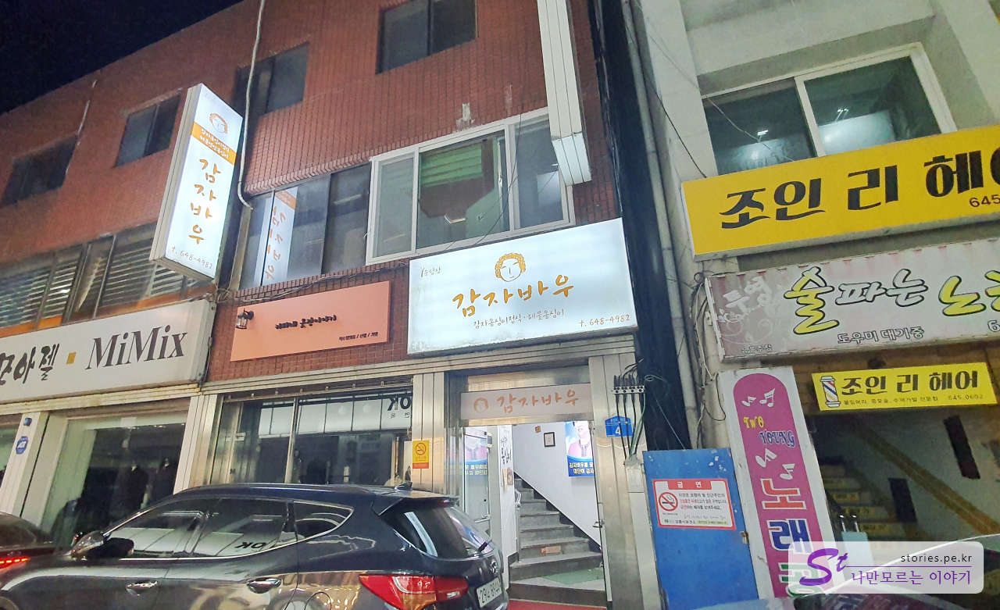
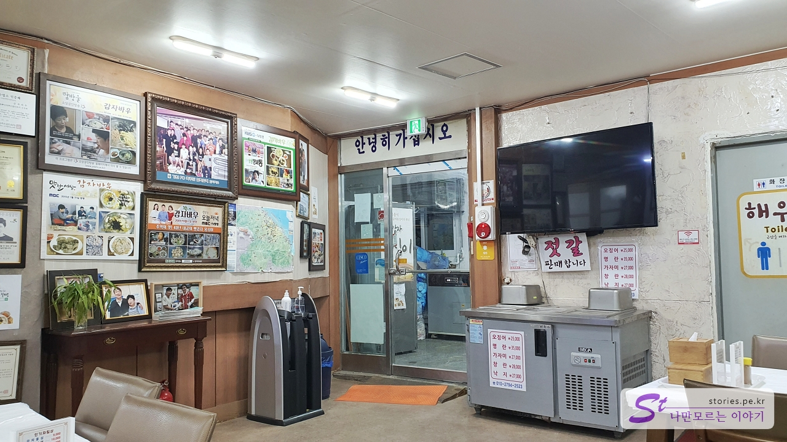
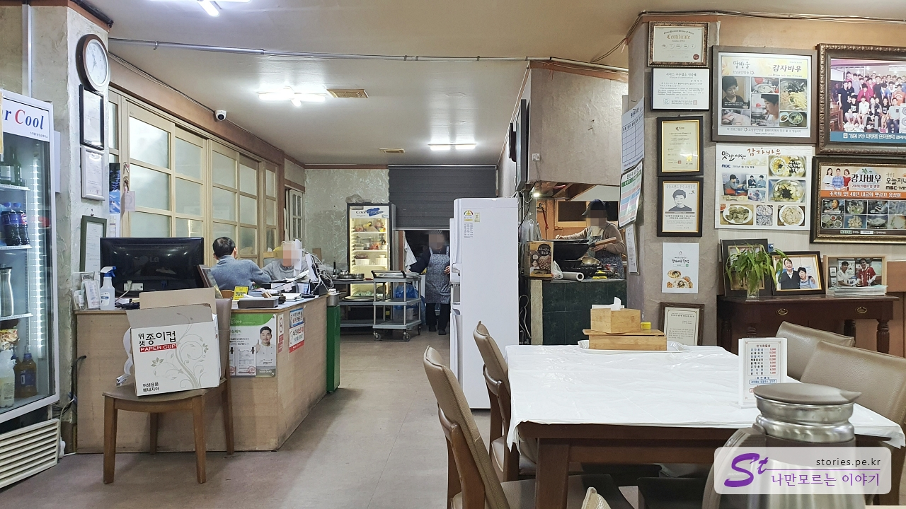
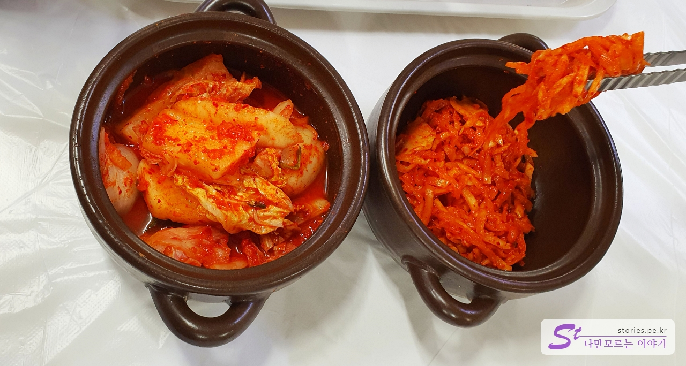
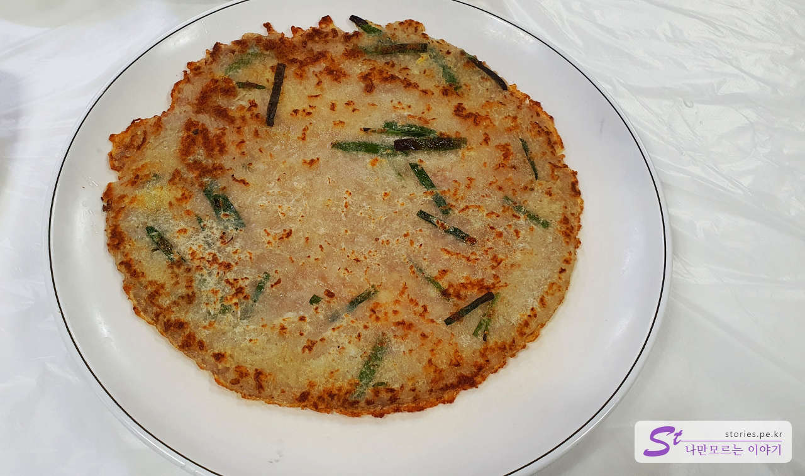
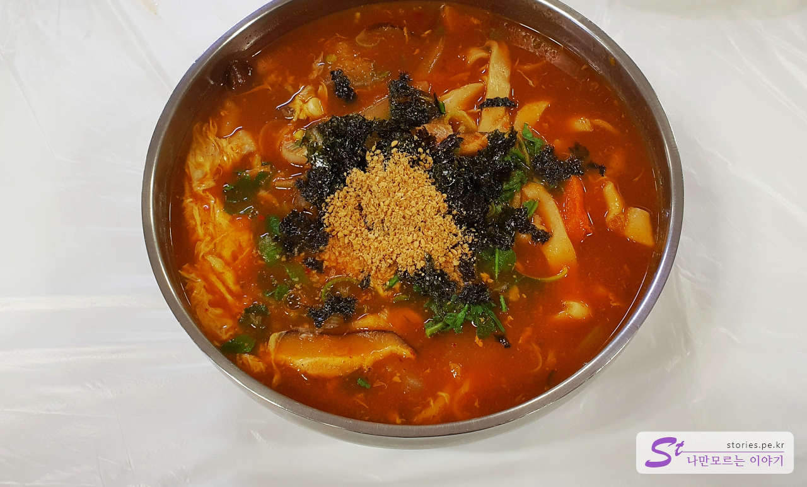
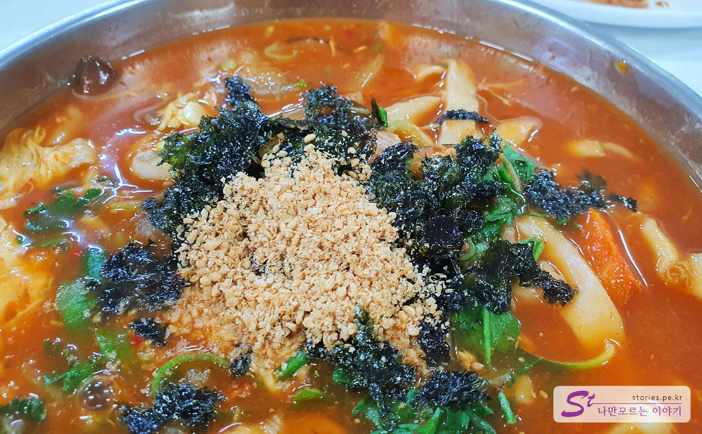
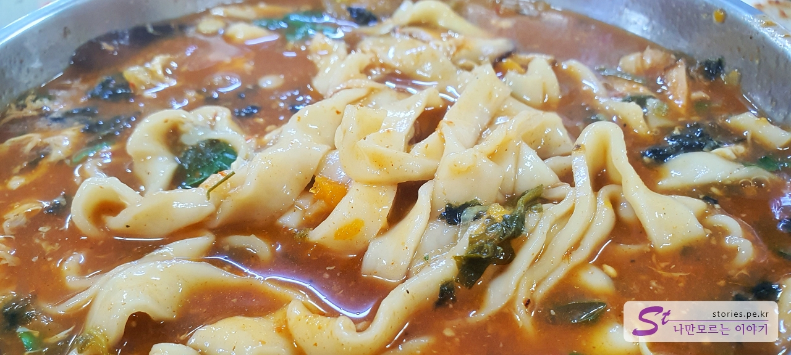
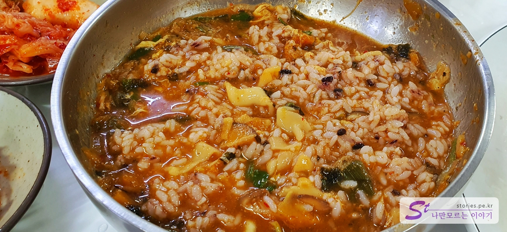

After my trip to the East Sea, I came up to take the Seoul Yangyang Expressway, and I was hungry, so I stopped by Gangneung to eat Jangkalguksu, which is famous in Gangneung.  
Since it is located in Geumseong-ro, downtown Gangneung, there is no separate parking lot, but I parked next to the road while looking at the atmosphere.

The restaurant is on the 2nd floor and you have to go up through a small entrance. If you go up, the restaurant is bigger than you think.

The restaurant is not a sophisticated interior. It's said to be a 40-year-old tradition, and it's a good atmosphere.

The kitchen is an open kitchen inside.

## Representative menu and price (cost-effectiveness)

There are a variety of menus, and the representative menus are **potato ongshimi**, **jangkalguksu**, and **potato pancake**.

![Images/njo2_20221217_185656-01.jpeg)

## Food I've tried

We ordered Jang Kalguksu and Potato Pancake.

When you order, you put the mixed gourd and radish salad in a jar. You can eat as much as you want on a plate. Mixed gourd and radish salad also taste good.

First, potato pancake It tasted good because it was crispy and had a unique texture of potato pancake. The representative menu is worth it.

Finally, the noodles are ready. The soup is made with soy sauce, so the thick and spicy taste is excellent. But it's not too spicy. Between red pepper paste and soybean paste...I think it's a taste of.

Seaweed and sesame are served on top of kalguksu. It looked so delicious.

The noodles are also thicker than regular kalguksu noodles. Noodles taste good, too.

It doesn't look neat in the picture, but I'm really satisfied with the rice. If you don't like noodles, you should look forward to rice.

## Taste Assessment (extremely subjective)

I ate it satisfactorily. The spicy taste and thick soup are excellent so that it's not too spicy.

<b>Subjective taste score: </b> ★★★★☆

## Restaurant Management System

We have general operations that are nothing special.

<b>Operating System: </b> ★★★☆☆

## Cleanliness

The cleanliness is not too bad, but overall, it doesn't feel clean.

<b>Cleanliness: </b> ★★☆☆☆

## Kindness

It was hard to feel that the owner was kind because the person who was serving was not Korean. That doesn't mean it's unkind. I think you can think of it as normal.

<b>Kindness: </b> ★★★☆☆

## Restaurant and parking information

- Address: 4, Geumseong-ro 35beon-gil, Gangneung-si, Gangwon-do
- Contact number: 033-648-4982
- Business hours: 09:00 - 21:00
  - Last order: 20:00
- Parking: There is no restaurant parking lot. You have to park your car behind the road.

<iframe src='https://www.google.com/maps/embed?pb=!1m18!1m12!1m3!1d3154.5778616637613!2d128.89256373128703!3d37.75304655646589!2m3!1f0!2f0!3f0!3m2!1i1024!2i768!4f13.1!3m3!1m2!1s0x3561e5fbcff7a757%3A0xe43cce10a77db329!2z6rCQ7J6Q67CU7Jqw!5e0!3m2!1sko!2skr!4v1672128418845!5m2!1sko!2skr' className='embed-responsive-item' allowFullScreen></iframe>

